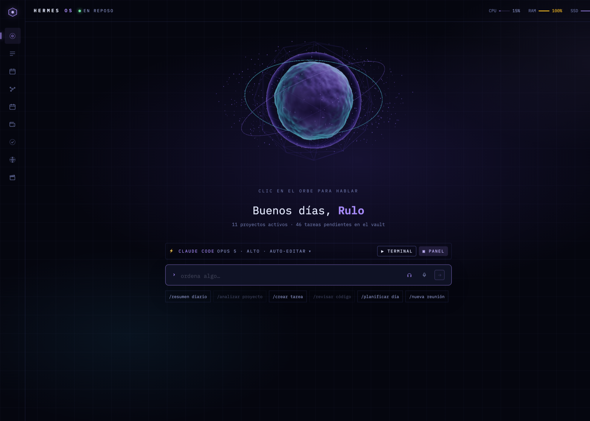

# ⚡ Hermes OS

<p align="center">
  
</p>

Sistema operativo de IA personal, **local-first** y en español: un dashboard estilo "AGENTIC OS" con voz en tiempo real, un agente ejecutor que corre en tu máquina con el **Claude Agent SDK** (sin API key: usa tu suscripción de Claude Code) y memoria persistente en Supabase. Conoce tu vault de Obsidian, tus tareas de Linear, tus reuniones, tu calendario y tu producción de contenido — y todo lo que muestra es real.

```
Browser (dashboard :31415)  ─┬─ Voz: ElevenLabs Agents (WebRTC) → client tools en el browser
                             ├─ Consola: contrato Hermes (SSE OpenAI-compatible)
                             └─ Paneles: actividad en vivo, conocimiento, juntas, tareas, estudio…
                                              │
                                              ▼
Agent server (apps/agent, Hono :8650) ── Claude Agent SDK ── spawnea el CLI `claude` (tu login)
        │                                   └─ tools MCP "hermes" + guardrails (canUseTool)
        ├─ Supabase (pgvector): memoria, conocimiento unificado, tareas, juntas, presencia
        ├─ Vault de Obsidian (opcional): verdad de proyectos, notas de ejecución
        └─ Integraciones opcionales: Linear · Google Calendar · AssemblyAI · OpenMontage · Kasa
```

## Requisitos

| Qué | Versión / nota |
|---|---|
| macOS (recomendado) o Linux/WSL2 | Las features de sistema (gestos, Chrome por AppleScript, luces, ventanas) son mac-only y se apagan solas en otros SO |
| Node | 22+ (probado con 24/25 vía nvm) |
| pnpm | 10+ |
| **Claude Code** | ≥ 2.1.247, **logueado con tu cuenta** (Pro/Max/Team). `claude --version` · `claude` → `/login` |
| Supabase | Un proyecto propio (plan gratis basta) |
| `rg` (ripgrep), `ffmpeg` | ffmpeg solo para reuniones y Estudio |

## Cómo consume Claude (y por qué no hay API key)

```
Hermes → @anthropic-ai/claude-agent-sdk → query() → spawnea el CLI `claude`
       → el CLI usa el login OAuth de tu cuenta (Keychain en macOS) → Anthropic
```

El agente **nunca** recibe una key: [session.ts](apps/agent/src/agent/session.ts) llama `query()` y el CLI resuelve la credencial. Todo el consumo sale de tu suscripción. **Si `ANTHROPIC_API_KEY` existe en el entorno, el CLI la prefiere y cobra por API** — no la configures. El uso (tokens por turno) se cuenta desde el evento `result` del CLI y se muestra en el dashboard; es conteo, no factura.

Verifica tu login en macOS:

```bash
security find-generic-password -s "Claude Code-credentials" -w \
  | python3 -c "import sys,json;print(json.load(sys.stdin)['claudeAiOauth']['subscriptionType'])"
```

## Setup por máquina

```bash
git clone git@github.com:ruloCode/hermes-os.git ~/dev/side/hermes-os
cd ~/dev/side/hermes-os
./hermes setup            # pnpm install (+ agente de voz de ElevenLabs si hay key)
cp .env.example .env      # y completa el mínimo (abajo)
```

**1. Supabase.** Crea un proyecto y aplica **todas** las migraciones de [supabase/migrations/](supabase/migrations/) en orden numérico:

```bash
supabase login && supabase link --project-ref <ref> && supabase db push
# o pega cada .sql en el SQL Editor del dashboard, en orden
```

**2. `.env` mínimo** (en la raíz del monorepo; el resto es opcional y degrada solo):

```
HERMES_OWNER_NAME=<tu nombre>          NEXT_PUBLIC_HERMES_OWNER_NAME=<tu nombre>
MACHINE_NAME=<único por máquina>       HERMES_API_KEY=<openssl rand -hex 24>
NEXT_PUBLIC_SUPABASE_URL=…             NEXT_PUBLIC_SUPABASE_ANON_KEY=…
SUPABASE_SERVICE_ROLE_KEY=…            VAULT_PATH=<ruta del vault o vacío>
```

**3. Tu persona (opcional, recomendado).** Copia [docs/SOUL.example.md](docs/SOUL.example.md) a `~/.hermes-os/SOUL.md` y escríbelo en primera persona: Hermes lo inyecta a su system prompt y a los prompts especializados. Vive fuera del repo.

**4. Arranca.**

```bash
./hermes                  # desarrollo: web :31415 + agente :8650
./hermes doctor           # requisitos, puertos, autostart, salud
./hermes install          # producción: build + autostart al login (launchd com.hermes-os.*)
```

Prueba desde la terminal (misma ruta que usa el dashboard):

```bash
KEY=$(grep -o "^HERMES_API_KEY=.*" .env | cut -d= -f2-)
curl -s -N -X POST localhost:8650/v1/chat/completions \
  -H "Authorization: Bearer $KEY" -H "Content-Type: application/json" \
  -d '{"messages":[{"role":"user","content":"Di hola y dime en qué máquina corres"}],"stream":true}'
```

## Estructura

```
apps/web        Next.js 15 — dashboard (shell único, providers, design system en src/components/ui)
apps/agent      Hono — agente (Agent SDK, tools MCP, guardrails, jobs, rutas /v1 /tasks /meetings /content …)
packages/shared Tipos y lógica compartida (contrato Hermes, etapas de contenido, beats de guion)
mobile/         App Expo (Android): chat, grabación de juntas a prueba de red, tablero Linear
supabase/       Migraciones (001 → 024)
docs/           Guías: multi-máquina, flujo de contenido, publicación automática, SOUL.example.md
hermes          Lanzador: dev · install · uninstall · doctor · stop · typecheck
```

La guía de arquitectura para trabajar en el código está en [CLAUDE.md](CLAUDE.md) (la lee Claude Code al abrir el repo).

## Qué hace

- **Voz en tiempo real** (ElevenLabs): client tools en el browser → agente local, sin túnel. Segundo agente "tutor de inglés" con reportes y vocabulario.
- **Consola**: chat con memoria de sesión (`X-Hermes-Session-Id`), runs de Claude Code por proyecto con stop y continuación.
- **Conocimiento unificado**: `match_knowledge` busca en memorias, reuniones, ejecuciones, conversaciones y vault (pgvector).
- **Reuniones**: ingest de grabaciones (resumen + accionables → Linear) y **junta EN VIVO** con transcripción diarizada, copiloto rápido (~2 s) y coach.
- **Tareas Linear-first**: tablero, detalle, "Copy prompt" por issue y ejecución headless con métricas.
- **Estudio de contenido**: pipeline por etapas con criterios reales, teleprompter, checklist de captura contra el disco, voz en off, edición automática (OpenMontage) y métricas de YouTube.
- **Vida**: finanzas (COP/USD) y hábitos por voz; agenda de Google Calendar con escritura por voz.
- **Sistema (macOS)**: control por gestos con MediaPipe, navegación web agéntica en un Chrome dedicado, luces Kasa, multi-monitor.
- **Multi-máquina y móvil**: un dashboard, un agente por PC (descubrimiento por heartbeat); túnel cloudflared + login Supabase para la app.

## Comandos

| Comando | Qué hace |
|---|---|
| `./hermes` | Web + agente en desarrollo |
| `./hermes install` / `uninstall` | Build de producción + autostart (launchd) / quitarlo |
| `./hermes doctor` | Diagnóstico: requisitos, puertos, servicios, salud |
| `pnpm typecheck` | Typecheck de todo el monorepo (obligatorio antes de commitear) |
| `pnpm setup:elevenlabs` | Crea/actualiza los agentes de voz y sus client tools |
| `pnpm backfill:knowledge` | Indexa el conocimiento existente (idempotente) |
| `launchctl kickstart -k gui/$UID/com.hermes-os.agent` | Reinicia el agente de producción (`.web` para el dashboard) |

Logs de producción: `~/.hermes-os/logs/`.

## Seguridad

- El agente escucha solo en `127.0.0.1` sin `HERMES_API_KEY`; con key se abre a la red y exige Bearer (o JWT de Supabase Auth para el móvil).
- Bash/Write/Edit pasan por `canUseTool` ([guardrails.ts](apps/agent/src/agent/guardrails.ts)); el navegador y las luces reciben solo acciones semánticas de una allowlist.
- `.env`, `SOUL.md`, `.data/` y los binarios generados están fuera de git. Nunca commitees credenciales.

## Convenciones

Español en UI, comentarios y mensajes; código en inglés. **Todo dato visible es real**: sin métricas inventadas ni placeholders. Ningún nombre propio en el código — la identidad del dueño vive en `.env` + `SOUL.md`.
