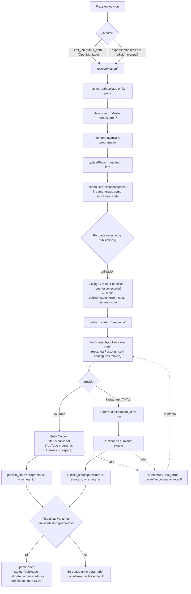

# Auto-publicación de piezas de RuloCodeShow

> Documento de **exploración**. No hay código nuevo todavía: esto es el mapa del
> pipeline actual, la viabilidad real de cada plataforma y el diseño propuesto
> para que Rulo confirme antes de construir.
>
> Fecha: 2026-08-10 · Autor: Claude (sesión de exploración) · Estado: **borrador para decisión**

---

## 0. TL;DR

- El pipeline **ya tiene el 80% de la infraestructura**: modelo de variantes por
  plataforma (`ContentPublication`), hook de transición de etapa
  (`updatePiece` → `moved`), patrón de job asíncrono con estado en jsonb
  (`edit_job`) y precedente exacto de OAuth con refresh token
  (`google-calendar.ts`). Falta el eslabón de red.
- Lo que **sí falta hoy**: no existe un campo canónico "este es el video final
  de la pieza" (el master vive en dos sitios y ninguno es obligatorio), y la
  etapa `programado` no exige que el master exista.
- **Viabilidad real**: YouTube es el único que se puede automatizar de punta a
  punta hoy (subida directa + programación nativa). Instagram Reels es viable
  pero exige que el mp4 esté en una URL pública. TikTok **obliga a paso manual**
  hasta pasar una auditoría de TikTok — sin excepción, ni siquiera para tu
  propia cuenta.
- **Recomendación: opción A (integración nativa), empezando por YouTube**, con
  la puerta abierta a delegar TikTok a un proveedor externo. Postiz self-hosted
  **no resuelve el problema**: te obliga igual a registrar tus propias apps de
  desarrollador y heredas exactamente las mismas auditorías, más un servicio
  extra que mantener.

---

## 1. Estado actual del pipeline (con rutas reales)

### 1.1 Dónde vive el modelo

| Qué | Dónde |
|---|---|
| Tipos de la pieza | [`packages/shared/src/types.ts:1175`](../packages/shared/src/types.ts#L1175) (`ContentPiece`) |
| Etapas + criterios de salida | [`packages/shared/src/content.ts`](../packages/shared/src/content.ts) (`STAGES`, `stageGates`, `pipelineProgress`, `isStuck`) |
| Persistencia + transiciones | [`apps/agent/src/content/store.ts`](../apps/agent/src/content/store.ts) |
| Crudos + render automático | [`apps/agent/src/content/edit.ts`](../apps/agent/src/content/edit.ts) |
| Carpeta del disco extraíble | [`apps/agent/src/content/media.ts`](../apps/agent/src/content/media.ts) |
| Rutas HTTP | [`apps/agent/src/index.ts:1121-1430`](../apps/agent/src/index.ts#L1121) (`/content/*`) |
| UI (tab Publicación) | [`apps/web/src/components/estudio/PieceWorkspace.tsx:1359`](../apps/web/src/components/estudio/PieceWorkspace.tsx#L1359) |
| Migraciones | `supabase/migrations/016_content.sql` … `020_content_media_dir.sql` |

### 1.2 Campos que ya existen y sirven para publicar

La pieza ya modela la variante por red — este es el registro donde debe vivir el
estado de publicación ([`types.ts:1165`](../packages/shared/src/types.ts#L1165)):

```ts
export interface ContentPublication {
  id: string;
  platform: "youtube" | "shorts" | "tiktok" | "reels" | "linkedin" | "x";
  title: string | null;
  copy: string | null;
  scheduled_at: string | null;
  status: "borrador" | "programada" | "publicada";
}
```

Hoy ese `status` **lo marca un humano a mano** desde el tab Publicación
([`PieceWorkspace.tsx:1361-1440`](../apps/web/src/components/estudio/PieceWorkspace.tsx#L1361)):
no hay ningún efecto de red detrás. Es un checkbox de memoria, no un hecho.

Otros campos relevantes de `ContentPiece`:

- `publish_at` — fecha/hora objetivo de la pieza (la principal).
- `platforms: string[]` — a qué redes va (lo usa el gate de `programado`).
- `format: "vertical" | …` — el vertical de ~40s es el caso de RuloCodeShow.
- `media_dir` — carpeta canónica sellada en el disco extraíble
  (`/Volumes/Rulo/estudio/<slug>/{crudos,assets,exports}`).
- `edit_job` — snapshot del run de OpenMontage.

### 1.3 Dónde está hoy el video final renderizado — **y por qué es un problema**

Hay **dos** lugares posibles y ninguno es obligatorio ni canónico:

1. **`piece.edit_job.output_path`** — ruta absoluta del master que reportó el run
   de OpenMontage, verificada contra el disco antes de marcar `done`
   ([`edit.ts:401-410`](../apps/agent/src/content/edit.ts#L401)):

   ```ts
   const outputOk = existsSync(result.output_path);
   await patchJob({ status: outputOk ? "done" : "error", output_path: outputOk ? result.output_path : null, … });
   ```

   Solo existe si la pieza pasó por la **edición automática**.

2. **`<media_dir>/exports/`** — el prompt del run le pide al agente copiar el
   master ahí ([`edit.ts:203`](../apps/agent/src/content/edit.ts#L203)) y
   `scanPieceMedia` lo lista
   ([`media.ts:107-120`](../apps/agent/src/content/media.ts#L107)). Si Rulo edita
   **a mano** (CapCut, Premiere, Final Cut), el master aparece aquí y **la base
   de datos no se entera de nada**.

> **Hueco #1** — falta un `master_path` sellado en la pieza. Sin él, un
> publicador no sabe qué archivo subir. Se resuelve con un resolvedor honesto:
> `edit_job.output_path` si existe y el archivo está en disco, si no el video más
> reciente de `exports/`, si no → no hay master y la publicación no arranca.

> **Hueco #2** — los criterios de salida de `programado`
> ([`content.ts:171-188`](../packages/shared/src/content.ts#L171)) piden variante
> por plataforma, copy y fecha… **pero no piden que el video exista**. Una pieza
> puede llegar a `programado` sin master. Falta el gate "Master renderizado".

### 1.4 Cómo se disparan acciones al cambiar de etapa

Este es el hallazgo importante: **el hook ya existe y está en un solo sitio**.
Toda transición pasa por `updatePiece()`
([`store.ts:166-206`](../apps/agent/src/content/store.ts#L166)):

```ts
const before = patch.status !== undefined ? await getPiece(id) : null;
const moved = before != null && before.status !== patch.status;
if (moved) {
  row.status_since = now;
  row.stage_history = [...before.stage_history, { status: patch.status, at: now }];
}
…
if (moved) {
  emit({ kind: "task_done", taskId: `content-${piece.id}`, detail: `"${piece.title}" → …` });
  void syncLinearState(piece);        // ← efecto lateral fire-and-forget, nunca bloquea
}
```

`syncLinearState` es la plantilla exacta del efecto que queremos: se dispara solo
en una transición **real**, no bloquea la respuesta y nunca lanza. Un
`schedulePublications(piece)` va justo al lado.

**Los otros mecanismos disponibles:**

- **Jobs periódicos**: `registerJob()` en [`apps/agent/src/jobs.ts:39`](../apps/agent/src/jobs.ts#L39),
  registrados en [`index.ts:2313-2330`](../apps/agent/src/index.ts#L2313)
  (`presence-heartbeat` 30s, `vault-knowledge-sync` 10min, `voice-transcripts`
  5min, `code-graph-update` 6h). Son `setInterval(...).unref()` en memoria del
  proceso, con anti-solape. **Ojo**: el registro se resetea en cada reinicio del
  agente ([`jobs.ts:5-7`](../apps/agent/src/jobs.ts#L5)) → **la cola de
  publicaciones NO puede vivir en memoria**, tiene que estar en Postgres y el job
  ser un simple "escanea y actúa" (self-healing entre reinicios, como
  `code-graph-update`).
- **Runs largos asíncronos**: `startEditRun` / `runEdit`
  ([`edit.ts:211-418`](../apps/agent/src/content/edit.ts#L211)) — responde de
  inmediato con el job en `running`, el progreso se escribe a la columna jsonb y
  la UI lo pinta con su poll de 10s; `⏹ Detener` es un `AbortController` real.
  **Este es el patrón a copiar tal cual para `publish_job`.**
- **Bus de eventos**: `emit()` de [`apps/agent/src/events.ts`](../apps/agent/src/events.ts)
  → SSE `/events` → ActivityFeed.

### 1.5 Manejo de secretos: el precedente ya está escrito

[`apps/agent/src/google-calendar.ts`](../apps/agent/src/google-calendar.ts) es
literalmente el molde:

- `GOOGLE_OAUTH_CLIENT_ID` / `_SECRET` / `_REFRESH_TOKEN` en el `.env` de la raíz,
  leídos en [`env.ts:46-53`](../apps/agent/src/env.ts#L46).
- Sin librería de Google: `fetch` al token endpoint, **access token cacheado en
  memoria** hasta 60s antes de expirar ([`google-calendar.ts:27-52`](../apps/agent/src/google-calendar.ts#L27)).
- `isConfigured()` como guard: si falta cualquiera de los tres, la feature se
  apaga sola y el resto del sistema degrada.
- Consentimiento **una sola vez** con un script de loopback:
  `pnpm --filter @hermes/agent google:auth` → [`apps/agent/scripts/google-oauth.ts`](../apps/agent/scripts/google-oauth.ts).

> **YouTube usa el mismo proveedor OAuth que Google Calendar.** Fase 1 reutiliza
> el script, el cliente OAuth del proyecto GCP existente y el patrón de caché;
> solo se agrega el scope y hay que **re-consentir** (un refresh token nuevo con
> los scopes ampliados).

### 1.6 El túnel (importante para Instagram)

`scripts/hermes-tunnel.sh` levanta un **quick tunnel** de cloudflared y publica
la URL vigente en `remote_config` (migración 013). La URL **rota** en cada
reinicio — por eso el móvil la descubre desde Supabase en vez de traerla bakeada.

Esto tiene consecuencia directa en el diseño (§4.3): Instagram exige que el mp4
esté en una URL pública, y TikTok exige **verificación de dominio** para su modo
`PULL_FROM_URL` — algo imposible con una URL rotativa. El pendiente ya anotado en
`CLAUDE.md` ("named tunnel con dominio propio, URL fija") deja de ser opcional y
pasa a ser **prerrequisito de la fase 2**.

---

## 2. Viabilidad real por plataforma

### 2.1 Tabla resumen

| | **YouTube Shorts** | **TikTok** | **Instagram Reels** |
|---|---|---|---|
| **API** | Data API v3 · `videos.insert` | Content Posting API v2 · `/v2/post/publish/video/init/` | Graph API · `/media` + `/media_publish` |
| **Auth** | OAuth2 Google (mismo proveedor que el calendario) | OAuth TikTok, scope `video.publish` | Instagram Login, `instagram_business_content_publish` |
| **Subir el archivo** | ✅ Subida directa (multipart/resumable) desde el disco | ⚠️ `FILE_UPLOAD` por chunks, o `PULL_FROM_URL` **con dominio verificado** | ⚠️ Requiere `video_url` **público**; el upload directo (`resumable`) solo con Facebook Login |
| **Programar fecha** | ✅ Nativo: `status.publishAt` | ❌ No existe | ❌ No existe |
| **Cuota** | Bucket propio de `videos.insert`: **100/día** | **6 req/min** por token de usuario | **100 posts / 24 h** móviles |
| **Bloqueo de aprobación** | 🔴 Proyecto no auditado → **el video queda privado** | 🔴 Cliente no auditado → **SELF_ONLY, siempre** | 🟢 Standard Access basta para tu propia cuenta |
| **¿Obliga paso manual?** | **Sí**, hasta pasar la auditoría (o dejarlo privado y publicar a mano desde Studio) | **Sí, siempre** hasta la auditoría — el post cae en el inbox y hay que confirmarlo en la app | **No**, si es tu propia cuenta y la app tiene tu rol |

### 2.2 YouTube Data API v3 — el más viable

**Flujo**: OAuth2 con refresh token → `POST videos.insert` con el binario
(`multipart` o `resumable`) + `snippet` (título, descripción, tags) + `status`.

**Scopes** para subir: `https://www.googleapis.com/auth/youtube.upload`
(alternativas más amplias: `youtube`, `youtube.force-ssl`).
Fuente: [videos.insert](https://developers.google.com/youtube/v3/docs/videos/insert).

**Cuota — cambió y es buena noticia.** El modelo ya no es "1600 unidades sobre
10.000". Hoy `videos.insert` y `search.list` tienen **buckets propios de 100
llamadas/día cada uno**, aparte de las 10.000 unidades del resto de endpoints.
Fuente: [determine_quota_cost](https://developers.google.com/youtube/v3/determine_quota_cost).
Para 3-5 piezas/semana esto sobra por dos órdenes de magnitud.

**Programación nativa** — `status.publishAt` sí existe, con una regla estricta:

> "It can be set only if the privacy status of the video is private." Y: "If your
> request schedules a video to be published at some time in the past, the video
> will be published right away."
> — [Videos resource](https://developers.google.com/youtube/v3/docs/videos)

O sea: se sube como `private` con `publishAt = piece.publish_at` y **YouTube se
encarga del timing**. No hace falta que Hermes esté vivo a esa hora.

**El bloqueo (🔴 leer con calma):**

> "All videos uploaded via the `videos.insert` endpoint from unverified API
> projects created after 28 July 2020 will be restricted to private viewing mode."
> — [videos.insert](https://developers.google.com/youtube/v3/docs/videos/insert)

El creador recibe un email diciendo que el video quedó bloqueado en privado. No
hay excepción documentada por subir a **tu propio canal** con **tu propio
proyecto** — y hay reportes de campo de exactamente ese caso
([youtubeuploader#86](https://github.com/porjo/youtubeuploader/issues/86)).
Se levanta pasando la auditoría de cumplimiento:
[Quota and Compliance Audits](https://developers.google.com/youtube/v3/guides/quota_and_compliance_audits)
(formulario "YouTube API Services - Audit and Quota Extension Form", sin código de por medio).

> ⚠️ **Pregunta abierta a verificar empíricamente**: si el proyecto está sin
> auditar, ¿un `publishAt` programado llega a disparar, o el bloqueo lo anula?
> Mi lectura de los docs es que el bloqueo gana. El plan de fases no depende de
> la respuesta (ver §5, fase 1).

### 2.3 TikTok Content Posting API — el que obliga a paso manual

**Requisitos**: app registrada en TikTok for Developers, producto *Content
Posting API* añadido, *Direct Post* habilitado en la config de la app, y el
usuario autorizando el scope `video.publish`.
Fuente: [content-posting-api-get-started](https://developers.tiktok.com/doc/content-posting-api-get-started).

**Transferencia del video**: `FILE_UPLOAD` (subida por chunks a una URL que da
TikTok) o `PULL_FROM_URL`. Este último exige que el desarrollador **verifique la
propiedad del prefijo de URL o del dominio** — imposible con un quick tunnel de
URL rotativa. Rate limit: **6 requests/minuto** por access token.
Fuente: [direct-post reference](https://developers.tiktok.com/doc/content-posting-api-reference-direct-post).

**El bloqueo (🔴 este es el duro):**

> "All content posted by unaudited clients will be restricted to private viewing
> mode." / "unaudited clients can only post to private accounts"

En sandbox el post cae en el inbox del usuario con `privacy_level: SELF_ONLY` y
**el humano tiene que confirmar la publicación desde la app de TikTok**. Solo tras
pasar la auditoría de TikTok la misma llamada publica en `PUBLIC_TO_EVERYONE`.
No hay atajo por ser tu propia cuenta.

**Conclusión honesta**: TikTok **no se puede automatizar de verdad** sin auditoría.
Con auditoría pendiente, lo máximo que da la integración es "el video ya está
cargado en tu inbox, dale publicar" — que sigue siendo mejor que exportar y subir
desde el celular, pero **no es publicación automática**.

### 2.4 Instagram Reels — viable, con la fricción del hosting

**Cuenta**: Instagram **profesional** (Business o Creator). Con *Instagram API
with Instagram Login* **ya no hace falta una Página de Facebook enlazada**
(scopes `instagram_business_basic`, `instagram_business_content_publish`).
Fuente: [Instagram API with Instagram Login](https://developers.facebook.com/docs/instagram-platform/instagram-api-with-instagram-login).

**Flujo de 3 pasos** ([content-publishing](https://developers.facebook.com/docs/instagram-platform/content-publishing)):

1. `POST /media` con `media_type=REELS` + `video_url` → devuelve un container id.
2. `GET /{container_id}?fields=status_code` en bucle hasta `FINISHED`.
3. `POST /media_publish` con `creation_id={container_id}`.

**Hosting**: el video debe estar "hosted on a public server" al momento de
publicar. Hay upload resumible vía `rupload.facebook.com`, pero **solo para
implementaciones con Facebook Login**. Con Instagram Login toca la URL pública.

**Rate limit**: 100 posts publicados por API en 24 h móviles. **Sin scheduling**
en la API: si quieres una hora exacta, la dispara tu propio scheduler.

**Aprobación**: los docs de content publishing listan "Access Level: Advanced **or
Standard** Access". Y Standard Access "permite pedir permisos solo a usuarios que
tienen un rol en la app", se **auto-aprueba** y no exige Business Verification ni
App Review ([access levels](https://developers.facebook.com/docs/graph-api/overview/access-levels)).
Como Rulo es dueño de la app **y** de la cuenta, encaja en Standard.

> ⚠️ Meta cambia esto con frecuencia. Tratarlo como "probablemente sí, verificar
> en 30 minutos con una prueba real antes de escribir el resto de la fase 2".

---

## 3. Opción A vs Opción B

### 3.1 La pregunta correcta

La tentación es "B es menos trabajo porque alguien ya resolvió las APIs". Eso es
verdad **solo si el proveedor publica con SUS credenciales ya auditadas**.

**Postiz self-hosted no lo hace.** Para conectar cada red hay que registrar tus
**propias** apps de desarrollador y meter client id/secret en el docker-compose:
la doc de TikTok de Postiz pide cuenta de desarrollador de TikTok, añadir *Login
Kit* + *Content Posting API*, activar *Direct Post* y **verificar la propiedad de
un sitio HTTPS público** ([docs.postiz.com/providers/tiktok](https://docs.postiz.com/providers/tiktok)).
Es decir: **heredas la auditoría de TikTok y la de YouTube íntegras**, y encima
mantienes un servicio más (Postgres + Redis + backend + worker) para no ahorrarte
el problema real.

Los que **sí** saltan la auditoría son los SaaS hospedados —
[Metricool](https://help.metricool.com/api-access-export-your-metricool-data-to-other-tools-and-automate-tasks-x8ln5)
(API solo en plan Advanced o superior, header `X-Mc-Auth`), Publer, Buffer —
porque publican bajo sus propias apps ya aprobadas.

**Entonces la comparación real no es "nativo vs herramienta", es
"auditar mis propias apps vs pagar por las de alguien más".**

### 3.2 Comparación

| Criterio | **A · Nativo en hermes-os** | **B · Delegar (Metricool/Publer)** | **B' · Postiz self-hosted** |
|---|---|---|---|
| Esfuerzo inicial | Medio-alto: 1 cliente HTTP por red | Bajo: 1 cliente HTTP + mapeo de canales | Medio: desplegar servicio + registrar apps propias |
| ¿Salta las auditorías? | ❌ No | ✅ Sí (usan sus apps aprobadas) | ❌ **No** |
| Costo recurrente | $0 | Plan Advanced de Metricool (o equivalente) | $0 en licencia, sí en infra + mantenimiento |
| Mantenimiento | Alto: 3 APIs que rompen por su cuenta | Bajo: 1 API estable | Alto: infra + 3 APIs + upgrades del proyecto |
| Riesgo de romperse | Medio (cambios de Meta/TikTok) | Bajo-medio (el proveedor absorbe) + riesgo de vendor | Alto (dos capas que pueden romperse) |
| Encaje arquitectónico | 🟢 Perfecto: mismo patrón que `edit_job`, `google-calendar.ts`, `linear.ts` | 🟡 Bien, pero mete un tercero en el camino del dato | 🔴 Malo: un segundo servicio con su BD, contra "no agregar dependencias pesadas" |
| Control del dato | Total (ids remotos, errores, métricas en Supabase) | Parcial (lo que exponga la API del proveedor) | Total pero en OTRA base de datos |
| Deuda si se abandona | Código propio, borrable | Piezas atadas a un SaaS | Servicio zombi |

### 3.3 Recomendación

> **Opción A, nativa, empezando por YouTube — con una interfaz de `provider` que
> deje enchufar la opción B para TikTok si la auditoría no vale la pena.**

Por qué:

1. **YouTube solo tiene sentido nativo.** Es el único con programación nativa y
   subida directa desde el disco; meter un intermediario para eso es pagar por
   perder control. Y el OAuth ya está resuelto en el repo — es el mismo proveedor
   que el calendario, con script de consentimiento incluido.
2. **La arquitectura ya lo pide.** `publish_job` es `edit_job` con otra carga
   útil: mismo jsonb, mismo poll de 10s, mismo ⏹ Detener, mismos guardrails. El
   código nuevo es sobre todo cliente HTTP, no plomería.
3. **B no elimina el trabajo, lo mueve.** Con Metricool sigues necesitando el
   master resuelto, el copy por red, el estado por variante, los reintentos y la
   UI. Lo único que te ahorras son los tres clientes HTTP — y a cambio pagas un
   plan y le entregas el momento de publicación a un tercero.
4. **B sí gana en un caso concreto: TikTok.** Si la auditoría de TikTok se
   atasca, delegar SOLO TikTok es la salida limpia. Por eso el diseño lleva una
   interfaz `PublishProvider` desde el día uno: `youtube` y `instagram` nativos,
   `tiktok` intercambiable entre nativo y `metricool` con un cambio de config.
5. **Postiz self-hosted: no.** Es la peor de las tres — todos los costos de A,
   todos los de B, y ninguna de las dos ventajas.

---

## 4. Diseño propuesto

### 4.1 Flujo



**Dos decisiones de diseño que vale la pena subrayar:**

- **YouTube se sube apenas la pieza entra a `programado`**, no cuando llega la
  fecha. La subida es lo lento y lo que puede fallar; hacerla temprano da margen
  para arreglar problemas, y `publishAt` deja que YouTube haga el timing exacto
  aunque el Mac esté apagado.
- **La cola vive en Postgres, nunca en memoria.** `registerJob` se resetea en cada
  reinicio ([`jobs.ts:5-7`](../apps/agent/src/jobs.ts#L5)); el job debe ser un
  "escanea la tabla y actúa", igual que `code-graph-update`. Así un reinicio a
  mitad de una publicación no pierde nada.

### 4.2 Modelo de datos (migración 021 propuesta)

**Columnas nuevas en `content_pieces`:**

```sql
alter table content_pieces
  -- El master canónico: lo sella el run de edición o el escaneo de exports/.
  add column if not exists master_path text,
  -- Snapshot del run de publicación en curso/último (patrón edit_job).
  add column if not exists publish_job jsonb;
```

**`ContentPublication` crece** (es jsonb, no requiere DDL — solo migrar el tipo y
hacer backfill de defaults):

```ts
export interface ContentPublication {
  id: string;
  platform: "youtube" | "shorts" | "tiktok" | "reels" | "linkedin" | "x";
  title: string | null;
  copy: string | null;
  scheduled_at: string | null;
  /** Estado editorial que marca el humano (se queda como está). */
  status: "borrador" | "programada" | "publicada";

  // ── nuevo: el estado REAL de la publicación automática ──
  /** Quién publica. 'manual' = Rulo lo sube a mano, Hermes solo lleva registro. */
  provider: "youtube" | "instagram" | "tiktok" | "metricool" | "manual";
  /** Estado de la máquina, distinto del editorial: aquí no hay checkbox decorativo. */
  publish_state: "pendiente" | "subiendo" | "programada" | "publicada" | "error" | "manual";
  /** Id del video en la plataforma (idempotencia: si existe, JAMÁS se re-sube). */
  remote_id: string | null;
  remote_url: string | null;
  attempts: number;
  last_attempt_at: string | null;
  last_error: string | null;
}
```

> **La regla de oro del dashboard aplica aquí**: `status` (editorial, humano) y
> `publish_state` (máquina, verificado contra la API) son cosas distintas y no
> deben colapsarse. Cuando la API confirma, el sistema puede subir `status` a
> `publicada` — pero nunca al revés.

**Cuentas conectadas** — dos caminos, y recomiendo empezar por el barato:

| | (a) `.env` de la raíz | (b) Tabla `social_accounts` |
|---|---|---|
| Cómo | YouTube **reusa** `GOOGLE_OAUTH_*` con el scope ampliado; IG/TikTok agregan `IG_*` / `TIKTOK_*` al lado | Fila por cuenta: `provider`, `label`, `refresh_token`, `scopes`, `expires_at`, `connected_at`; RLS deny-all (service role, como todo el Estudio) |
| Pros | Idéntico al precedente de `google-calendar.ts`; cero infra; el secreto nunca sale del disco de Rulo | Varias cuentas; rotación sin reiniciar; visible desde la UI |
| Contras | Una cuenta por red; rotar exige reiniciar el agente | Tokens de larga vida en Supabase (aunque con RLS deny-all) |

**Recomendación**: **(a) para la fase 1** — es el patrón que ya existe y que ya
está probado con el calendario. Migrar a (b) solo si aparece una segunda cuenta o
si la UI necesita mostrar "conectado/desconectado" por red.

En ambos casos: **nada hardcodeado**, `isConfigured()` por provider como guard
(igual que [`google-calendar.ts:18`](../apps/agent/src/google-calendar.ts#L18)),
y `.env.example` documentando cada variable sin valores.

### 4.3 Archivos nuevos propuestos

```
apps/agent/src/content/
  publish.ts        # orquestador: resolveMaster, schedulePublications, el job, reintentos
  providers/
    types.ts        # interface PublishProvider { isConfigured, upload, checkStatus }
    youtube.ts      # OAuth (reusa el patrón de google-calendar.ts) + videos.insert resumable
    instagram.ts    # container → poll status_code → media_publish     [fase 2]
    tiktok.ts       # init + FILE_UPLOAD por chunks                    [fase 3]
    metricool.ts    # fallback delegado                                [fase 3, opcional]
  media-serve.ts    # endpoint firmado y efímero para exponer el mp4   [fase 2]
supabase/migrations/021_content_publish.sql
```

Rutas nuevas en `index.ts`, siguiendo la convención de `/content/*`:

- `POST /content/pieces/:id/publish` — dispara ya (o re-dispara) las variantes.
- `POST /content/pieces/:id/publish/stop` — `AbortController`, como `edit-run/stop`.
- `GET  /content/publish/accounts` — qué providers están configurados (para la UI).
- `GET  /media/piece/:id/:token.mp4` — **fase 2**: sirve el master a Meta con un
  token firmado, de un solo uso y con expiración corta. Debe quedar **fuera** del
  middleware de auth del agente (Meta no lleva Bearer) y por eso el token firmado
  es obligatorio, no opcional.

### 4.4 Fallos y reintentos

| Situación | Qué hace el sistema |
|---|---|
| No hay master en disco | `publish_state='error'`, `last_error` explícito, **no reintenta** (es un problema humano) |
| Falta el copy de una variante | Ni siquiera entra a la cola; lo bloquea el gate de `programado` |
| Provider sin configurar | `publish_state='manual'` — la variante existe, Hermes no la toca, la UI dice "súbela tú" |
| HTTP 5xx / timeout / red caída | `attempts++`, backoff exponencial (1 → 5 → 25 → 60 min), tope **5** → `error` |
| HTTP 4xx (copy inválido, cuota, permiso) | `error` de una, **sin reintentos** (reintentar un 4xx solo quema cuota) |
| Token expirado / revocado | `error` con mensaje accionable ("re-consiente con `pnpm youtube:auth`") |
| Reinicio del agente a mitad de subida | La variante quedó en `subiendo` con `last_attempt_at`; el job la rescata pasados 30 min y reintenta |
| **Subida duplicada** | `remote_id` es el candado: si ya existe, la variante **jamás** se vuelve a subir. Es el fallo más caro (dos videos en el canal) |
| YouTube deja el video privado por proyecto no auditado | Se detecta leyendo `status.privacyStatus` tras subir → `publish_state='manual'` + aviso "listo en Studio, dale público" |

Todo error visible en el tab Publicación con su mensaje literal y un ↻ Reintentar
manual — el mismo lenguaje que ya usa `edit_job`.

---

## 5. Plan de implementación por fases

### Fase 0 · El master canónico (~½ día, sin nada de red)

Entrega valor solo: hoy nadie sabe con certeza si una pieza tiene video.

1. `master_path` en la pieza (migración 021) + `resolveMaster(piece)`:
   `edit_job.output_path` si el archivo existe → si no, el video más reciente de
   `<media_dir>/exports/` → si no, `null`.
2. Sellarlo cuando `record_edit_result` verifica el master
   ([`edit.ts:401`](../apps/agent/src/content/edit.ts#L401)) y cuando
   `scanPieceMedia` encuentra algo en `exports/`.
3. **Gate nuevo** en `programado` ([`content.ts:171`](../packages/shared/src/content.ts#L171)):
   "Master renderizado" — comprobado contra el disco, no un checkbox.
4. UI: el tab Publicación muestra el master (nombre, duración, ⊙ Finder).

### Fase 1 · YouTube Shorts (~2 días) ← **empezar aquí**

1. **OAuth: es un cambio de una línea.** En
   [`scripts/google-oauth.ts:23`](../apps/agent/scripts/google-oauth.ts#L23) el
   scope es una constante suelta:

   ```ts
   const SCOPE = "https://www.googleapis.com/auth/calendar.events";
   ```

   Basta con añadir `https://www.googleapis.com/auth/youtube.upload` separado por
   espacio y volver a correr `pnpm --filter @hermes/agent google:auth`: el script
   ya usa `access_type:"offline"` + `prompt:"consent"`, así que devuelve un
   refresh token nuevo con ambos scopes y el calendario sigue funcionando igual.
   **Mismo cliente OAuth del proyecto GCP que ya usa el calendario** — hay que
   habilitar la YouTube Data API v3 en ese proyecto y guardar el token nuevo en
   `GOOGLE_OAUTH_REFRESH_TOKEN`.
2. `providers/youtube.ts`: token cacheado (copiar
   [`google-calendar.ts:27-52`](../apps/agent/src/google-calendar.ts#L27)) +
   `videos.insert` resumable con `snippet` (título/descripción del copy de la
   variante, `#Shorts`) y `status` (`privacyStatus:'private'`,
   `publishAt: piece.publish_at`, `selfDeclaredMadeForKids:false`).
3. `publish.ts`: `schedulePublications` colgado del `moved` de
   [`store.ts:198`](../apps/agent/src/content/store.ts#L198) + job
   `content-publish` cada 5 min + reintentos.
4. UI: estado real por variante en el tab Publicación, ⏹ Detener, ↻ Reintentar.
5. **Verificar empíricamente** si el video queda bloqueado en privado.

> **Esta fase entrega valor aunque la auditoría no exista.** El peor caso es
> "el video ya está en tu canal, con título, descripción y fecha puestos — solo
> falta darle público en Studio". Eso ya elimina la subida manual, que es el 90%
> del trabajo y el 100% de la espera.

### Fase 1.5 · Auditoría de YouTube (0 código, días o semanas de espera)

Enviar el *YouTube API Services - Audit and Quota Extension Form*
([guía](https://developers.google.com/youtube/v3/guides/quota_and_compliance_audits)).
Arrancar temprano: corre en paralelo mientras se construye la fase 2.

### Fase 2 · Instagram Reels (~2 días + el túnel)

**Bloqueante real**: named tunnel de Cloudflare con dominio propio (URL fija) —
el pendiente que ya está anotado en `CLAUDE.md`. Un quick tunnel rotativo puede
funcionar en una prueba puntual, pero no es base para producción.

1. Named tunnel + dominio.
2. `media-serve.ts`: `GET /media/piece/:id/:token.mp4`, token HMAC de un solo uso
   con TTL corto, fuera del middleware de auth.
3. `providers/instagram.ts`: container → poll `status_code` hasta `FINISHED` →
   `media_publish`. Sin scheduling nativo → lo dispara el job local.
4. Antes de escribir nada: **prueba de 30 minutos** confirmando que Standard
   Access publica en la cuenta propia sin App Review.

### Fase 3 · TikTok — decisión, no implementación automática

Al llegar aquí ya habrá dos redes automatizadas y datos reales para decidir:

- **3a · Auditoría propia**: `providers/tiktok.ts` con `FILE_UPLOAD` por chunks
  (evita la verificación de dominio de `PULL_FROM_URL`) + enviar la auditoría.
  Mientras no pase: el video llega al inbox y Rulo confirma en la app.
- **3b · Delegar a Metricool/Publer** solo para TikTok, implementando
  `providers/metricool.ts` contra la misma interfaz `PublishProvider`.

Recomendación provisional: **3a con expectativa de "asistido, no automático"**, y
saltar a 3b solo si la auditoría se rechaza o se atasca más de un mes.

### Fuera de alcance de este plan

LinkedIn y X están en el union de `ContentPublication["platform"]` pero no en el
objetivo declarado (Shorts + TikTok + Reels). Se pueden sumar después contra la
misma interfaz; LinkedIn en particular es fácil y ya tiene precedente de guiones
en el repo (los posts de LinkedIn donde el guion ES el texto).

---

## 6. Riesgos

| Riesgo | Impacto | Mitigación |
|---|---|---|
| **Subida duplicada** al canal | Alto — visible para la audiencia | `remote_id` como candado; nunca re-subir si existe |
| Auditoría de YouTube rechazada o lenta | Medio | La fase 1 vale igual (video privado listo en Studio) |
| Auditoría de TikTok rechazada | Medio | Plan B ya diseñado (3b, delegar) |
| Meta cambia Standard Access | Medio | Verificar ANTES de escribir la fase 2 |
| El master no existe cuando la pieza avanza | Alto | Gate "Master renderizado" en fase 0 |
| Refresh token revocado en silencio | Medio | `isConfigured()` + error accionable + chip de estado en la UI |
| El túnel se cae durante una publicación de IG | Medio | Reintento con backoff; el container de Meta expira y se recrea |
| Tokens OAuth en el `.env` | Medio | Ya es el modelo del repo; `.env` fuera de git, `.env.example` sin valores |
| Publicar algo equivocado automáticamente | **Alto** | El disparo lo hace un humano al mover a `programado`; los gates son criterios reales; ⏹ Detener aborta de verdad |

---

## 7. Decisiones abiertas — necesito que Rulo confirme

1. **`youtube` vs `shorts` en el union de plataformas.** Hoy son dos valores
   distintos ([`types.ts:1167`](../packages/shared/src/types.ts#L1167)) pero para
   un vertical de 40s son la misma subida. ¿Colapsamos a `shorts`, o los dos
   mapean al provider `youtube`?
2. **¿Publicar automáticamente o "un clic para confirmar"?** El diseño de arriba
   publica solo al entrar a `programado`. La alternativa conservadora: dejar todo
   listo y que el último botón sea humano. **Mi recomendación: automático para
   YouTube** (queda privado hasta su fecha, es reversible) **y confirmación humana
   para IG** las primeras semanas.
3. **Secretos: `.env` (a) o tabla `social_accounts` (b)?** Recomiendo (a) para la
   fase 1.
4. **¿Arrancamos la auditoría de YouTube ya**, antes de escribir código? Es gratis
   y el tiempo de espera corre en paralelo.
5. **¿Hay presupuesto para el plan Advanced de Metricool** como red de seguridad
   de TikTok, o TikTok se queda en "asistido" indefinidamente?
6. **Named tunnel con dominio propio**: ¿lo montamos en la fase 2, o antes por
   otras razones (la URL rotativa también molesta al móvil)?
7. **`publish_at` de la pieza vs `scheduled_at` de cada variante.** Hoy conviven.
   ¿La fecha de la pieza es el default y cada variante puede desviarse (escalonar
   Shorts a las 7am y Reels a las 12pm), o una sola fecha manda para todas?

---

## Fuentes

**YouTube**
- [videos.insert — YouTube Data API v3](https://developers.google.com/youtube/v3/docs/videos/insert) (scopes, restricción de proyectos no verificados)
- [Videos resource](https://developers.google.com/youtube/v3/docs/videos) (`status.publishAt`, `privacyStatus`)
- [Determine quota cost](https://developers.google.com/youtube/v3/determine_quota_cost) (buckets separados, 100 `videos.insert`/día)
- [Quota and Compliance Audits](https://developers.google.com/youtube/v3/guides/quota_and_compliance_audits)
- [youtubeuploader#86](https://github.com/porjo/youtubeuploader/issues/86) (reporte de campo del bloqueo en canal propio)

**TikTok**
- [Content Posting API — Get Started](https://developers.tiktok.com/doc/content-posting-api-get-started) (registro, `video.publish`, auditoría)
- [Direct Post reference](https://developers.tiktok.com/doc/content-posting-api-reference-direct-post) (`FILE_UPLOAD` vs `PULL_FROM_URL`, verificación de dominio, 6 req/min, `privacy_level`)

**Instagram / Meta**
- [Content Publishing — Instagram Platform](https://developers.facebook.com/docs/instagram-platform/content-publishing) (REELS, `video_url`, 100 posts/24h, sin scheduling)
- [Instagram API with Instagram Login](https://developers.facebook.com/docs/instagram-platform/instagram-api-with-instagram-login) (sin Página de Facebook, scopes `instagram_business_*`)
- [Graph API Access Levels](https://developers.facebook.com/docs/graph-api/overview/access-levels) (Standard vs Advanced Access)

**Opción B**
- [Postiz Public API](https://docs.postiz.com/public-api/introduction) (base URL self-hosted, `/upload`, `/posts`, 90 req/h)
- [Postiz — proveedor TikTok](https://docs.postiz.com/providers/tiktok) (exige app de desarrollador propia + verificación de sitio HTTPS)
- [gitroomhq/postiz-app](https://github.com/gitroomhq/postiz-app)
- [Metricool — API Access](https://help.metricool.com/api-access-export-your-metricool-data-to-other-tools-and-automate-tasks-x8ln5) (plan Advanced, header `X-Mc-Auth`)

> Notas de versión: consultado el **2026-08-10**. Las APIs de Meta y TikTok
> cambian requisitos de acceso con frecuencia — reverificar cada afirmación
> marcada con ⚠️ antes de escribir la fase correspondiente.
