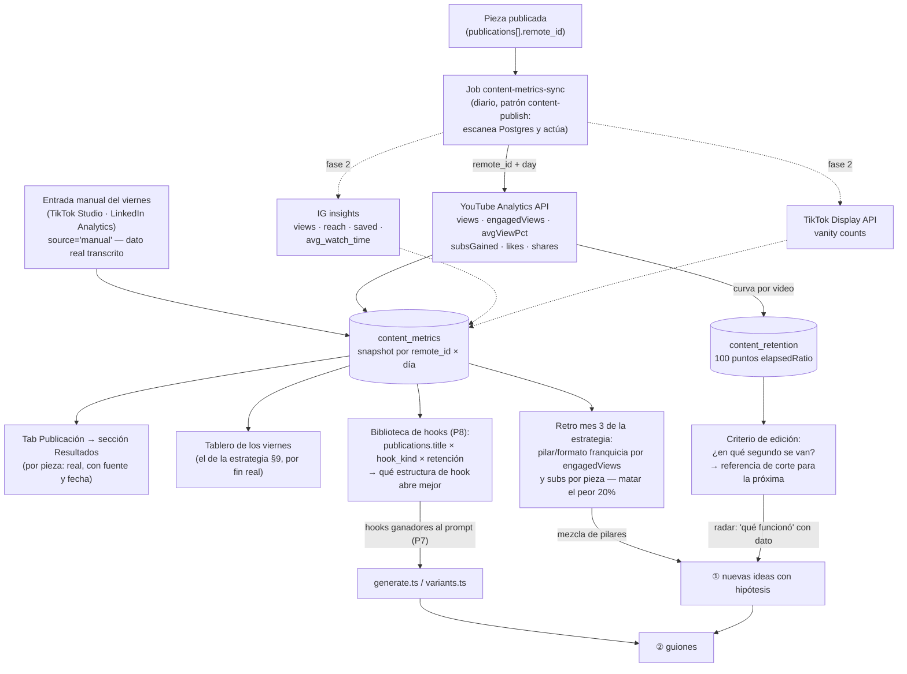

# Mejoras al flujo de creación de contenido (RuloCodeShow)

> Auditoría del ciclo completo idea → guion → grabación → edición → publicación
> → resultados. Medido contra la base real, el repo, el vault y el disco el
> **2026-08-10 (12:20 Bogotá)**. Cada número lleva su consulta reproducible
> (apéndice A). No se modificó código de producción ni ninguna pieza real.
>
> Autor: Claude (auditoría) · Estado: **para decisión de Rulo**

---

## 0. TL;DR

El sistema está **sobre-construido hacia adelante y desconectado hacia atrás**:
tiene teleprompter con beats, edición automática con OpenMontage y publicación
a YouTube con programación nativa — y sin embargo produce ~1 pieza cada 2
semanas contra un plan de 8-9 semanales, porque:

1. **La grabación no sucede.** 8 de las 12 piezas "atascadas en guion" ya
   cumplen sus tres criterios de salida: no están escribiéndose, están
   **escritas esperando cámara**. El cuello de botella no es el guion — es que
   el batch sabatino nunca arrancó.
2. **El sistema vive de un único lote de planeación.** 20 de las 22 piezas
   nacieron el mismo día (2026-07-24). Desde entonces han nacido 2 ideas en 17
   días, el calendario tiene 12 fechas ya vencidas y el colchón de programadas
   es 0 (la regla de la estrategia pide ≥3).
3. **El bucle de resultados no existe** — y no es solo que falte el código:
   la estrategia ya lo diseñó en papel (tablero de los viernes, KPIs de
   retención, retro mensual) y nada lo implementa. Hoy ni siquiera se sabe
   cuántas views tiene el único Short publicado por el sistema.

La pieza 23 ("5 cosas para lanzar una app") demostró que el pipeline **sí
funciona de punta a punta cuando se usa**: idea → publicado en 6 días, con
RecordMode, edición automática y subida a YouTube. El problema no es la
maquinaria: es que el flujo de entrada (ideas), la restricción física
(grabación) y el flujo de retorno (métricas) están desconectados de ella.

---

## 1. Diagnóstico medido, fase por fase

Estado del tablero (`GET /content/board`, apéndice A.1):

| Métrica | Valor medido 2026-08-10 |
|---|---|
| Piezas totales | 22 (idea 6 · guion 12 · grabacion 1 · edicion 1 · publicado 2) |
| Piezas con `ref_id` | **0** |
| Sesiones de grabación | 1 ("Batch #1", marcada `completada` con 2/4 ítems sin marcar) |
| Referencias del radar | 15 (7 tendencias · 6 referentes · 2 guardadas) |
| Piezas con `publish_at` | **22/22** — y **12 con la fecha ya vencida** |
| Piezas en `programado` (el colchón) | **0** (la estrategia exige mínimo 3) |
| Mensajes del chat por pieza | 20, en 4 piezas (ids 2, 12, 22, 23) |
| Código de ingesta de métricas | **0 líneas** (apéndice A.6) |

### ① IDEA — no hay flujo de entrada: hay un lote congelado

- **20 de las 22 piezas se crearon el 2026-07-24** (el lote de planeación
  inicial); solo 2 nacieron después: la 22 el 07-25 y la 23 el 08-04
  (apéndice A.2). El ritmo real de ideas nuevas es ~1/quincena contra una
  cadencia planeada de 16 piezas en el mes 1
  (`vault: projects/rulocode/docs/estrategia-marca-personal-2026.md`, §8).
- **Las 6 ideas vivas incumplen su propio gate de "ángulo escrito"**: ninguna
  tiene hook ni notas ([`content.ts:126-130`](../packages/shared/src/content.ts#L126);
  medición A.2). Todas tienen plataforma y fecha — es decir, tienen *logística*
  pero no *hipótesis*.
- **El radar no está roto: está sin estrenar.** El camino "referencia → pieza
  con `ref_id`" existe en la UI
  ([`EstudioRadar.tsx:162`](../apps/web/src/components/estudio/EstudioRadar.tsx#L162))
  y `createPiece` acepta `refId`
  ([`store.ts:72`](../apps/agent/src/content/store.ts#L72)). Pero las 15
  referencias son del mismo lote del 07-24 (A.3) — desde entonces no se ha
  capturado ni una referencia nueva, así que tampoco ha habido ocasión de
  convertir una. El 0 en `ref_id` es síntoma del cuello #2, no un bug del radar.
- **La tool de voz/chat crea ideas sin ángulo por diseño**:
  `create_content_idea` ([`tools.ts:592-620`](../apps/agent/src/agent/tools.ts#L592))
  solo acepta `title/pillar/platforms/format/hook` — no acepta `notes`, ni
  `ref_id`, ni nada parecido a una hipótesis ("esto funciona porque X"). Una
  idea dictada por voz nace incumpliendo el gate de idea.
- **Fuentes de demanda real desconectadas**: el repo ya tiene reuniones con
  accionables (`meetings`), conversaciones de voz/chat indexadas, issues de
  Linear y el RPC `match_knowledge` — ninguna alimenta ideas de contenido. El
  precedente arquitectónico existe: el triage de accionables de juntas ya crea
  issues de Linear; el mismo patrón serviría para "dolor de cliente → idea con
  hipótesis".

### ② GUION — el falso cuello de botella

- **8 de las 12 piezas en `guion` ya cumplen los tres gates** (hook ✓, ≥120
  palabras ✓, CTA ✓ — medición A.4 con la regex real de
  [`content.ts:144`](../packages/shared/src/content.ts#L144)). Llevan ahí
  desde el 07-24: 17 días contra un SLA de 7. **No se están escribiendo:
  están escritas.** Lo que no sucede es el paso siguiente (grabar).
- **La regex del CTA, verificada contra los 15 guiones del vault** (A.5):
  11 ✓ / 4 ✗. Los 4 "sin CTA" (`construi-un-copiloto`, `le-hablo-a-mi-computador`,
  `mi-codigo-es-una-galaxia-3d`, `mi-tutor-de-ingles`) **sí cierran con una
  pregunta a comentarios** ("¿Lo usarías en tus reuniones? 👇") — que es
  exactamente el CTA del mes 1 según la estrategia (seguir + comentar con
  pregunta concreta). Son **falsos negativos**: la regex busca verbos
  explícitos y se pierde el patrón pregunta-cierre. En sentido contrario, el
  literal `\bcta\b` se satisface con un encabezado `## CTA` vacío (hoy matchea
  la etiqueta en 2 guiones, no la frase). Veredicto: el criterio apunta bien
  pero mide mal — debería evaluar el **último bloque** del guion (¿hay pregunta
  o verbo de CTA en el cierre?), no todo el markdown.
- **El gate de ≥120 palabras contradice la espec del propio sistema.** El
  system prompt de generación pide verticales de **~90-120 palabras habladas**
  ([`generate.ts:35`](../apps/agent/src/content/generate.ts#L35)), pero el gate
  cuenta **todas** las palabras del markdown — marcas de tiempo, cues de demo y
  notas incluidas ([`content.ts:113,137`](../packages/shared/src/content.ts#L113)).
  Hoy pasa de casualidad porque los cues inflan el conteo (los guiones reales
  miden 156-400 palabras brutas pero ~74-185 habladas, reporte del vault). Un
  vertical perfecto y magro podría fallar el gate. El parser que distingue lo
  hablado ya existe ([`script-beats.ts`](../apps/web/src/lib/script-beats.ts),
  `words` por beat) — pero vive en `apps/web` y el gate en `packages/shared`.
- **`generate.ts` genera a ciegas — confirmado leyendo su prompt.** El
  contexto es únicamente los campos de la propia pieza
  ([`generate.ts:102-111`](../apps/agent/src/content/generate.ts#L102)); la
  estrategia va **resumida y hardcodeada** en el system prompt
  ([`generate.ts:27-41`](../apps/agent/src/content/generate.ts#L27)); no lee el
  radar, ni la estrategia del vault, ni guiones anteriores, ni el code-graph —
  y no puede: sus `allowedTools` son solo `record_content_kit`
  ([`generate.ts:119`](../apps/agent/src/content/generate.ts#L119)), así que el
  `cwd` apuntando al vault es letra muerta. Lo mismo aplica a `variants.ts` y
  al chat de la pieza (mismo patrón de prompt).
- **¿Qué distingue a las que avanzaron?** No la calidad del guion (estructura
  y longitud son homogéneas en el set, reporte del vault). Las 4 piezas
  tocadas en agosto son exactamente las 4 con actividad humana reciente (chat,
  tomas, transiciones). La pieza 23 — creada, grabada, editada y publicada
  entre el 08-04 y el 08-10 — sugiere que el modelo que funciona es **"en
  caliente"**: idea → publicado en 6 días, sin pasar por la nevera del lote.
- **Hooks sin memoria**: `variants.ts` ya genera versiones con `angle`
  etiquetado ([`variants.ts:27,63`](../apps/agent/src/content/variants.ts#L27))
  y `publications[].title` guarda qué hook salió a cada red — pero nada une
  "este ángulo de hook" con "esto pasó" porque no hay métricas (fase ⑥). La
  biblioteca de hooks es imposible sin cerrar el bucle; los datos que faltan
  están en §4.

### ③ GRABACIÓN — la restricción real del sistema

- **1 sesión en todo el histórico** ("Batch #1 — pilar Jarvis + 3 verticales",
  2026-07-25), marcada `completada` con 2 de 4 ítems del checklist sin marcar
  y cuya carpeta declarada (`~/Grabaciones/rulocode/2026-07-25-batch1`) **no
  existe en el disco** (A.7). El batch sabatino de la estrategia no arrancó.
- **Tomas con veredicto real: 1 pieza.** La 23 tiene 6 tomas `buena` (RecordMode
  usado de verdad). Las "tomas" de las piezas 13 y 22 son el plan generado por
  el kit — nacen con `verdict: "revisar"` por defecto
  ([`generate.ts:139`](../apps/agent/src/content/generate.ts#L139)) y nadie las
  ha tocado. Medición A.2: `13 → {revisar: 5}`, `22 → {revisar: 7}`,
  `23 → {buena: 6}`. RecordMode es sofisticado y **sí funcionó** la única vez
  que se usó — el problema es que se ha usado una vez.
- **El contrato del disco extraíble no se usa ni en la pieza que salió.** Solo
  2 piezas tienen `media_dir` (las creadas después de la migración 020); sus
  dos carpetas existen en `/Volumes/Rulo/estudio/` pero con `crudos/`, `assets/`
  y `exports/` **vacíos** (A.7). Los crudos reales de la 23 se vincularon desde
  `~/Downloads` y `~/Pictures/screenshots` (A.2) — es decir, el flujo real de
  captura (celular → AirDrop/Descargas) no pasa por la carpeta canónica, y el
  checklist de captura contra el disco no marca nada. Hipótesis (no medida):
  el disco no siempre está montado y la fricción de moverlo ahí es mayor que
  el beneficio del check automático.

### ④ EDICIÓN — la automática funcionó; los puntos de edición son decorado

- **El run de OpenMontage se usó 1 vez y funcionó**: pieza 23, `edit_job.status
  = done`, master verificado en disco (1080×1920, 34.1s, h264+aac) y sellado en
  `master_path` (A.2). La única pieza editada es la única publicada — la
  cadena edición→publicación está sana.
- **Dato incómodo: la 23 tenía 0 `edit_points`.** Los únicos `edit_points` del
  sistema están en las piezas 13 (8) y 22 (6) — ambos generados por el kit en
  etapa de guion, con timecodes estimados, y ninguno ha llegado jamás a un run
  de edición. El run que sí corrió fue footage-led (así lo dirige el
  AGENT_GUIDE de OpenMontage) y no los necesitó. Conclusión: los `edit_points`
  como "instrucciones del kit al editor" están sin validar; hoy son un plan
  especulativo que nadie consume.
- **Referencias de edición**: `content_refs` guarda texto libre (título, body,
  métrica, fuente — A.3). No hay nada tipado sobre ritmo/cortes/captions que se
  pueda "aplicar" a una pieza. Propuesta en §3 (P8): antes de construir un
  sistema de referencias de edición, hay que tener ≥5 piezas editadas y el dato
  de retención que diga dónde se va la gente — sin eso, cualquier taxonomía de
  cortes es opinión.
- **Qué separa un corte que retiene**: hoy el sistema no puede saberlo (no hay
  retención de nadie). Lo que SÍ puede hacer antes de exportar: validar contra
  la espec de duración (24-38s), palabras habladas vs segundos declarados
  (`spokenSeconds` en [`script-beats.ts:112`](../apps/web/src/lib/script-beats.ts#L112))
  y densidad de cues por bloque. Con métricas (fase ⑥), la curva
  `audienceWatchRatio` de YouTube marca el segundo exacto del abandono — eso sí
  es criterio de corte, y es gratis con la API (§4).

### ⑤ PUBLICACIÓN — construida y operativa; el copy y el calendario, no

- **YouTube funciona de punta a punta**: `publish.ts` tiene validación previa,
  cola en Postgres, backoff, idempotencia por `remote_id`, barrido cada 5 min y
  verificación contra la API ([`publish.ts`](../apps/agent/src/content/publish.ts)).
  `GOOGLE_OAUTH_*` está configurado. Hay un video real:
  `Hjeiz5E6Qtg` (pieza 23), subido con `publishAt` programado para hoy
  2026-08-10 12:00 Bogotá, en estado `programada` al momento de la medición.
  La exploración de viabilidad por plataforma ya está hecha y con fuentes en
  [`docs/auto-publicacion-rulocodeshow.md`](auto-publicacion-rulocodeshow.md)
  (TikTok bloqueado por auditoría, IG requiere URL pública) — esa parte no la
  repito: la valido y me remito a ella.
- **El copy por red NO se está reescribiendo en la práctica.** La única
  publicación real salió con **título heredado del hook y descripción vacía**
  (A.2: `title propio: false, copy propio: false` — `effectiveCopy` devuelve
  `""` como respaldo legal, [`content.ts:349-351`](../packages/shared/src/content.ts#L349)).
  Ya hubo un incidente por esto: el video `TFYDBmye6nI` subido sin descripción
  el 2026-08-10, documentado en el propio código
  ([`publish.ts:222-226`](../apps/agent/src/content/publish.ts#L222)). La regla
  transmedia de la estrategia ("cada red SU hook, nunca el mismo") está en tres
  system prompts pero en ningún gate: `blockedReason` exige título efectivo y
  master, **no exige copy propio**
  ([`publish.ts:92-103`](../apps/agent/src/content/publish.ts#L92)). La pieza
  22 sí tiene 3 copies por red — generados por el kit — lo que confirma que la
  maquinaria existe y el hueco es el gate.
- **La fecha/hora se elige con criterio… de hace 17 días.** Las 22 fechas
  siguen la pauta horaria de la estrategia (short-form 12:30, LinkedIn 8:00
  Bogotá, Ma/Ju — A.2), así que el criterio existe; lo que no existe es
  mantenimiento: 12 fechas ya pasaron con las piezas en `guion`/`idea`. El
  calendario es aspiracional, no operativo. Dato de audiencia para elegir hora:
  hoy no hay ninguno; con YouTube Analytics se puede tener por día de la semana
  (dimensión `day`), pero con n≈2 videos publicados, optimizar la hora es ruido
  — la estrategia misma lo dice ("el horario es desempate — el hook y la
  retención pesan 10x más").
- **El espejo del vault miente sobre el estado.** `mirrorPieceToVault` solo se
  dispara cuando cambia el guion
  ([`store.ts:203`](../apps/agent/src/content/store.ts#L203)), así que las
  transiciones posteriores no se reflejan: el .md de la pieza 23 dice
  `estado: grabacion · publica: null` cuando en la base está `publicado` con
  fecha (reporte del vault + A.2). Para un vault que es "la verdad de
  proyectos", esto es deuda barata de cerrar (1 línea).
- Detalle de higiene: la pieza 16 figura `publicado` con una sola entrada de
  historial, sin variantes, sin URL — se publicó fuera del sistema y se marcó a
  mano. Y el `stage_history` de la 22 tiene 12 transiciones (7 el mismo día
  2026-08-04, con rebotes programado→edicion→grabacion→guion): ruido de pruebas
  sobre pieza real que ya contamina `leadTimeDays` y el recorrido visible.

### ⑥ RESULTADOS — el agujero, medido

- **0 líneas de código de métricas** en todo el monorepo (A.6: ni
  `yt-analytics`, ni `insights`, ni `view_count` aparecen en `apps/`,
  `packages/` ni `mobile/`).
- **El bucle ya está diseñado — en el vault.** La estrategia define el ritual
  exacto (tablero de los viernes con views/mejor pieza por retención/subs/
  leads, 15 min, anotado como "automatizable con Hermes"), los KPIs que
  importan (finalización >70% en short-form, retención media >50% en pilares,
  curva plana en los primeros 30s, subs ganados por video, saves+shares,
  leads B2B 3-5/mes) y las decisiones que dependen de ellos (semana 3:
  re-hookear el clip con mejor retención; semana 4: repetir el mejor formato;
  mes 3: elegir "formato franquicia" y matar el peor 20%). Nada de eso tiene
  implementación. Hasta la etapa `publicado` del modelo lo pide: su trabajo es
  "anotar qué funcionó para el radar"
  ([`content.ts:91`](../packages/shared/src/content.ts#L91)) — hoy es un texto
  que nadie puede escribir con datos.
- **Qué métricas importan para el funnel de servicios** (en este orden, no el
  de vanity): (1) **retención** — finalización en verticales y
  `averageViewPercentage`, porque decide si el algoritmo distribuye, que es la
  puerta de todo lo demás; (2) **subs/seguidores ganados por pieza** — el
  activo que compone; (3) **saves + shares** — proxy de "esto le sirvió a
  alguien", el mejor predictor de lead B2B en LinkedIn; (4) **comentarios de
  calidad y conversaciones iniciadas** — se cuentan a mano el viernes, la API
  solo da el conteo; (5) views al final, como denominador. Los **leads de
  NevadaTech** son la métrica de negocio, pero viven en LinkedIn/DM — quedan
  manuales (ver §4, LinkedIn).
- **APIs verificadas contra doc oficial** (detalle y enlaces en §4): YouTube da
  todo incluida la curva de retención con solo `yt-analytics.readonly`; IG
  Reels da watch time real con Standard Access sin App Review; TikTok solo da
  vanity (views/likes/comments/shares) y **jamás** retención por API; LinkedIn
  exige aprobación de partner (en la práctica: manual).

---

## 2. Los 3 cuellos de botella, en orden

### #1 — La grabación no sucede (frena 12 piezas hoy)

**Evidencia**: 8/12 piezas en `guion` con los tres gates cumplidos desde hace
17 días (A.4) · 1 sesión de grabación en el histórico, con carpeta inexistente
(A.7) · tomas reales en 1 sola pieza (A.2) · `crudos/` vacío en las 2 carpetas
del disco (A.7).

`guion` no es donde el trabajo se atasca — es el buffer delante de la
restricción. Toda mejora aguas arriba (más ideas, mejores guiones, más
variantes) **empeora** este cuello: apila más inventario delante de la cámara.
La contraparte es que la única vez que la grabación sucedió (pieza 23), todo lo
demás fluyó en 6 días. La palanca con más retorno del sistema es hacer que
grabar sea la acción por defecto del sábado, con la cola servida.

### #2 — El sistema vive de un lote muerto: sin flujo de ideas ni calendario vivo

**Evidencia**: 20/22 piezas y 15/15 referencias creadas el 2026-07-24 (A.2,
A.3) · 2 ideas nuevas en 17 días · 6 ideas sin ángulo (gate incumplido en
todas) · 12 fechas vencidas · colchón 0 vs regla de ≥3 · 0 `ref_id` ·
`create_content_idea` sin campo de hipótesis ni notas
([`tools.ts:592`](../apps/agent/src/agent/tools.ts#L592)).

El plan del 07-24 fue un buen arranque y una mala rutina: el calendario se
fijó una vez y nadie lo re-negocia contra la realidad. Mientras tanto, las
fuentes de demanda real que Hermes ya tiene (juntas con clientes,
conversaciones, Linear) no producen ideas, y el radar — el órgano diseñado
para esto — no recibe nada nuevo.

### #3 — Se publica a ciegas: el bucle de resultados no existe

**Evidencia**: 0 líneas de ingesta (A.6) · el ritual de viernes de la
estrategia sin implementar · la única publicación real salió con descripción
vacía y nadie lo habría sabido sin leer el jsonb (A.2) · la biblioteca de
hooks es inviable sin el dato de qué hook funcionó.

Es el tercero en orden porque con n=1-2 videos publicados aún no hay nada que
medir — pero se vuelve el primero en cuanto #1 se destrabe: cada video que
salga sin bucle es un experimento cuyo resultado se tira a la basura. Y es el
único de los tres que requiere construir algo nuevo (los otros dos son de
proceso + ajustes finos).

---

## 3. Propuestas priorizadas (impacto × esfuerzo)

Orden = prioridad recomendada. Esfuerzo: S <½ día · M 1-2 días · L >2 días.

| # | Propuesta | Impacto | Esf. | Archivos que toca | Dato nuevo a guardar |
|---|---|---|---|---|---|
| P1 | **Cola de grabación servida**: sección "Listas para grabar" (piezas en `guion` con `stageReady`) arriba del riel + botón "armar sesión del sábado" que crea la `content_session` con esas piezas y su checklist | Alto — ataca #1 | S | `components/estudio/` (riel/`EstudioView`), `content/store.ts` (sesión desde piezas), `commands.ts` (⌘K) | ninguno (usa `stageReady` que ya existe) |
| P2 | **Re-negociación del calendario**: al abrir el Estudio con ≥N fechas vencidas, ofrecer "re-fechar a cadencia X" (una acción, no 12 ediciones); el `publish_at` vencido ya pinta atascada vía `isStuck` | Alto — ataca #2 | S | `components/estudio/` (pipeline "Por fecha"), `content/store.ts` (patch masivo de fechas) | ninguno |
| P3 | **Bucle de resultados fase YouTube** (diseño completo en §4): tabla `content_metrics` + provider `youtube-analytics` + job diario + sección "Resultados" en el tab Publicación | Alto — ataca #3 | M | `content/providers/youtube-analytics.ts` (nuevo), `content/metrics.ts` (nuevo), `jobs` en `index.ts`, migración 022, `PublishTab`/`PieceWorkspace` | tabla `content_metrics` (+`content_retention` opcional) |
| P4 | **Ideas con hipótesis y procedencia**: `notes` + `ref_id` + `hypothesis` en `create_content_idea`; el gate de idea ya lo exige — que la captura lo permita. Además "→ idea de contenido" en el triage de accionables de juntas (patrón Linear-first ya existente) | Alto — ataca #2 | S-M | [`tools.ts:592`](../apps/agent/src/agent/tools.ts#L592), `content/store.ts`, `meetings/store.ts` (triage), system-prompt | campo `hypothesis` (o convención en `notes`: "funciona porque…") |
| P5 | **Gates de guion honestos**: mover `parseScript` a `packages/shared` y (a) contar palabras **habladas** contra la espec 90-120 del formato, (b) evaluar el CTA sobre el **último bloque** (pregunta o verbo de CTA en el cierre) | Medio — precisión del tablero | S | `apps/web/src/lib/script-beats.ts` → `packages/shared/src/script-beats.ts`, [`content.ts:132-149`](../packages/shared/src/content.ts#L132), imports en web | ninguno |
| P6 | **Gate de copy propio antes de publicar**: `blockedReason` exige `pub.copy` no vacío para providers automáticos (el título heredado se queda; la descripción vacía no vuelve a pasar) | Medio — evita repetir el incidente | S | [`publish.ts:92-103`](../apps/agent/src/content/publish.ts#L92), gate en [`content.ts:184-201`](../packages/shared/src/content.ts#L184) | ninguno |
| P7 | **Contexto real en `generate.ts`/`variants.ts`**: inyectar al prompt (como texto, sin darle tools) los 2-3 hooks con mejor métrica (cuando P3 exista), las referencias `aplicado`/`probar` del radar del pilar, y el resumen de la estrategia leído del vault en vez de hardcodeado | Medio — mejora la materia prima | M | [`generate.ts:96-121`](../apps/agent/src/content/generate.ts#L96), `variants.ts`, `content/chat.ts` | ninguno (lee lo que ya hay) |
| P8 | **Biblioteca de hooks que aprende**: etiqueta `hook_kind` (pregunta / dato duro / contraste / error común / promesa) en variantes y pieza + vista "hooks por rendimiento" cruzando `publications[].title` con `content_metrics` | Medio-alto, **depende de P3** | M | `types.ts` (`ContentVariant.hook_kind`), `variants.ts` (el `angle` ya se acerca — normalizarlo a enum), UI radar/estudio | `hook_kind` en variants + la métrica de P3 |
| P9 | **Captura sin fricción**: fallback de `media_dir` a carpeta local (`~/Movies/estudio/<slug>/`) cuando `/Volumes/Rulo` no está montado, con "mover al archivo frío" después; o al revés — decidirlo es de Rulo (§6) | Medio — ataca la parte física de #1 | S-M | `content/media.ts`, `env.ts` (`ESTUDIO_MEDIA_ROOT`) | ninguno |
| P10 | **Espejo del vault en transiciones**: disparar `mirrorPieceToVault` también en `moved`, no solo al guardar guion | Bajo — coherencia del vault | S (1 línea) | [`store.ts:203`](../apps/agent/src/content/store.ts#L203) | ninguno |

**Qué NO haría ahora** (y por qué, contra el objetivo comercial):

- *Sistema de referencias de edición tipado* (ritmo/cortes/captions): sin ≥5
  piezas editadas ni curvas de retención, sería una taxonomía sin datos. Cuando
  P3 lleve un mes dando curvas, el "segundo del abandono" dirá qué referencias
  de edición valen.
- *Optimización de horarios con datos*: con n<20 publicaciones es ruido; la
  propia estrategia lo degrada a desempate.
- *Publicación automática TikTok/IG*: ya está planeada por fases en
  [`auto-publicacion-rulocodeshow.md`](auto-publicacion-rulocodeshow.md); no es
  el cuello hoy (el cuello es que haya videos que publicar).

---

## 4. Diseño del bucle de resultados (lo que hoy no existe)

### 4.1 Qué da cada plataforma (verificado contra doc oficial, 2026-08-10)

| Plataforma | Métricas por API | Retención | Acceso para un creador individual |
|---|---|---|---|
| **YouTube** — [Analytics API v2](https://developers.google.com/youtube/analytics/channel_reports) | `views`, `engagedViews` (métrica post-2025 para Shorts, [revision history](https://developers.google.com/youtube/analytics/revision_history)), `estimatedMinutesWatched`, `averageViewDuration`, `averageViewPercentage`, `subscribersGained`, `likes`, `comments`, `shares` — por `video`+`day` ([metrics](https://developers.google.com/youtube/analytics/metrics)) | **Sí**: curva completa `audienceWatchRatio` + `relativeRetentionPerformance` por `elapsedVideoTimeRatio` (100 puntos/video, [dimensions](https://developers.google.com/youtube/analytics/dimensions)) | Scope `yt-analytics.readonly` ([query](https://developers.google.com/youtube/analytics/reference/reports/query)). En modo Testing el refresh token expira a los 7 días ([manage audience](https://support.google.com/cloud/answer/15549945)); publicar la app a producción evita eso con un warning de "no verificada", sin trámite para uso propio ([verification FAQ](https://support.google.com/cloud/answer/13463073)) |
| **YouTube** — [Data API v3 `videos.list`](https://developers.google.com/youtube/v3/docs/videos/list) | `viewCount`, `likeCount`, `commentCount` — con **API key simple**, 1 unidad, 50 ids/llamada | No | Ninguna fricción — fallback barato para el conteo del día |
| **Instagram Reels** — [insights](https://developers.facebook.com/docs/instagram-platform/instagram-graph-api/reference/ig-media/insights) | `views` (reemplazó `plays`/`impressions`), `reach`, `likes`, `saved`, `shares`, `comments`, `total_interactions` | **Sí**: `ig_reels_avg_watch_time`, `ig_reels_video_view_total_time` | Cuenta professional + [Instagram API with Instagram Login](https://developers.facebook.com/docs/instagram-platform/overview/) (`instagram_business_basic` + `instagram_business_manage_insights`); **Standard Access sobre tu propia cuenta, sin App Review**. Ojo: Meta renombra métricas ~2 veces/año — mapear nombres, no asumirlos |
| **TikTok** — [Display API v2](https://developers.tiktok.com/doc/tiktok-api-v2-video-list) | `view_count`, `like_count`, `comment_count`, `share_count` (scope `video.list`, sandbox con tu cuenta como tester, sin review) | **No — no existe por API.** Watch time/retención viven solo en TikTok Studio | Baja para vanity; retención queda **manual** (leerla en Studio) |
| **LinkedIn** — [memberCreatorPostAnalytics](https://learn.microsoft.com/en-us/linkedin/marketing/community-management/members/post-statistics?view=li-lms-2026-06) | impresiones, reach, reacciones, comentarios, saves, `FOLLOWER_GAINED_FROM_CONTENT`, `PROFILE_VIEW_FROM_CONTENT` | Video watch time existe | **Partner-gated**: Community Management API es "Vetted Product" (solicitud + video demo, aprobación discrecional — [overview](https://learn.microsoft.com/en-us/linkedin/marketing/community-management/community-management-overview?view=li-lms-2026-06)). Veredicto práctico: **manual** (los números de LinkedIn Analytics se transcriben el viernes) |

### 4.2 El bucle



**La decisión concreta que cambia cada dato** (para que ningún panel sea
decorativo):

| Dato | Umbral (de la estrategia §9) | Decisión que dispara |
|---|---|---|
| Caída de la curva en 0-3s | curva de los primeros 30s no plana | El hook: re-hookear el clip (variantes P8) y marcar el `hook_kind` perdedor |
| `averageViewPercentage` | <70% de finalización en un vertical de 24-38s | Duración/ritmo: el próximo guion del pilar se acorta; el punto de fuga entra como referencia de edición |
| `subscribersGained` por pieza | tendencia, no absoluto | Qué pilar se dobla en la mezcla del mes siguiente |
| `saved + shares` (IG) / saves (LI manual) | tendencia | Qué tema se convierte en pilar largo de YouTube |
| Todo lo anterior con n≥12 piezas | retro mes 3 | "Formato franquicia" + matar el 20% peor — la decisión ya está agendada en la estrategia, solo le falta el dato |

### 4.3 Modelo de datos propuesto (migración 022)

```sql
-- Snapshot diario por publicación remota. Fila = (video, fuente, día).
create table content_metrics (
  id bigint generated always as identity primary key,
  piece_id bigint not null references content_pieces(id) on delete cascade,
  publication_id text not null,          -- id de la variante en publications jsonb
  platform text not null,                -- youtube|shorts|reels|tiktok|linkedin|x
  remote_id text not null,
  source text not null,                  -- 'youtube-analytics' | 'youtube-data' | 'ig-insights' | 'tiktok-display' | 'manual'
  day date not null,
  views bigint,
  engaged_views bigint,                  -- YouTube post-2025; null donde no aplique
  avg_view_duration_s numeric,
  avg_view_pct numeric,
  watch_time_s bigint,
  likes int, comments int, shares int, saves int,
  subs_gained int,
  fetched_at timestamptz not null default now(),
  unique (remote_id, source, day)        -- idempotencia del job: upsert por día
);

-- Curva de retención (solo YouTube la da; 100 filas por video, se refresca entera).
create table content_retention (
  remote_id text not null,
  elapsed_ratio numeric not null,        -- 0.01 … 1.00
  watch_ratio numeric,                   -- audienceWatchRatio
  rel_performance numeric,               -- relativeRetentionPerformance
  fetched_at timestamptz not null default now(),
  primary key (remote_id, elapsed_ratio)
);
```

RLS deny-all (service role), como el resto del Estudio. El job
`content-metrics-sync` sigue el patrón de `publishSweep`: registro con
`registerJob`, estado en Postgres, self-healing tras reinicio, un upsert por
`(remote_id, source, day)` — correr dos veces el mismo día no duplica nada.
OAuth: **mismo proveedor Google que calendario y subida** — agregar
`yt-analytics.readonly` al scope de
[`google-oauth.ts`](../apps/agent/scripts/google-oauth.ts) y re-consentir una
vez (idéntico al paso ya documentado para `youtube.upload` en
[`auto-publicacion-rulocodeshow.md`](auto-publicacion-rulocodeshow.md) §5.1).

**Regla de oro respetada**: la sección Resultados de una pieza solo se pinta si
hay filas en `content_metrics` para sus `remote_id`; cada valor muestra fuente
y `fetched_at`. La entrada `source='manual'` es dato real transcrito por Rulo
de TikTok Studio / LinkedIn Analytics — marcada como manual en la UI, jamás
estimada. Si no hay dato, el elemento no existe.

---

## 5. Quick wins (<1 h cada uno)

1. **Ponerle descripción al Short en vivo** (`Hjeiz5E6Qtg`): salió con
   descripción vacía (A.2). Un copy + hashtags en YouTube Studio, 10 minutos.
   El copy generado por el kit de la pieza 22 sirve de plantilla.
2. **Enviar la auditoría de YouTube**: el formulario ya está redactado en
   [`docs/youtube-audit-borrador.md`](youtube-audit-borrador.md) — solo faltan
   los campos personales 🔴 y enviarlo. Desbloquea que los videos no queden
   privados y corre en paralelo sin código.
3. **Armar el Batch #2 del sábado** con las 8 piezas listas (A.4): crear la
   sesión en el Estudio con su checklist. Es la acción que más piezas
   destraba por minuto invertido.
4. **Re-fechar las 12 vencidas** a una cadencia honesta (decisión abierta #1):
   hoy es edición pieza por pieza (~20 min); P2 lo vuelve un botón.
5. **Espejo del vault en transiciones** (P10): mover el `void
   mirrorPieceToVault(piece)` de [`store.ts:203`](../apps/agent/src/content/store.ts#L203)
   a dispararse también con `moved` — 1 línea + typecheck.
6. **`notes` en `create_content_idea`** ([`tools.ts:598-606`](../apps/agent/src/agent/tools.ts#L598)):
   agregar el param y pasarlo a `createPiece` (que ya lo persiste) — con eso
   una idea dictada por voz puede nacer cumpliendo el gate de ángulo.
7. **Higiene de historial**: anotar en la pieza 16 que se publicó fuera del
   sistema (o cargarle su URL real como publicación manual `publicada`), y
   documentar que el `stage_history` de la 22 tiene rebotes de QA del 08-04 —
   para que el lead time del tablero no mienta. (Tocar piezas reales: lo decide
   y lo hace Rulo, no un agente — regla 4.)

---

## 6. Decisiones abiertas para Rulo

1. **La cadencia real.** La estrategia pide ~16 piezas/mes con 8-11 h/semana;
   el dato real es ~1 pieza e2e en 6 días cuando se le dedica el día. ¿Se
   recorta el plan a algo sostenible (p. ej. 2 verticales + 1 LinkedIn por
   semana) o se protege el sábado completo para el batch? El calendario
   re-fechado (quick win 4) depende de esta respuesta.
2. **El batch sabatino vs "en caliente".** El modelo diseñado es batch; la
   única pieza que salió se hizo en caliente en 6 días. ¿Se mantiene el batch
   (y entonces P1 es la prioridad) o se acepta el modelo pieza-a-pieza y el
   Estudio optimiza para eso (cola de 1, siempre la siguiente)?
3. **El disco extraíble.** `crudos/` está vacío y los crudos reales viven en
   `~/Downloads`. ¿Carpeta local con archivado al disco después (P9), o
   disciplina de disco montado? Hoy el checklist de captura no marca nada y esa
   feature está muerta en la práctica.
4. **Métricas manuales sí o no.** TikTok (retención) y LinkedIn van a ser
   manuales por meses (límites de API verificados en §4.1). ¿Entra la fila
   `source='manual'` del viernes al modelo, o el bucle arranca solo con
   YouTube/IG y TikTok queda fuera del tablero?
5. **¿Auditoría de YouTube ya?** (quick win 2). Sin ella, cada Short
   programado puede quedar privado y exigir el clic en Studio.
6. **`edit_points`: ¿se validan o se retiran?** El único run de edición real
   no los usó. ¿El próximo run se hace a propósito con puntos marcados para
   validar que OpenMontage los respete, o se acepta el flujo footage-led y los
   puntos se degradan a notas?
7. **Los umbrales del bucle.** Los KPIs de la estrategia (>70% finalización,
   curva plana 30s) se escribieron sin datos propios. ¿Se adoptan tal cual como
   umbrales del tablero de P3 y se recalibran al mes 3, como dice la propia
   estrategia?

---

## Apéndice A — Consultas reproducibles

Los números de este doc se midieron el 2026-08-10 ~12:20 Bogotá. El barrido de
publicación corre cada 5 min y la pieza 23 tenía `publishAt` hoy 12:00 — su
`publish_state` puede haber avanzado `programada → publicada` solo por eso.

**A.1 — Tablero completo y conteos:**

```bash
KEY=$(grep -E "^HERMES_API_KEY=" .env | cut -d= -f2-)
curl -s -H "Authorization: Bearer $KEY" http://127.0.0.1:8650/content/board \
  | python3 -c "
import json,sys; from collections import Counter
b=json.load(sys.stdin); ps=b['pieces']
print(len(ps), Counter(p['status'] for p in ps))
print('ref_id:', sum(1 for p in ps if p.get('ref_id')), '· sesiones:', len(b['sessions']), '· refs:', len(b['refs']))
print('publish_at:', sum(1 for p in ps if p.get('publish_at')), '· vencidas:', sum(1 for p in ps if p.get('publish_at') and p['publish_at'] < '2026-08-10T17:20' and p['status'] not in ('publicado','descartada')))"
```

**A.2 — Detalle por pieza** (fechas de creación, tomas y veredictos,
edit_points, crudos, publicaciones con título/copy propio, historial): mismo
`/content/board`, campos `created_at`, `takes[].verdict`, `edit_points`,
`raw_clips[].path`, `publications[].{title,copy,publish_state,remote_url}`,
`stage_history`. Resultados clave medidos: 20/22 piezas con
`created_at = 2026-07-24`; tomas `buena` solo en pieza 23; pieza 23 con
`title/copy` de la publicación en `null` (heredado/vacío); `raw_clips` de la 23
en `~/Downloads` y `~/Pictures/screenshots`; historial de la 22 con 12 entradas
(7 del 2026-08-04).

**A.3 — Radar:**

```bash
# (SUPABASE_SERVICE_ROLE_KEY y NEXT_PUBLIC_SUPABASE_URL del .env de la raíz)
curl -s "$NEXT_PUBLIC_SUPABASE_URL/rest/v1/content_refs?select=kind,apply_status,created_at" \
  -H "apikey: $SUPABASE_SERVICE_ROLE_KEY" -H "Authorization: Bearer $SUPABASE_SERVICE_ROLE_KEY"
# medido: 15 refs, todas created_at 2026-07-24; apply_status: 8 null · 5 aplicado · 1 probar · 1 observar
```

**A.4 — Gates de las 12 en guion** (la regex es la de
[`content.ts:144`](../packages/shared/src/content.ts#L144)): script en Python
sobre el board aplicando `hook`, `len(script_md.split())>=120` y la regex →
**8/12 cumplen los tres** (fallan solo por CTA: ids 3, 5, 7, 9).

**A.5 — Regex del CTA contra los 15 guiones del vault:**

```bash
node -e '
const fs=require("fs"),p="/Users/rulocode/Documents/Obsidian Vault/projects/rulocodeshow/contenido/";
const re=/\bcta\b|suscr[ií]|s[ií]gue|seguir|coment|comparte|guarda esto|link en|escr[ií]beme|te leo/i;
for(const f of fs.readdirSync(p).filter(f=>f.endsWith(".md"))){
  const b=fs.readFileSync(p+f,"utf8").replace(/^---\n[\s\S]*?\n---\n/,"");
  console.log(re.test(b)?"✓":"✗", f);}'
# medido: 11 ✓ / 4 ✗ — los 4 ✗ cierran con pregunta a comentarios (falso negativo)
```

**A.6 — Ausencia de código de métricas:**

```bash
grep -rli "yt-analytics\|youtubeAnalytics\|ig_reels\|averageViewPercentage\|engagedViews" \
  apps/ packages/ mobile/ --include="*.ts" --include="*.tsx"   # → vacío
```

**A.7 — Disco y sesión:**

```bash
for d in /Volumes/Rulo/estudio/*/; do echo "$d $(ls "$d/crudos" | wc -l) crudos"; done
# medido: 2 carpetas, 0 crudos en ambas
ls ~/Grabaciones/rulocode/2026-07-25-batch1   # → No such file or directory
```

**A.8 — Mensajes de chat por pieza:** `content_chat_messages?select=piece_id`
→ 20 filas: pieza 2 ×6 · 12 ×6 · 23 ×6 · 22 ×2.
