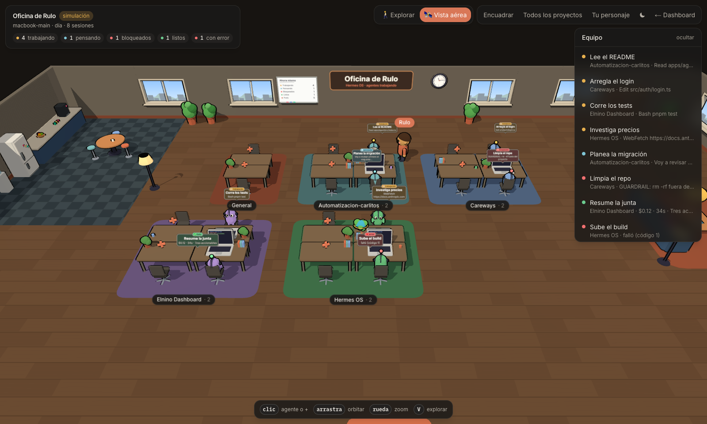
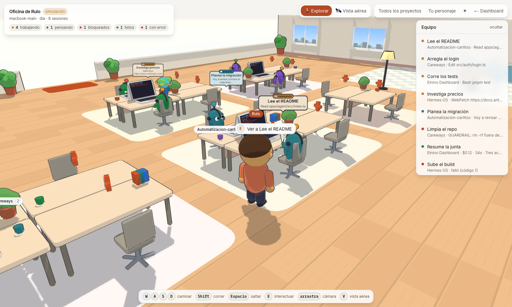
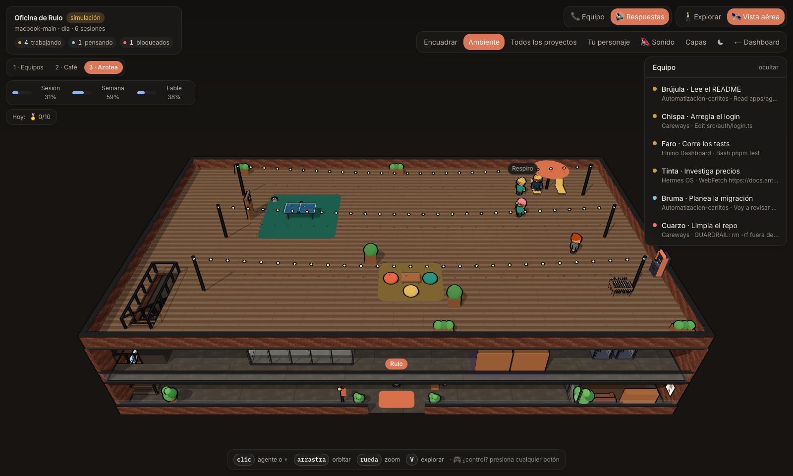
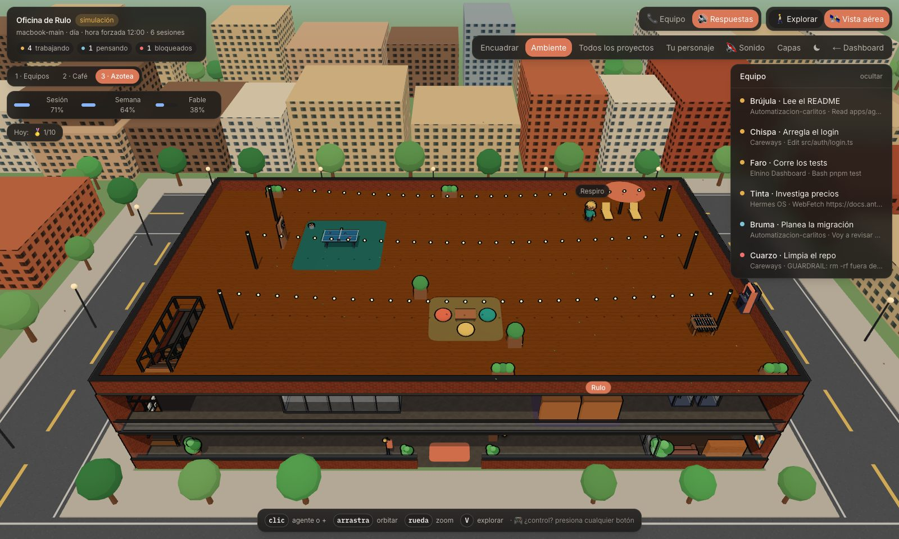
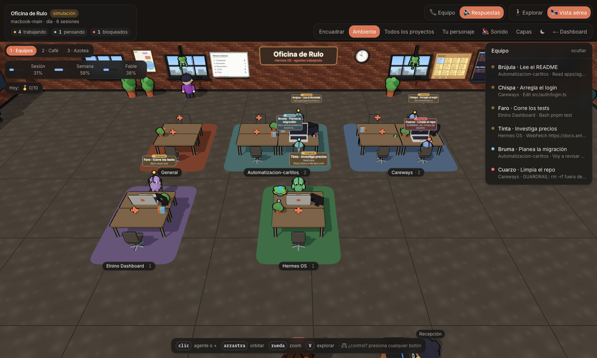
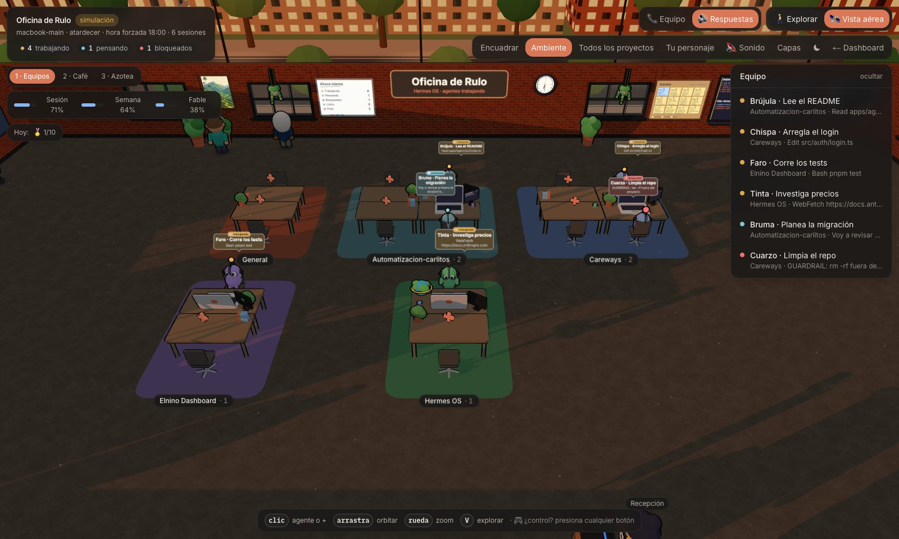
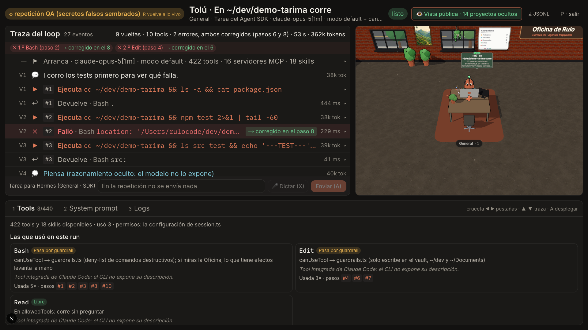
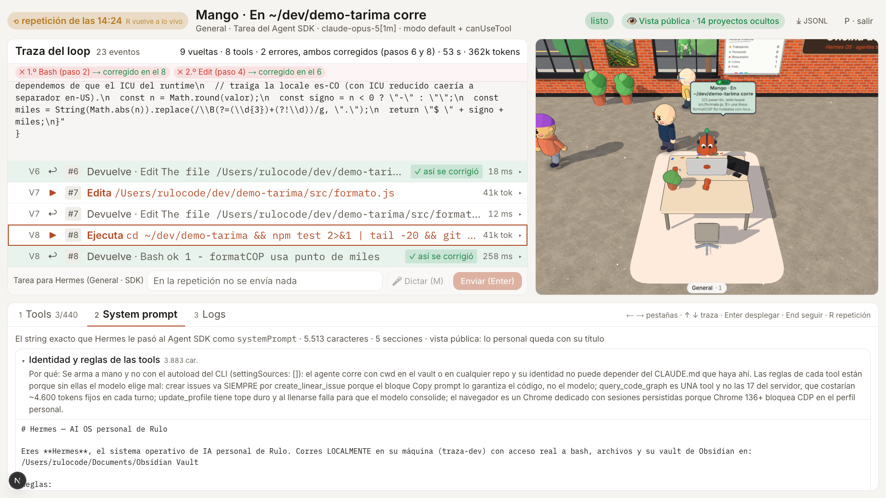

# Oficina de agentes 3D (`/oficina`)

2026-09-29 · para el workshop de la comunidad de Anthropic (2026-10-01) · por dentro (traza, tools, system prompt y modo tarima): 2026-10-01

Una oficina 3D con estilo de caricatura donde cada sesión **viva** del Claude Agent SDK o run de `claude -p` que corre en Hermes es un personaje sentado en un escritorio. Los personajes se agrupan por proyecto del vault. Cada uno actúa su tool real, su bombilla dice su estado y su laptop muestra sus últimas líneas. Desde la misma oficina se contrata un agente y se abre la salida de cualquiera.

Inspirada en [agent-office](https://github.com/AgentSystemLabs/agent-office) (AgentSystemLabs, MIT). De ahí se portó el **motor visual**, no la infraestructura: el look toon (`MeshToonMaterial` con rampa de 3 pasos más `OutlineEffect`), el personaje con sus poses, la laptop, el confeti y el mapeo tool → pose (`actions.ts`). Cada archivo portado lo dice en su cabecera. agent-office corre CLIs en PTYs y lee su estado con hooks de Claude Code. Hermes ya tenía el bus de actividad del SDK, así que el estado sale de ahí.





## Recorrer la oficina

El dueño es un personaje dentro de la oficina, un humano portado del `Person` de agent-office. Su nombre sale de `NEXT_PUBLIC_HERMES_OWNER_NAME` y su apariencia se elige en **Tu personaje** (piel, pelo, peinado, camiseta y rasgos: barba, gafas, collar y arete), guardada en el navegador. El default es el avatar del dueño: **rulos** con volumen arriba y reflejos cobrizos, piel trigueña, barba corta con bigote, gafas de marco transparente con patillas azules, arete, collar con dije azul y camiseta blanca.

| Tecla | Explorar (tercera persona) | Vista aérea |
| --- | --- | --- |
| W A S D / flechas | Caminar, relativo a la cámara | — |
| Shift | Correr | — |
| Espacio | Saltar (se puede subir a un escritorio) | — |
| Arrastrar / rueda | Orbitar / acercar la cámara que lo sigue | Orbitar / zoom |
| E | Interactuar con lo que tiene al alcance: contratar en un escritorio libre o ver a un agente | — |
| Clic | Igual que E, sobre lo que se apunta | Agente o "+" |
| V | Pasar a vista aérea | Volver a explorar |
| Esc | Cerrar panel o diálogo | Igual |

La lista **Equipo** lleva al dueño junto al agente que elijas (en aérea, la cámara va a él). Escribir en un diálogo no mueve al personaje.

## Jugar con el control (Xbox Wireless Controller)

La oficina se juega con un control Bluetooth por la Gamepad API del navegador (mapeo "standard"). Está probada con el **Xbox Wireless Controller** de Microsoft (vendor `045e`, producto `02fd`, el modelo One S) en Chrome sobre macOS. El mapeo es puro y tiene pruebas (`packages/shared/src/gamepad.ts`).

| Control | Acción |
| --- | --- |
| Stick izquierdo | Caminar; más inclinado, más rápido |
| RT | Correr |
| Stick derecho | Mover la cámara (en vista aérea, orbitar) |
| Cruceta ↑ ↓ | Acercar / alejar |
| LT | Recentrar la cámara |
| **A** | Hablar con el agente o contratar en el escritorio cercano · en la conversación: escuchar, parar y enviar |
| X | Saltar · en la conversación: volver a hablar |
| B | Cancelar / cerrar |
| Y | Llamar a Hermes por voz (ElevenLabs) y colgar |
| LB / RB (o cruceta ← →) | Ir al agente anterior / siguiente |
| View | Vista aérea / explorar |
| Menu | Ayuda de controles |

El control vibra al interactuar y cuando un agente te responde. El HUD muestra "🎮 Xbox Wireless Controller" y los atajos pasan a los botones del control apenas lo usas.

**Ojo con Chrome:** el navegador no expone el control hasta que se presiona un botón con la página enfocada (regla de privacidad). Por eso el HUD pide "presiona cualquier botón".

## Hablarle a un agente con la voz

1. **Abrir**: acércate a un agente o a un escritorio libre y presiona **A** (o E, o haz clic). Se abre la conversación con el micrófono ya escuchando.
2. **Hablar**: dices la instrucción y la ves en vivo. Al callarte (1,6 s) se detiene sola.
3. **Enviar**: **A** envía, **X** vuelve a grabar y **B** cancela. Antes de enviar se puede corregir el texto a mano.
4. **Destino**:
   - Con un agente que es un run de Claude, la instrucción **continúa su misma sesión**: el nuevo run hereda su escritorio y su nombre (`continues` en el modelo).
   - Con un agente que sigue trabajando, espera a que termine o detenlo.
   - En un escritorio libre, contrata uno nuevo.
5. **Respuesta**: cuando el agente termina, su resumen se lee en voz alta con la síntesis del sistema (🔊 en el HUD la apaga). Si sigues en su panel, el micrófono vuelve a escucharte: una conversación de ida y vuelta.

El dictado usa dos motores:

| Motor | Cuándo | Detalle |
| --- | --- | --- |
| Reconocedor del navegador | Por defecto | Web Speech en `es-CO`, texto en vivo |
| Transcripción de Hermes | Si el navegador falla (sin red, sin permiso) | Graba hasta el silencio y usa `POST /office/dictate`, la misma cadena STT de las juntas: Scribe, Whisper y local. Unos 1,6 s en la prueba |

**Y** llama a Hermes, el agente de voz de ElevenLabs. Sus tools se montan en la página, así que un "pon a alguien a revisar X en hermes-os" lanza `work_on_project` y el personaje aparece en su pod.

**Antes del taller:**

- Da permiso de micrófono una vez en `localhost:31415`.
- Empareja el control y presiona un botón con la página abierta.
- Sube el volumen para la respuesta hablada.

## Hablarle al equipo entero (elenco de voces)

Con el elenco configurado, **Y** (o el botón 📞 Equipo) abre UNA llamada de ElevenLabs donde cada personaje vivo tiene su propia voz. Le hablas a todos a la vez: "Hermes, contrata dos agentes en hermes-os…", "Iván, ¿cuál es el más largo?", "equipo, corran los tests". Sin elenco, **Y** sigue llamando a Hermes como antes.

| Pieza | Qué hace |
| --- | --- |
| `sala.json` → `office` | Las voces del elenco: `default` es el líder (Hermes) y el resto se reparte entre los runs. Un miembro apagado en la Sala (`enabled:false`) igual presta su voz aquí |
| `pnpm setup:elevenlabs --sala` | Crea el agente multi-voz "Hermes Oficina · Elenco" con sus 4 client tools y escribe `office.agent_id` |
| `packages/shared/src/office-voices.ts` | Reparto puro y probado: pegajoso, una sesión continuada hereda la voz, sin voces libres no hay voz |
| `hooks/useOfficeCast.ts` | La llamada (`CastCall` de la Sala), las tools y los avisos |
| `GET /office/cast` · `/elevenlabs/token?agent=office` | Líder y voces · token de la llamada |

Las tools, todas con datos reales:

| Tool | Qué hace |
| --- | --- |
| `office_team` | Quién tiene qué voz, su proyecto, estado, tarea y lo último que hizo. El modelo la llama al empezar: el reparto cambia y nunca se recuerda |
| `office_tell` | Pasa una instrucción y **continúa la sesión** del agente. Si está trabajando, queda en cola y se le entrega al terminar |
| `office_hire` | Contrata un agente nuevo en un proyecto (o en General) |
| `office_report` | Últimas líneas y texto final completo de un agente |

**El resultado llega con la voz de quien trabajó.** Cuando un run que salió de la llamada termina, la oficina manda un turno `[aviso] Iván terminó…` tras un silencio real de 0,9 s, y el director lo cuenta con esa voz. Nadie dice "listo" antes del aviso. Dos avisos seguidos salen en una sola respuesta a dos voces.

**Honestidad del dato.** En la primera prueba el aviso iba recortado a 600 caracteres, justo a mitad de una tabla, y el modelo le atribuyó las líneas de un archivo a otro. Ahora el aviso lleva hasta 1.800 caracteres y, si corta, lo dice ("recortado: no completes lo que falta"). El prompt exige que cada número y nombre esté escrito tal cual en el aviso o en una tool.

En la escena, la tarjeta de cada personaje dice su voz (🎙 Iván · …) y el cuerpo late con el volumen real mientras su voz suena. QA sin micrófono: `window.__hermesOficinaTeam.say(texto)` y `.debug()` (voces, runs vigilados, cola, avisos pendientes). En simulación no hay llamada con el equipo: esos runs no existen.

## El agente levanta la mano (aprobaciones)

Cuando un agente va a hacer algo con efectos (un `git push`, un `pnpm install`, borrar un archivo), **se pausa de verdad** y te pide permiso en la Oficina. El personaje medio se pone de pie y saluda con un guante blanco por encima de la cabeza, su bombilla late en terracota, su tarjeta dice "✋ te necesita" con el comando, el HUD cuenta "N te necesitan", sale un aviso y el control vibra.

- **Decidir:** acércate y abre su panel (**E** o **A**, o clic en vista aérea). Arriba ves el comando EXACTO que va a ejecutar y cuánto falta para que se niegue solo. **Aprobar** (o **A**) lo deja correr; **Negar** (o **B**) se lo niega. El panel no prende el micrófono: lo que toca es decidir.
- **Lo que recibe el modelo al negar:** que el humano lo negó y que no lo repita igual, así cambia de plan en vez de reintentar. Si nadie responde en **10 minutos**, se niega solo y el modelo lo sabe.
- **Solo pregunta si alguien está mirando la Oficina** (una conexión viva a `/office/events`). Sin nadie, todo se comporta como antes: las tareas del SDK las decide el guardrail y los runs de `claude -p` niegan lo que pediría permiso, ahora diciendo por qué. Una tarea por voz a las 3 a. m. no se queda colgada. Ojo: una pestaña de la Oficina olvidada abierta cuenta como alguien mirando.
- **Qué pide permiso:** Bash que no sea de solo lectura (`isReadOnlyBash` en `packages/shared/src/office-approvals.ts`: `ls`, `cat`, `git status/log/diff`… pasan; lo que no se reconoce, pregunta; redirigir a un archivo ya es escribir). En los runs de `claude -p` también pregunta lo que el modo de permisos del CLI haría preguntar (con `acceptEdits`, que es el default de la consola, las ediciones pasan solas).

**Dos caminos, un mismo personaje** (`apps/agent/src/office/approvals.ts` guarda las solicitudes vivas en memoria):

| Camino | Cómo se pausa |
| --- | --- |
| Tareas del SDK (General, `POST /tasks`) | `canUseTool` en `session.ts` espera `requestApproval()` |
| Runs de `claude -p` (pods de proyecto) | `--permission-prompt-tool mcp__hermes-approval__ask`: el CLI le pregunta al puente `office/approval-mcp.mjs` (MCP por stdio, sin dependencias), que hace `POST /office/approvals/ask` y consulta la decisión. El puente va oculto al modelo con `--disallowedTools` |

**Seguridad:** cada run recibe un token propio (`--mcp-config`) que solo sirve para **pedir** y leer sus propias decisiones; **decidir** (`POST /office/approvals/:id/decide`) exige la credencial del dashboard, y un request con token de run se rechaza aunque traiga más. El hijo no hereda el `.env`, así que el modelo no puede aprobarse a sí mismo. Rutas: `GET /office/approvals` (pendientes + si alguien mira), `GET /office/approvals/:id`, `POST /office/approvals/ask`, `POST /office/approvals/:id/decide {allow, note?}`.

Verificado con runs reales de haiku: sin nadie mirando se niega con motivo; mirando, el run queda en `needs_you` sin ejecutar nada hasta que apruebas (el archivo aparece después); negando con una nota, el modelo la recibe y cambia de plan; decidir dos veces o sin credencial falla. La tarea del SDK en General pasa por el mismo flujo.

## Modos de los agentes (los de Claude Code)

Cada agente de proyecto corre en uno de los cuatro modos de Claude Code. **Auto es el default.** Se elige al contratar (queda guardado en el navegador para los siguientes) y por agente en su panel; **Shift+Tab** los recorre como en la terminal y **View** hace lo mismo con el control, dentro de una conversación. La tarjeta lleva el modo en el chip cuando no es Auto (`✋ te necesita · Plan`) y el panel dice el modo REAL que reportó el CLI.

| Modo | CLI | Qué pasa cuando el agente quiere hacer algo con efectos |
| --- | --- | --- |
| **Auto** | `auto` | El clasificador del CLI decide. Lo seguro pasa; lo riesgoso **lo niega solo, sin preguntar** (el personaje queda "bloqueado" con el motivo: "El modo Auto lo negó: Data Exfiltration"). Solo Opus/Sonnet: con Haiku el CLI arranca en Preguntar y el selector lo avisa |
| **Editar** | `acceptEdits` | Edita sin preguntar; un comando que no esté permitido levanta la mano |
| **Plan** | `plan` | Solo lee. Al terminar levanta la mano con **su plan completo** (markdown en el panel). "Aprobar y ejecutar en X" lo ejecuta en el MISMO run, cambiando la sesión al modo elegido (Auto si el agente estaba en Plan); "Pedir cambios" le manda lo que dictaste y sigue planeando |
| **Preguntar** | `manual` | Levanta la mano para cada edición y cada comando no permitido |

Verificado contra el CLI 2.1.285: el plan pasa por el puente (`ExitPlanMode` → `--permission-prompt-tool`) y aprobarlo con `updatedPermissions: [{type:"setMode", mode:"auto"}]` hace que el CLI reporte `status → auto` y siga editando sin preguntar. Run real en producción: plan con la mano levantada → aprobado → la oficina vio `plan → auto` → archivo editado.

Ojo con `~/.claude/settings.json` del usuario: los runs heredan sus reglas `allow`. Si ahí dice `Bash(git commit *)` o `Bash(git push *)`, esos comandos pasan sin preguntar en Editar y Preguntar.

Las tareas de General (`POST /tasks`, Agent SDK) no tienen modo: las cuida el guardrail y, si miras la oficina, piden permiso para los comandos con efectos.

## Tres pisos

La oficina es un edificio de tres pisos (`FLOOR_Y` en `room.ts`: 0 · 3,6 · 7,2 m):

| Piso | Qué hay |
| --- | --- |
| **1 · Equipos** | Los pods con los agentes, la entrada, el letrero, la pizarra y el reloj. Todo lo de los agentes vive aquí, sin cambios |
| **2 · Café** | La cocina con isla, neón y pizarra de tiza, el lounge con la TV del feed, la cabina telefónica, la estantería y un tapete con pufs en el centro. Balcón de vidrio al frente |
| **3 · Azotea** | Terraza de madera con antepecho de ladrillo, guirnaldas de bombillos, ping-pong, diana en su tablero, futbolín, arcade, sombrilla con sillas y materas |

- **Escaleras en zigzag** contra el muro oeste: la 1 arranca junto a la entrada y sube hacia el fondo, y la 2, al lado, vuelve hacia el frente. Son macizas: cada escalón es una colisión 20 cm más alta y el personaje los sube solo (su paso automático es de 35 cm). Barandas en el lado abierto y guardas alrededor de cada hueco, salvo por donde se llega.
- **Colisiones con base** (`Collider.bottom` en `player.ts`): una caja estorba solo si se cruza con la franja del cuerpo (1,7 m). Por eso se camina debajo de la losa del piso 2 y los muebles de abajo no estorban arriba.
- **Corte de casa de muñecas**: se ven el piso donde estás y los de abajo (el de llegada aparece a mitad de la escalera). Solo se encienden las lámparas de ese piso, y quedan en 0 en vez de quitarse: cambiar cuántas luces hay recompila los shaders y el juego da un tirón.
- **Vista aérea por piso**: abre en el piso donde estás. El selector "1 · Equipos / 2 · Café / 3 · Azotea" del HUD y las teclas **1**, **2** y **3** eligen cuál ver. Viendo el 2 o el 3 no se clickea nada del 1 a través de la losa y las etiquetas de los pods se ocultan.
- **"E" solo alcanza a los agentes en el piso 1** (los NPC con rol, en su piso; ver abajo). "Ir con un agente" (LB/RB o la lista del equipo) te trae abajo desde cualquier piso.
- **QA**: `__hermesOficinaStair(i)` te pone al pie de la escalera `i` mirando hacia arriba, y `__hermesOficinaFloor(n)` abre la vista aérea del piso `n`. `oficina-qa.py` sube las dos escaleras caminando y revisa las alturas, el piso que se ve y las teclas.

## La gente del edificio (interruptor "Ambiente")

2026-09-30. Con pocas sesiones vivas la oficina se veía vacía. Ahora hay **gente de ambiente** que va por café, se sienta en el sofá, juega ping-pong, mira por la ventana y sube y baja las escaleras, y **tres NPC con rol** a los que se les habla. Todo vive detrás del botón **Ambiente** del HUD: se guarda en el navegador (`hermes-oficina-ambiente-v2`) y viene prendido. La clave cambió el 2026-10-01: Sonido y Capas quedaron junto a Ambiente, un clic de más lo apagaba y la oficina amanecía vacía; el "apagado" viejo se ignoró una vez y los botones nuevos se movieron lejos. Apagado, no se crea nada: ni personas, ni atril, ni rejilla, ni colisiones.

**No son agentes y se nota.** Los agentes son los frijoles con audífonos y antena (`worker.ts`). La gente es humana chibi (`Person`, como el dueño), con otras pieles, peinados y camisetas: nunca los rulos ni la camiseta blanca del dueño, y tampoco el peinado "Rizado", que son 70 esferas por persona. No tienen bombilla ni tarjeta, nunca se sientan en un escritorio de pod y no cuentan en el HUD, la lista del equipo ni la pizarra. La regla "una silla por sesión viva" no cambia.

| Quién | Dónde | Qué dice (y de dónde sale) |
| --- | --- | --- |
| **Recepción** | Piso 1, a la derecha de la entrada, con su atril | "¿Qué está pasando?": cuántas sesiones vivas hay y en qué estado, con los mismos conteos del HUD (`officeCounts`), y quién te pide permiso. Preguntas: quién me necesita, quién trabaja y qué terminó, cada agente con su proyecto y un **Ir →** que te lleva a su escritorio. Sin conexión con `/office/events` dice que no sabe. En simulación lo dice |
| **Barista** (con mandil) | Piso 2, detrás de la isla. Se le habla desde las banquetas | La hora local; las ejecuciones terminadas hoy, su costo y sus tokens (`usage` de `GET /dashboard`, que ya trae el `DashboardProvider`: cero polls nuevos); el próximo evento del calendario si está configurado; el clima si el agente lo reporta; y las próximas tareas programadas (`GET /scheduled`, una vez al abrir el diálogo) |
| **Respiro** | Piso 3, junto a las sillas de playa | La hora, una **pausa de 5 minutos** con temporizador real (pastilla "☕ Pausa 4:59" en el HUD, aviso, vibración y voz al terminar) y la ayuda de controles (teclado o control, según lo que estés usando) |

**Honestidad:** cada línea con un dato sale de `packages/shared/src/office-npc.ts` (puro, con tests). Si la fuente no existe o falla, la línea no se dice, y la pregunta que la pide no aparece: sin clima no hay "¿Qué tal el clima?" y, si `/scheduled` falla, no hay "¿Qué hay programado?". Las respuestas se recalculan en cada render, así que no se quedan viejas con el diálogo abierto.

**Hablarles:** acércate (o `__hermesOficinaWalkTo({kind:"npc", id})`) y presiona **E** o **A**. El NPC te mira y saluda. Teclado: **1–3** o **↑↓** y **Enter** eligen, **Esc** cierra. Control: cruceta, **A** y **B**. Mientras el diálogo está abierto el dueño no camina, la cruceta no hace zoom y las teclas 1–3 no cambian de piso. Si **Respuestas** está prendido, la respuesta se lee en voz alta con `speak()`.

**Prioridad de "E":** si hay un escritorio de pod al alcance, gana el escritorio. Un NPC solo entra cuando no hay ninguno, así que "Contratar aquí" y "Hablar con X" no cambian.

### Cómo camina la gente

- **Navegación por capas** (`packages/shared/src/office-nav.ts`, puro y con tests). Cada celda de 25 cm guarda las *superficies* donde se puede estar de pie: el suelo, la losa de cada piso y cada escalón. Una caja es suelo si su tope queda al alcance del paso (35 cm) y estorba si se cruza con la franja del cuerpo (1,7 m), igual que el controlador del dueño. No hay "portales" escritos a mano: la escalera es camino porque sus escalones lo son, el hueco no es camino porque ahí no hay dónde pararse, y si la escalera se mueve en `room.ts` la navegación la sigue sola. La celda es más chica que la huella de un escalón (30 cm), así que dos vecinas difieren a lo sumo un escalón. A\* usa adyacencia precalculada y una heurística ×1,4; el camino se suaviza por línea de vista. Medido: la rejilla tiene unos 37.000 nodos y tarda de 8 a 25 ms en armarse; cada camino tarda unos 4 ms (máximo 7). Se calcula **un camino por frame**.
- **Qué estorba a la gente:** la sala, los escritorios, **cada pod con sus sillas** (nadie camina entre los agentes) y los NPC con rol. La rejilla se rehace cuando cambian la sala o los escritorios, no por frame. Si la sala se reconstruye con el mismo tamaño (llegó un pod), la gente sigue donde estaba.
- **Quién va a dónde** (`packages/shared/src/office-ambient.ts`, puro, con RNG sembrado). La sala exporta 27 lugares con intención (`room.pois`): ventanas, pizarra y cuadro en el piso 1; barra, agua, snacks, banquetas, sofá (dos puestos), sillón, pufs, libros y ventanas en el piso 2; ping-pong y futbolín (de a dos), dardos, arcade, guirnaldas, sillas de playa y vistas en el piso 3. Cada persona elige un lugar, camina, se queda entre 5 y 32 s según la actividad (con su pose: sentada, taza con sorbos, raqueta, manos en el juego, señalando, mirando arriba, lanzando un dardo, manos atrás) y elige otro. Reglas: nunca más gente que puestos; cada piso pesa lo mismo aunque tenga más lugares; cambiar de piso pesa más que quedarse; nadie repite sus últimos lugares; un juego de a dos solo arranca con los dos presentes, y quien espera pareja se rinde a los 22 s. Si un lugar no tiene camino, se evita un minuto.
- **Cuánta gente:** 9 con hasta 2 sesiones vivas, 8 con hasta 5 y 6 desde ahí (`ambientPopulation`; era 6/5/4 y, con el edificio de 33 lugares, el piso donde estabas se sentía vacío). Al abrir, cada uno ya está instalado en algún lugar; los que llegan después entran por la puerta.
- **Escaleras de verdad:** la altura sale de la rejilla escalón por escalón, no por interpolación entre pisos.
- **Con el dueño:** si está en el camino, se detienen, lo miran y, si sigue ahí, se hacen a un lado. Si no hay a dónde (la escalera), a los 3,5 s pasan de largo. El dueño choca solo con quien está quieto en su lugar (`PlayerController.people`), nunca con quien camina, y no queda atrapado si alguien se le mete encima.

> **Ojo:** la primera versión hacía que todos bloquearan al dueño. En la escalera, alguien que bajaba esperaba al dueño y el dueño no podía pasar: los dos quedaban esperándose (el QA de las escaleras lo atrapó a 1 m de altura). Quien camina es quien esquiva.
- **Corte de pisos:** solo se ven los del piso que se ve y los de abajo. Las etiquetas de los NPC, solo en el piso que se ve.

> **Ojo (lo encontró la rejilla):** el pie de la escalera 1 estaba encerrado entre la baranda, la maceta de la esquina suroeste y el muro bajo del frente. Los huecos medían 0,40 y 0,45 m y una persona necesita 0,6 m, así que el dueño solo salía saltando la maceta. El QA no lo veía porque `__hermesOficinaStair(0)` teletransporta al pie. La maceta pasó de 2,6 a 3,3 m del muro oeste.

**QA:** `apps/web/scripts/oficina-npc-qa.py` revisa, en los dos temas, que haya gente en al menos dos pisos y nadie dentro de un pod; que Recepción diga los mismos conteos que la simulación y nombre a los agentes de cada estado; los diálogos de Barista y Respiro y la pausa real; que junto a un agente "E" sea del agente; el interruptor (apagado no queda nadie, se recuerda al recargar); y fps ≥ 55. Una vez, que alguien cruce de piso por la escalera y que a media altura siempre esté sobre una escalera. `?seed=N` en la URL o `__hermesOficinaAmbient({ seed })` fijan la coreografía.

## Paredes con datos, TV compartida y la cola de agentes

2026-09-30, a partir del recorrido por las funciones de agent-office en un reel de Kenji Phang. Se tomaron las ideas, no el código ni los diseños: los tableros, la pizarra, los apodos y la gata son propios.

**Tableros de pared (piso 1).** Sus datos salen de `GET /office/boards` (`apps/agent/src/office/boards.ts`, lógica pura en `packages/shared/src/office-boards.ts`). Cada fuente tiene su caché y su error:

| Tablero | Dónde | Fuente |
| --- | --- | --- |
| **Issues** (corcho con notas) | Pared del fondo, simétrico al cuadro | Linear (`linearBoard()`): Por hacer · En curso · Hecho. Los cancelados quedan fuera. "prompt listo" marca los issues que traen bloque Copy prompt |
| **Pull requests** | Muro este | `gh pr list --repo <origin>` en cada repo de `indexableRepos()`. Ojo: sin `--repo`, en un fork `gh` lista los PR del upstream y la etiqueta mentía |
| **Servicios** | Muro este | `lsof -iTCP -sTCP:LISTEN`, solo procesos de desarrollo en puertos < 49152. El proyecto sale de la carpeta del proceso; el agente y el dashboard se reconocen por su puerto |

"E" o un clic abre el detalle, con "↻ Actualizar" (`?refresh=1`). Si una fuente falla, el tablero lo dice; nunca aparece vacío como si no hubiera nada. Los binarios van por ruta absoluta (`GH_BIN`, `LSOF_BIN`) porque launchd no trae `/opt/homebrew/bin` en el PATH. La página consulta la ruta cada 30 s, solo mientras la Oficina está abierta.

**TV del café con pantalla compartida.** "E" frente a la TV llama a `getDisplayMedia` y pone el video en la pantalla (`VideoTexture`; `room.setTvVideo`). "dejar de compartir" (o el botón del navegador) vuelve al feed. Tres cosas que costaron:
- El `<video>` tiene que estar en el DOM (oculto, de 2 px). Fuera de él, Chromium no produce cuadros y la TV queda negra.
- El control no cuenta como gesto del navegador: con **A**, `getDisplayMedia` se niega, y el aviso pide E o clic.
- La etiqueta dice qué se comparte (pestaña, ventana o pantalla), por `displaySurface`. El `label` del track es un id interno.

En headless no hay pantalla que capturar, así que `__hermesOficinaShareTest()` manda un canvas animado por la misma ruta.

**Pizarra libre** (muro oeste). "E" abre un editor de canvas con colores, grosores, borrador y limpiar. "Guardar" la deja en el agente (`PUT /office/whiteboard` → `~/.hermes-os/oficina/pizarra.png`, solo PNG, tope de 3 MB). Cualquier navegador que abra la oficina la ve, porque la página la relee cada 15 s mientras el editor está cerrado. Cerrar con trazos sin guardar pregunta.

**Apodos** (`packages/shared/src/office-nicknames.ts`). Cada agente vivo tiene un nombre corto y estable (Lince, Brújula, Chispa…) junto a su tarea, en la tarjeta, en la lista del equipo y en el aviso de "E". Son pegajosos: la sesión que continúa a otra hereda su apodo, como hereda el escritorio. Nunca hay dos vivos con el mismo. Si se acaba la lista, se numeran.

**La gata** (`lib/oficina/pet.ts`). Una atigrada low-poly que pasea por el piso 1 con la rejilla de la gente, se sienta a ratos y a veces se acerca al dueño. Va con "Ambiente".

**Cola de agentes** (`apps/agent/src/office/queue.ts`, lógica pura en `packages/shared/src/office-queue.ts`). La cola recibe trabajo y lo reparte a agentes **nuevos** sin pasar de un tope (1 a 3 a la vez, con el modo de permisos de la Oficina, Auto por defecto):
- Cada tarea es un run real de `claude -p` (`startClaudeRun`). Aparece en su escritorio como cualquier otro, con "Ir →" desde el panel.
- Los issues de Linear entran con **«→ Cola»** desde el tablero de Issues. Van por su puente (`executeLinearIssue`): pasan a In Progress y al final se comenta cómo terminó.
- El estado vive en `~/.hermes-os/oficina/cola.json` y se concilia cada 3 s con el run real. "En curso" existe solo con un run vivo detrás; si el agente se reinició, la tarea pasa a error con ese motivo.
- Lo que no arrancó se puede sacar. Lo que corre se detiene desde el panel del agente.
- Rutas: `GET /office/queue`, `POST /office/queue {items}`, `POST /office/queue/:id/cancel`, `PUT /office/queue/settings {max, mode}` y `POST /office/queue/plan {text, project}`.

**El coordinador** (`office/queue-plan.ts`). Le dices qué hay que hacer y Haiku (`HERMES_QUEUE_MODEL`) lo parte en 1 a 6 tareas independientes, cada una con un prompt autocontenido y su proyecto (solo slugs reales; si no sabe, `general`). **Propone; no encola**: eliges con casillas qué entra, porque cada tarea gasta tokens al correr. Su única herramienta es `propose_tasks`: sin Bash, sin Read y sin red. Tiene cara: **Coordinación**, un NPC junto al tablero de la cola (con Ambiente), cuyo "E" abre el mismo panel. En simulación no se puede pedir ni encolar.

Verificado de punta a punta: una tarea mínima pasó de esperando a en curso, su agente apareció en la Oficina, y quedó lista en 15 s. El coordinador partió un pedido doble en 2 tareas en 19 s.

**QA:** `apps/web/scripts/oficina-features-qa.py` cubre los tres tableros contra lo que dice el agente, «→ Cola» deshabilitado en simulación, la TV, la pizarra (dibuja y cierra **sin guardar**: la real no se toca), la cola y Coordinación, los apodos, la gata y fps ≥ 55, en los dos temas. No gasta tokens.

## Uso de Claude y gasto de tokens

2026-09-30. Un tablero en la pared del fondo del piso 1 (rincón noreste, junto a la sala de control) y su versión grande en el monitor de la oficina de CEO. "E" o un clic abre el panel **Uso de Claude**. En el HUD, una píldora resume el uso del plan ("Sesión 43 % · Semana 55 % · Fable 38 %") y también abre el panel.

**Arriba, el uso del plan**, como en la página de uso de claude.ai: **sesión actual** (la ventana de 5 h), **esta semana** y los límites semanales propios de un modelo (**Fable esta semana**). Cada uno trae su barra, su "% usado" y "Se restablece el jue, 12:20 a.m.". La barra es azul, ámbar desde el 80 % y roja desde el 95 %.

**Abajo, el gasto equivalente en dólares** de los agentes, con lo que el CLI reporta en cada `result`.

| Número | Fuente | Alcance |
| --- | --- | --- |
| % de sesión, semana y por modelo, con su reinicio | `GET /office/plan-usage` → el control `get_usage` del CLI (lo mismo que `/usage`), por `usage_EXPERIMENTAL_MAY_CHANGE_DO_NOT_RELY_ON_THIS_API_YET` del Agent SDK | La cuenta de claude.ai con la que corre Claude Code. **No llama al modelo: cero tokens.** Con API key, Bedrock o Vertex no hay límites de plan y el tablero lo dice |
| Gasto de hoy, ejecuciones y tokens (entrada, salida, caché creada, caché leída) | `.data/usage/AAAA-MM-DD.json` (`usage.ts`, el `usage` de `/dashboard`) | Runs de `claude -p` y, desde este cambio, tareas del SDK (`POST /tasks`). **No incluye** el chat, las juntas ni el Estudio |
| Serie de 7 y 30 días | Los mismos archivos diarios | Un día sin archivo después del primero de la máquina (hay desde el 2026-07-06) es un cero real; antes no hay dato y la barra no se pinta |
| Por proyecto y por modelo (hoy y 7 días), "terminaron hace poco" | `.data/usage/runs-AAAA-MM-DD.jsonl`, una línea por run terminado con su proyecto y su `modelUsage` | **Existe desde el 2026-09-30.** El panel dice "registro por run desde el…" y, sin líneas, "sin desglose todavía" |
| Lo que lleva cada agente | El personaje (`OfficeWorker.spend`): los tokens de cada mensaje de la API mientras corre (sumados una vez por `message.id`: el CLI repite el mensaje por bloque) y el costo y los tokens del `result` al terminar | **El costo solo existe al terminar**: mientras corre se muestran tokens y el panel lo aclara. La tarjeta del personaje lleva el costo solo cuando es final |

- `task_executions` (Supabase) **no se usa**: solo guarda las ejecuciones del tablero de tareas (Ejecutar/Continuar). Su última fila es del 2026-07-30 y en septiembre no hay ninguna.
- Rutas: `GET /office/spend` (caché de 10 s para los archivos; lo vivo sale de memoria) y `GET /office/plan-usage` (caché de 60 s: arrancar el CLI tarda ~1 s). La página consulta el gasto cada 15 s y el plan cada minuto, solo mientras la Oficina está abierta.
- Lógica pura y probada en `packages/shared/src/office-spend.ts` (`parseModelUsage`, `assistantUsageDelta`, `spendByProject`, `spendByModel`, `spendSeries`, `parsePlanUsage`, `formatPlanReset`…).

> **Ojo con `get_usage`:** el SDK lo marca EXPERIMENTAL. Si una versión lo cambia, la ruta responde el error y el tablero dice "sin datos". La consulta abre una sesión con entrada en streaming que nunca manda un mensaje (sin turno, sin modelo). Hay que **drenar el iterador** para que el SDK procese el control y cerrar la sesión en el `finally`. El reinicio llega como `05:19:59.88`: se redondea al minuto para leer 12:20, como claude.ai.

## Pantallas de los agentes

- **Monitor en cada escritorio ocupado** (`lib/oficina/monitor.ts`): una pantalla más grande que la laptop, en la punta exterior del escritorio, girada hacia la silla y el pasillo. Tiene una barra con el apodo, la tarea, el estado y lo que lleva gastado, y debajo el stream del agente: `⚙` tool y objetivo, `↩` resultado, texto del modelo, `✓`/`✗` cierre. Corta con "…" y nunca completa.
- **Sala de control** (`lib/oficina/controlwall.ts`), piso 1, pared del fondo a la derecha de Issues: una cuadrícula con la terminal de **todos** los agentes vivos (hasta 12; el resto se cuenta). Muestra apodo, proyecto, estado y gasto. Clic en una pantalla abre el panel de ese agente. "E" abre la sala en grande (`ControlRoomPanel`). Sin agentes, la pared lo dice.
- **Panel a pantalla completa**: ⤢ en el panel del agente. Trae la terminal grande con scroll, que sigue el final solo si ya estabas abajo, y la conversación de siempre debajo. La primera Esc sale de pantalla completa y la segunda cierra el panel. El panel también muestra el gasto.

**Un solo canal, cero streams nuevos.** Cada actualización de `GET /office/events` ya trae las últimas 12 líneas de cada personaje, y de ahí leen el monitor y la sala de control. Solo el panel abierto usa el stream del run (`GET /claude/run/:id/stream`), como antes: uno a la vez. El monitor se repinta hasta 4 veces por segundo a menos de 6 m, una por segundo hasta 16 m y nunca fuera de cámara o con otro piso a la vista. La sala de control es **un** canvas y **una** malla para toda la pared, repintada hasta 3 veces por segundo si se ve.

## Minijuegos de la azotea

Los cinco puestos de la azotea se juegan. Acércate (sale "Jugar…") y presiona **E**, **A** o haz clic. La cámara pasa al juego y el dueño se esconde para no tapar la mesa. **Esc** o **B** salen. Con la partida terminada, **Espacio** o **A** empiezan otra. El HUD del juego (abajo) muestra el puntaje de esta partida, tu **récord** y los controles.

| Juego | Teclado | Control | Cómo se gana |
| --- | --- | --- | --- |
| **Dardos** | Flechas/WASD mueven la mira (oscila sola, como el pulso); Espacio lanza | Stick y A | 9 dardos en tres rondas. El puntaje sale del sector y el anillo **reales** de la diana pintada: 20 arriba, triple, doble, diana 50 y su anillo 25 |
| **Ping-pong** | ←→ o A/D | Stick | Contra la CPU, hasta que te gane 3 puntos. Tu puntaje son los puntos que le ganas. Pegarle con el borde de la raqueta cruza la pelota, y la CPU (más lenta) no llega |
| **Futbolín** | ↑↓ o W/S suben y bajan tus varillas (rojas); Espacio las gira y patea | Stick y A | Las ocho varillas de la mesa (1-2-3-5-5-3-2-1). Hasta que te metan 3; tu puntaje son tus goles |
| **Canasta** | ↑↓ cambian el ángulo; mantener Espacio carga la fuerza (sube y baja) y soltar lanza | Stick y A sostenida | 10 pelotas a la cesta. Entra si cruza el aro bajando por dentro; si toca el borde, rebota |
| **Lluvia de tokens** (arcade) | ←→ | Stick | Juego propio: un cursor de terminal atrapa tokens verdes (+1) y esquiva bugs rojos (−1 vida). Cada 10 tokens la lluvia acelera. 3 vidas |

- **Récords** en localStorage (`hermes-oficina-record-<juego>`), uno por navegador. Son datos reales de partidas reales. La pantalla de la arcade, en espera, muestra el título y su récord, o "sin récord todavía". La ilustración de marcianitos se fue: imitaba un juego conocido.
- **Si alguien de ambiente está jugando ahí, se aparta** (`AmbientPlanner.reserve`), y nadie vuelve a ese lugar mientras juegas.
- Física y puntaje **puros y probados** en `packages/shared/src/office-games.ts`; cada juego se dibuja en `lib/oficina/games/<juego>.ts`.

> **Ojo (futbolín):** la primera versión tenía cuatro varillas. Dejaba una franja de 36 cm al centro donde ningún muñeco llegaba, y con tanta fricción la pelota se dormía ahí: 0 a 0 para siempre. Ahora tiene las ocho de la mesa, una leve pendiente que despierta una pelota quieta y una CPU que decide cada 0,3 s (sin eso, alineaba perfecto y bloqueaba todo).
>
> **Ojo (canasta):** una pelota que rozaba el aro rebotaba contra el borde para siempre (cada cruce del plano del aro volvía a rebotar). Tras tocar el borde ya no se evalúa el aro.
>
> **Ojo (cámara):** durante el juego no se llama `player.update`, porque reubica la cámara detrás del dueño en cada frame. Las teclas del juego se sueltan al perder el foco (`blur`): si no, una flecha quedaba "presionada".

## Oficina de CEO

La oficina del dueño, en el **piso 1, esquina sureste** (x 12,6–19,4 · z 8,6–15). Ese rincón siempre está libre: los pods tienen 3 columnas fijas (x ≤ 7,7) y solo crecen hacia el frente dentro de ese ancho. Se ancla a `minZ`, así el ventanal del muro este, con el cielo de la hora real, siempre queda adentro, y por el vidrio se ve al equipo.

- Vidrio con **banda esmerilada** y marco negro. La puerta da a los pods, y en el vidrio está la **placa** con `NEXT_PUBLIC_HERMES_OWNER_NAME` ("Oficina privada" si está vacía).
- Escritorio de madera frente al ventanal, silla ejecutiva, sofá, estantería, planta grande, lámpara de pie (con su luz) y un cuadro propio.
- **Pantallas con datos reales**: el monitor grande trae el uso de Claude, el gasto, los 30 días, por proyecto, por modelo y quién gasta ahora. El monitor chico, **quién te necesita** (permisos abiertos con su comando o plan) y la cola. En el muro, el reloj y la **agenda** (`snapshot.calendar` de `/dashboard`, la misma de la Barista).
- **Modo CEO**: "E" junto a la silla. La cámara son los ojos del dueño sentado y mira el salón por el vidrio, con los monitores abajo. ←→ o **LB/RB** recorren a los agentes: la cámara voltea a su escritorio, sin caminar. **Enter** o **A** abren su panel. **Esc** o **B** te levantan (si hay un panel abierto, la primera Esc lo cierra).
- **Privada**: una caja solo-obstáculo en la rejilla de la gente; ni la gente de ambiente ni la gata entran.

> **Ojo (lo encontró el QA):** el vidrio tenía tope de muro (`top: 99`). En `col()`, 99 es absoluto, así que bloqueaba **los pisos de arriba**: sobre la oficina había una pared invisible en el café y en la azotea, justo donde está el futbolín. Una pared que no es muro de la sala lleva su altura real (2,9 m).

## Zonas nuevas y capas

**Medir antes de llenar.** `NavGrid.openZones(piso, k)` (`office-nav.ts`, método del histograma, con test) devuelve los rectángulos libres más grandes de cada piso sobre la misma rejilla de la gente. Se ven en `__hermesOficinaDebug().freeZones`. Sin agentes medía 336 m² en el piso 1 (rincón este), 222 m² en el café (centro-norte) y 213 m² en la azotea (todo el frente).

| Zona | Dónde | Qué tiene |
| --- | --- | --- |
| Sala de juntas | Café, frente oeste | Vidrio con puerta, mesa para 6 y una pantalla con **la próxima junta del calendario real** ("Sin juntas próximas" o "Calendario sin configurar" si no hay) |
| Biblioteca | Café, frente centro-este | Dos estanterías contra el balcón, dos sillones y una mesita |
| Cabinas de foco | Café, frente este | Dos cabinas de vidrio |
| Lounge de la azotea | Azotea, frente (el área vacía más grande) | Mesa baja, tres pufs y dos materas |

Hay 6 lugares nuevos para la gente (33 en total, ninguno descartado). Los muebles estáticos se funden por material (`mergeByMaterial`): pocos draw calls, porque el contorno dibuja todo dos veces. No hay hot desks: un escritorio sin personaje se confundiría con un escritorio de pod.

**Interruptor "Capas"** (HUD, `hermes-oficina-capas`): **Pantallas y uso** (monitores, sala de control, tablero y píldora), **Oficina de CEO**, **Zonas nuevas** y **Minijuegos**. Apagadas, la sala se arma como antes: vuelven la ventana del fondo y las dos matas. La única excepción es la pantalla de la arcade, que muestra su espera en vez de la ilustración vieja.

## Interacciones (capa "Interacciones")

2026-10-01. La oficina se usa, no solo se mira. Con **E** (o **A**, o un clic) sobre lo que tienes al lado:

| Qué | Dónde | Qué pasa |
| --- | --- | --- |
| **Sentarte** | Cualquier asiento: sofá, sillón, banquetas, pufs, sillas de playa, mesa de juntas, sillón de la biblioteca, pufs de la azotea, el sofá de tu oficina | Te sientas mirando hacia donde mira el asiento (en el sofá, la TV). Si alguien de ambiente estaba ahí, se levanta y busca otro lugar. **E**, **Espacio**, caminar, **A**, **B** o el stick te levantan |
| **Café** | La cafetera del café | 4 s preparándolo (molino y vapor, barra de avance). Lo llevas en la mano unos 2½ min: caminas con él, te sientas con él (pose de taza sentado) y, con nada al lado, **E** es un sorbo |
| **Agua** y **snack** | Dispensador y máquina de snacks del café | Un vaso de agua en la mano (1 min) o un snack (mordiscos, 3 s) |
| **Dejarle tu café a un agente** | Con el café en la mano, háblale a un agente | La taza queda en su escritorio mientras siga ahí; el aviso dice "Dejarle tu café a…" |
| **Acariciar a la gata** | Donde esté (piso 1) | Se sienta, te mira, suelta corazones, ronronea y te sigue un rato |
| **Saludar** | A cualquier persona de ambiente | Se detiene, te mira, te devuelve el saludo y te dice algo **real**: cuántos agentes trabajan y en qué tool va uno, quién te espera y para qué, quién terminó, el % de la sesión de Claude, las ejecuciones de hoy, tus cafés, la hora o el clima. Sin dato, esa frase no existe |
| **Cabina telefónica** | Café, esquina noreste | Llama al equipo (o a Hermes) por voz, igual que **Y** |
| **Cabina de foco** | Café, frente este (capa Zonas) | Un bloque de **25 min** con su píldora "🎧 Foco"; al terminar, aviso, campanita y voz |
| **Lámparas** | Las de pie del café y la de tu oficina | Prender y apagar (la luz queda en 0, no se quita) |
| **Q** / **F** | Donde sea | Saludar con la mano / bailar (hasta que camines) |

**Hoy y logros.** Lo que haces suma a un contador del día (`hermes-oficina-hoy`, en este navegador) que se ve en la píldora "Hoy: ☕ 2 · 🐈 1 · 🏅 3/10". Al hacerle clic se abre la lista de **logros**, que salen solo de tus acciones reales: primer café, tercer café, hidratado, amigo de la gata, sociable, recorrer los tres pisos, probar cinco asientos, bailar, dejarle café a un agente y terminar un bloque de foco. Cada uno avisa una vez por día. Lógica pura en `packages/shared/src/office-play.ts`, con tests.

**Prioridad de "E" (sin cambios para lo que ya existía):** escritorio de pod > NPC con rol > tableros, TV, juegos > objetos, la gata y la gente. Excepción: la gata a tus pies le gana a un NPC con rol más lejos (le gusta echarse junto a Recepción). Con la capa apagada, nada de esto existe.

> **Ojo (React en desarrollo):** el aviso de un logro se disparaba dentro del actualizador de `setState` y salía dos veces (StrictMode lo corre dos veces). Se calcula afuera, con el valor de un ref.
>
> **Ojo (el globo y el aviso):** mientras alguien te habla, el aviso "E · Saludar" no se dibuja, porque se encimaba con su globo.

## Sonido

Todo procedural con WebAudio (`lib/oficina/audio.ts`): sin samples ni audio con derechos. El botón **Sonido** viene **apagado**. El `AudioContext` nace con ese clic (política de autoplay), se suspende con la pestaña oculta y **baja solo durante una llamada** con Hermes o el equipo. El volumen se guarda (`hermes-oficina-volumen`).

| Suena | Cuándo |
| --- | --- |
| Tono de sala | El del piso que se ve: equipos (rumor grave), café (murmullo en la banda de la voz que respira lento), azotea (viento y la ciudad abajo). Se cruzan al cambiar de piso |
| Teclados | Solo agentes con estado `working`, posicionales (`PannerNode`, más fuertes cerca), a lo sumo 6 y solo con el piso 1 a la vista. Ráfagas de 3 a 9 teclas y una pausa |
| Cafetera | Vapor o molino cada 9–21 s, posicional en la barra del café |
| Minijuegos | Golpe, rebote, punto, error, lanzamiento y fin de partida |
| Pasos | Los del dueño al caminar o correr |
| Avisos | Dos notas cuando un agente te necesita; tres cuando alguien termina (con el confeti) |
| Lo que haces | Molino y vapor al preparar café, agua sirviéndose, mordiscos, sorbos, ronroneo de la gata, clic de lámpara, cojín al sentarte |

## Calidad visual v8: exterior, texturas y gente viva

2026-10-01, para presentarla. Tres capas nuevas en **Capas** (`hermes-oficina-capas`): **Exterior**, **Texturas y arte** y **Gente viva**. Más el interruptor **Voces de la gente**, junto al volumen. Apagadas, la oficina se ve como antes.

| Antes | Después |
| --- | --- |
|  |  |
|  |  |

### Cero espacios negros (capa "Exterior")

El negro salía de `scene.background` y `scene.fog`, que usaban `palette.bg`, el fondo de la **interfaz**: casi negro en el tema oscuro. Afuera solo había un plano de ese color. Ahora (`lib/oficina/outdoor.ts`):

| Capa | Qué es |
| --- | --- |
| Cielo | Domo con shader de gradiente (cénit y horizonte de `skyAt`). Trae cerros procedurales por si el panorama no carga, y estrellas de noche |
| Ciudad | **Cilindro de panorama** con tres imágenes de la misma composición (día, atardecer y noche) que se funden con la hora. Va espejado ×4 alrededor, así no hay costura. Sigue a la cámara, porque está "en el infinito" |
| Calle | Suelo de pasto, andenes, calles con línea amarilla y árboles, postes y edificios vecinos instanciados. Los edificios llevan UV en espacio mundo (ventanas de 4 × 3,2 m sin estirarse) y de noche se prenden ventanas y charcos de luz bajo los postes. Los altos van atrás y los bajos al frente, así no tapan la cámara aérea. Son ~15 draw calls, sin contorno ni sombras |
| Niebla | Del color del horizonte: el suelo se funde con el cielo |
| Ventanas | Dejan ver el exterior de verdad: el cielo pintado detrás del vidrio se oculta |

**La hora manda, no el tema.** `packages/shared/src/office-sky.ts` (puro, con tests) da los pesos día/atardecer/noche, los colores y la dirección del sol (sale por el este, +x, y se pone por el oeste). El cruce dura casi una hora a cada lado de la puesta, sin saltos de un minuto a otro. `daylightAt` (la luz de adentro) sale del mismo cielo. **En el tema oscuro** el exterior baja un 14 % de luminancia (`DARK_DIM`): la interfaz es oscura y el exterior no debe competir con el HUD. Pero es de día si es de día: el tema es de la interfaz, no de la noche.

> **Ojo (lo encontró el QA visual):** de noche, la banda de sombra del toon (35 %) sobre un color oscuro terminaba en negro: hasta un 28 % de la pantalla a las 23:00 en el tema oscuro. La noche no se hace apagando el relleno: el hemisferio pasa a **luz de luna azulada**, solo baja el sol, y el tinte nocturno del exterior es suave. El vidrio apagado de los edificios vecinos es azul pizarra, no negro.

### Texturas y arte (capa "Texturas y arte")

Ladrillo, concreto pulido, deck, madera, tela y tiza a 1024 px y sin costura, más los cuadros y el afiche, todo generado con Higgsfield con prompts propios (procedencia, prompts y créditos en `apps/web/public/oficina/README.md`; proceso en `apps/web/scripts/oficina-assets.py`). Siguen siendo `MeshToonMaterial` con su rampa de tres pasos: el estilo no cambia.

- `lib/oficina/hd.ts` precarga todo y la sala se rearma **una** vez cuando termina. Antes de eso se ven los canvas de siempre.
- Cada uso es un `clone()` que comparte la `Source`, así que la imagen se sube **una** vez a la GPU y solo cambia el `repeat`. Lo mismo para el ladrillo de canvas: antes cada tramo de muro creaba su `CanvasTexture` y subía su propia copia. **La memoria de texturas bajó de ~168 a ~117 MB** aunque se sumaron las HD.
- La tela es gris a propósito: el color del mueble la tiñe.

> **Ojo (sin costura):** mezclar el borde con la imagen corrida media vuelta sirve para el concreto o la tela. En un patrón regular deja una franja borrosa (ladrillos dobles). El ladrillo y el deck se recortan a un número **entero de períodos medidos**: el mortero cada 81,8 px y las juntas de los tablones cada 128 px.

### Gente viva (capa "Gente viva" + "Voces de la gente")

**Voz propia que no se repite.** `assignVoices` (`packages/shared/src/office-people-voices.ts`, con tests) reparte las voces del sistema:

- Chrome en macOS expone **18 voces en español**: Eddy, Flo, Grandma, Grandpa, Reed, Rocko, Sandy y Shelley en es-ES y es-MX, más Mónica y Paulina. Cargan **async** (`voiceschanged`): pedirlas en caliente devuelve una lista vacía.
- Nunca hay dos iguales vivas. La asignación es pegajosa mientras la persona sigue en el edificio, y los NPC con rol tienen voz fija (Recepción = Paulina, Barista = Mónica, Respiro = Reed es-MX, Coordinación = Shelley es-ES).
- La barba (y la mitad del resto) pide voz grave. Los abuelos quedan para el final.
- Con menos voces (otro sistema operativo), las que se repiten se separan por tono (≥ 0,12) y velocidad.

| Nivel | Qué | Cuándo |
| --- | --- | --- |
| 1 · Sistema | `speechSynthesis` con la voz, el tono y la velocidad de esa persona | Todo lo que lleva **datos**: su respuesta cuando la saludas, los avisos de Recepción y las frases con dato de las charlas |
| 2 · Pregrabada | 197 clips (6 voces × 33 frases fijas) de Higgsfield `text2speech_v2`/`elevenlabs`, cada uno **validado con Whisper local**. Suenan por WebAudio con paneo y volumen por distancia | Las frases **fijas** de las charlas y las reacciones. La voz premium sigue el timbre de su voz del sistema |

**No hay TTS por la API REST de Higgsfield** que el agente pueda llamar: las llaves `HIGGSFIELD_API_KEY_ID/_SECRET` no están en el `.env` (producción responde `/avatar/provider → openai`, y la API devuelve 401 en todas las rutas). Por eso las frases premium se pregeneraron por MCP y viven como archivos.

> **Ojo (validar audio sin oírlo):** `seed_audio` sonaba con acento inglés (Whisper lo detectaba como inglés con p = 0,66), y la voz "André" sonaba tan inglés que Whisper TRADUJO la frase. Cada clip se transcribe con `whisper-cli` local y se compara con el texto. La detección de idioma en un clip de un segundo no es confiable: decide la coincidencia del texto, con alias para "chao" (/tʃao/ → "Tchau") y "quiubo".

**Reglas:** una sola voz a la vez (tampoco encima de la respuesta de un agente), nunca durante una llamada con Hermes o el equipo (`setBlocked`), solo con Sonido prendido (su `AudioContext` nace con un clic: ese es el gesto del usuario) y con "Voces de la gente". Lejos o en otro piso no suena: queda el globo. La boca se abre con el volumen real del clip; con la síntesis del sistema, con cada palabra.

**Charlas entre personas.** `AmbientPlanner.proposeChats` (`office-ambient.ts`, puro y sembrado, con tests) junta a quienes coinciden:

- Mismo piso, a menos de 1,9 m y libres (no saludando, no reaccionando, no esperando pareja de juego).
- Enfriamiento de 35 s por persona y de 150 s por pareja. Con suerte se suma un tercero.
- Conversando, nadie se va: la estadía se estira. Quien iba caminando se detiene y retoma sin perder su plazo.
- Se miran, quien habla gesticula (pose `talk`), los demás asienten (`listen`) o siguen con la taza, y se turnan globos.
- El guion (`office-chatter.ts`) arma 3 a 5 turnos: saludo, un tema del lugar (café, sofá, ventana, juego, la gata) o **un dato real** (hora, clima de `/weather`, agentes trabajando, quién terminó; en simulación, sin datos de agentes) y despedida. Las frases fijas no llevan un solo dígito (lo revisa un test).

**Reacciones a lo que pasa:**

- Cuando un agente termina (el confeti), la gente de ese piso a menos de 14 m lo mira y **aplaude**.
- **Recepción avisa con su voz** cuando un agente levanta la mano: "Lince te necesita: …", con el texto de la solicitud real.
- Si bailas (F), los que están cerca **se apartan un paso** (si hay piso libre en la rejilla), te miran y vuelven a su lugar.
- Uno de ellos dice algo corto ("¡Bravo!", "¡Uy, qué pasos!").

**Personajes:** camisetas, pantalones, pieles y peinados salen de bolsas barajadas, así que no se repiten hasta agotar la paleta (dos que conversan ya no parecen clones). Hay gorra o gorro (nunca sobre puntas, moño o rulos), brillo en los ojos y una boca que se abre al hablar.

### Pulido de presentación

- **Recorrido de presentación** (Capas → «▶ Recorrido de presentación», o `__hermesOficinaTour(true)`): la cámara pasea sola, 7 s por toma, en cinco tomas (la ciudad desde lejos, los pisos 1, 2 y 3 en aérea, y la azotea mirando a los cerros). Las tomas se calculan sobre la planta real. Un clic, una tecla o arrastrar lo detienen. Combinado con `__hermesOficinaHour` sirve para mostrar día, atardecer y noche en un minuto.
- **Partículas** (con el Exterior, `lib/oficina/particles.ts`): polvo que flota en la luz del día adentro (se apaga de noche) y hojas que caen con viento en la azotea. Es un `Points` por sistema, animado en CPU, sin contorno y solo en el piso que se ve.
- **Sombras de contacto** (con Texturas y arte): un gradiente bajo los pies de cada persona, compartido (una textura y una geometría). Nunca proyecta: quien crea a la persona le pone `castShadow` a todo el cuerpo, y la mancha se volvía un cuadro en el shadow map.
- **Personajes:** sin GLB. El experimento con Meshy no se hizo: las poses (sentarse, la taza, los juegos, `talk`, `listen`, `clap`) viven en el chibi procedural, y un modelo con rig habría pedido rehacerlas para presentar.

### Presupuesto de render

`__hermesOficinaDebug().render` trae draw calls y triángulos (promedio de 60 frames; `info.autoReset = false` porque el contorno dibuja la escena dos veces) y la memoria de texturas estimada por imagen subida. Medido con 6 agentes simulados:

| | Antes de la v8 | Después | Tope (lo revisa el QA visual) |
| --- | --- | --- | --- |
| Draw calls, piso 1 | ~2.290 | ~2.000 | 2.400 |
| Draw calls, aérea del piso 3 | 6.135 | ~6.180 | 6.250 |
| Triángulos (peor vista) | 437k | ~450k | 600k |
| Memoria de texturas | ~168 MB | ~117 MB | 170 MB |
| fps | ≥ 55 | ≥ 55 | ≥ 55 |

**QA:** `apps/web/scripts/oficina-visual-qa.py`, en los dos temas:

- Lee el framebuffer (`__hermesOficinaPixels`, sin HUD) a las 6:30, 12:00, 18:00 y 23:00 en tres vistas y exige menos del 1 % de **zonas** casi negras (promedio de ~26 px) arriba y en el borde. Un poste de acero no es un hueco.
- Control negativo: con el Exterior apagado, el cielo del tema oscuro vuelve a dar ~50 % negro, así que la prueba sí mide.
- Además revisa voces únicas con el catálogo real inyectado, que haya una charla con su globo en 90 s, la reacción al baile, el clip premium, una sola voz a la vez, Gente viva apagada, el presupuesto, los fps y la consola.
- `--shots <carpeta>` deja las capturas de "después".

## Por dentro: la traza, las tools y el system prompt (modo tarima)

2026-10-01, para la demo en tarima de la comunidad de Anthropic (cero slides: "le das la tarea y lo vemos trabajar por dentro"). Todo sale de datos reales capturados en el agente; la simulación y las repeticiones se marcan siempre en pantalla.





**P** (o el botón **▣ Tarima**) abre una vista para un proyector de 1920 × 1080, legible a 10 metros:

| Zona | Qué muestra |
| --- | --- |
| Izquierda, grande | **La traza del loop** del agente: una fila por evento con su vuelta (V1, V2…), un icono por tipo y frases como "**Lee** `src/x.ts` · líneas 10–80", "**Busca** `foo` · en `src/`", "**Ejecuta** `npm test`", "**Llama** `mcp__linear__…`". El resultado va plegado (clic o Enter lo despliega, con el aviso si se recortó). Duración y tokens por vuelta a la derecha. Los errores van en rojo con "→ corregido en el paso N", y la fila que corrigió lleva "✓ así se corrigió" |
| Arriba | EN VIVO o "⟲ repetición de las HH:MM", el agente (apodo, tarea, proyecto, modelo y modo reales del `init`), su estado, el resumen ("9 vueltas · 8 tools · 2 errores, ambos corregidos (pasos 6 y 8) · 53 s · 362k tokens") y el indicador de la vista pública |
| Derecha | La oficina 3D con la cámara siguiendo el escritorio del agente (el canvas se mueve a ese hueco y se redimensiona solo) |
| Abajo | Pestañas **Tools**, **System prompt** y **Logs** |
| Al pie de la traza | La tarea para el escritorio General (el agente del Agent SDK), escrita o dictada |

| Tecla | Control Xbox | Qué hace |
| --- | --- | --- |
| P · Esc | View | Entrar / salir de la tarima |
| 1 · 2 · 3, ← → | Cruceta ◀ ▶ | Pestaña Tools · System prompt · Logs |
| ↑ ↓ (j k) | Cruceta ▲ ▼ | Recorrer la traza |
| Enter | A | Desplegar la fila (con algo dictado, A envía la tarea) |
| End (G) | B | Volver a seguir el final |
| Tab · Shift+Tab | LB · RB | Otro agente |
| N | — | Escribir la tarea |
| M | X | Dictar la tarea |
| A · B | A · B | Aprobar / negar cuando el agente levanta la mano |
| O | — | Vista pública prendida / apagada |
| R | — | Plan B: repetir la última traza real (R otra vez vuelve a lo vivo) |

El panel de cada agente (fuera de la tarima) tiene las mismas vistas en pestañas: **Salida · Traza · Tools · Prompt**. Si el personaje está en error o bloqueado, el panel abre en la Traza, sobre el error.

### La traza: captura completa en los dos caminos

| Camino | De dónde sale | Lo que se ve |
| --- | --- | --- |
| Tareas del Agent SDK (General, `POST /tasks`) | Cada mensaje del iterador de `query()` en `session.ts` (sin los deltas parciales) | El `init` entero, texto, razonamiento (vacío si el modelo lo oculta, y así se dice), cada `tool_use` y su `tool_result` completos, el `result` con costo y tokens |
| Runs de `claude -p` (pods de proyecto) | El stream-json CRUDO de `claude-cli.ts`, línea por línea, con el `init` entero (tools, `mcp_servers` con su estado, skills, slash commands, modelo, modo) | Lo mismo. `stderr` entra como aviso (no cuenta como error); el cierre con código ≠ 0 sí |
| Permisos | `canUseTool` (guardrail de Hermes, Chrome CDP), `approvals.ts` (los dos caminos: pidió, aprobado, negado, por quién y con qué nota), las negaciones del modo Auto y de las reglas deny del CLI (detectadas en el `tool_result`) | Filas ✋ / ⛔ / 🛡 en la misma secuencia |

- **Modelo puro** en `packages/shared/src/office-trace.ts`: `TraceRecorder` convierte mensajes en eventos (`seq`, `t`, `turn`, `kind`, `tool`, `input`, `output`, `isError`, `durationMs`, `tokens`); la vuelta es un `message.id` del asistente y sus tokens se cuentan una vez (el CLI repite el mensaje por bloque). Cada campo tiene tope de 20 KB con el tamaño original anotado. `reduceTrace` empareja `tool_use` ↔ `tool_result`, mide, marca errores y detecta la corrección; `traceSummary` arma el resumen; `describeStep` el "Lee/Busca/Ejecuta/Llama".
- **Persistencia**: `~/.hermes-os/trazas/<id>.jsonl` (meta, prompt, inventario y eventos), append por lote (`apps/agent/src/office/trace.ts`). En memoria quedan las vivas y las recién terminadas (10 min).
- **Canal**: los eventos nuevos van por `/office/events` como `{type:"trace", id, events | prompt | inventory}`. No hay un stream por agente. En el navegador viven en un store fuera de React (`lib/oficina/trace-store.ts`), agrupado por frame. Lo que va por el bus general (feed, monitores, laptop) sigue recortado como antes.
- **Rutas**: `GET /office/trace/:id` (snapshot + la configuración de permisos), `GET /office/traces` (las guardadas, con su resumen), `GET /office/trace/:id/export` (JSONL limpio con la vista pública aplicada en el servidor; `?view=raw` solo en local) y `GET /office/public-view`.
- **Lista virtualizada**: solo se pintan las filas visibles (alto fijo; una fila desplegada tiene su alto con scroll adentro). Sigue el final solo si estabas abajo.

**Errores y correcciones** (`reduceTrace`, con tests sobre trazas sintéticas y las dos reales de la demo):

| Es un error | La corrección es… |
| --- | --- |
| Un `tool_result` con `is_error`, o la salida de un test que falló (`outputFailed`: el `npm test \| tail` sale con código 0 aunque los tests fallen) | El primer paso posterior que funciona con la **misma tool y el mismo objetivo**; si no hay, con el mismo objetivo; si no, con la misma tool (en Bash, el mismo programa). Así un `Edit` fallido lo corrige el `Edit` que funcionó, no el `Read` de en medio |
| Un paso **negado** (guardrail, regla deny, modo Auto, el humano) | El siguiente intento que funciona con la misma tool, aunque cambie el comando: negar obliga a reformular |
| Un error del loop (excepción del SDK, el proceso murió) | Sin corrección: es el fin |

El objetivo de un paso (`stepGoal`) es el archivo para las tools de archivo, el patrón para buscar y, en Bash, las dos primeras palabras del primer comando que no sea un `cd` ("`cd repo; CI=1 pnpm test --x`" → `pnpm test`).

### Qué tiene este agente (pestaña Tools)

Una ficha por tool: **origen** (Claude Code, MCP de Hermes en proceso, Linear, chrome-devtools, otro servidor MCP, skill del plugin), **permiso** (libre, pasa por guardrail, revisada en `canUseTool`, pide permiso, negada por el modo), la **descripción que ve el modelo** y **en qué pasos la usó** (clic = salta a la traza; la que está en uso se resalta).

| Fuente | Tareas del SDK | Runs de `claude -p` |
| --- | --- | --- |
| Qué tools tuvo | El `init` del run | El `init` del CLI |
| Permisos | `sdkAgentConfig()` en `session.ts`, que sale de las MISMAS listas que usa `query()` (`allowedTools`, las del guardrail, el prefijo de Chrome) | El modo del `init` + las reglas deny de `claude-settings.json` |
| Descripciones | Las de Hermes, de `HERMES_TOOL_DEFS` (`tools.ts`: una sola lista de la que salen el servidor, `allowedTools` y el inventario). Skills: `supportedCommands()` | No se exponen |

> **Ojo (lo encontró la traza):** una tarea del SDK que solo contaba archivos corrió con **408 tools**: además de las de Hermes, Linear y chrome-devtools, entran los conectores de claude.ai de la cuenta (Gmail, Supabase, Calendly, Notion…) aunque `settingSources: []`. El CLI difiere su carga con ToolSearch, pero esa tarea igual costó US$0,41 con Opus. Queda a la vista en la pestaña Tools.
>
> **Ojo:** `mcpServerStatus()` del SDK 0.3.274 devuelve las tools de cada servidor **sin descripción**. Las de Linear y chrome-devtools dicen "no expuesta"; no se inventan.

### El system prompt en pantalla, y por qué (pestaña System prompt)

- **Tareas del SDK**: `buildSystemPromptCaptured()` devuelve el string EXACTO que recibe `query()` y sus secciones como **rangos** de ese string: el texto de cada una es un slice, byte a byte por construcción (y `buildSystemPrompt()` es su `.raw`, verificado idéntico al de antes en los cuatro casos: sin foco, con proyecto, Vida y sin mensaje).
- **El porqué vive junto a cada sección** (`WHY` en `system-prompt.ts`), escrito desde lo que ya documentan `CLAUDE.md` y `docs/`. Lo que no tiene motivo documentado dice "Sin motivo escrito": hoy, **Perfil del vault (`Perfil.md`)** y **Preferencias del dueño**.
- **Runs de `claude -p`**: una línea visible dice que el prompt base es el de Claude Code y que el CLI no lo expone. Se muestra lo que Hermes controla: los flags tal cual (con el token del puente de aprobaciones tapado siempre), el modo, el cwd, los `CLAUDE.md` que carga ese cwd (el del usuario y, de la raíz al cwd, cada `CLAUDE.md`/`CLAUDE.local.md`), las reglas deny y el `--mcp-config`.

### Vista pública

Prendida por defecto en la tarima (entrar la prende y se recuerda en el navegador: `hermes-oficina-vista-publica`), y con su botón **👁 Pública** en el HUD normal. Se aplica a los datos ANTES de entregarlos a React o a three.js: la traza, el prompt, las fichas, los logs, y también las laptops, los monitores, la sala de control, los tableros, la TV, los pods, los avisos, lo que dicen los NPC y la voz de las respuestas. Lógica pura en `packages/shared/src/office-redact.ts`, con tests de lo que debe ocultarse y de lo que **debe pasar intacto** (rutas, SHAs, uuids, fechas, puertos, versiones, tokens, `max_tokens=100000`, `const tokens = count(x)`).

| Se oculta | Cómo |
| --- | --- |
| Secretos | Formatos conocidos (`sk-…`, `ghp_…`, `lin_api_…`, `AKIA…`, `AIza…`, `xox…`), JWT, `Bearer …`, llaves privadas, URLs con `usuario:clave@`, el valor de variables con nombre de secreto (`*_KEY=`, `"token":`, `?api_key=`, `--password …`) y, en el servidor, los valores exactos de las variables de entorno con nombre de secreto (nunca viajan al navegador) |
| Lo leído de un `.env` | La salida entera del paso (Read de un `.env`, `cat .env`, `env`, `printenv`) |
| Correos y teléfonos | Internacionales con `+`, celulares colombianos y `(xxx) xxx-xxxx` |
| Proyectos de clientes | Todo proyecto del vault fuera de la lista pública, por nombre y slug (`[cliente]`; el pod dice "Proyecto de cliente"). Por defecto solo `hermes-os` y `general` son públicos: un proyector no perdona. La lista vive en `~/.hermes-os/vista-publica.json` (`{"publicProjects": [...], "extraHidden": [...]}`) |
| Lo personal del prompt | SOUL.md, USER.md, el Perfil del vault, las preferencias, las memorias y el modo Vida: queda el título y "oculto en vista pública" |
| Descripciones de skills personales | Las que no vienen del plugin de Hermes (pueden nombrar clientes y personas): queda el nombre |
| La agenda | Se ve que hay eventos y cuándo, no de qué son |

> **Ojo (lo encontró la primera captura):** el proyecto "rulocode" se llama igual que el usuario del sistema, y `/Users/rulocode/…` salía `/Users/[cliente]/…`. El segmento de usuario de una ruta de home no se toca.
>
> **Ojo (lo encontró el QA):** con la lista virtualizada, "no hay fuga en el DOM" pasaba aunque no se hubiera mirado: las filas desplegadas fuera de la vista no se pintan. El QA despliega cada fila sembrada de a una y además corre el control (con la vista pública apagada, los 7 datos falsos SÍ aparecen).

### Repetición y vitrina

- **Vitrina** (mesa de demos): en tarima, 2 minutos sin tocar nada (ni dictando) repiten en bucle la **última traza real grabada** del agente, con su ritmo comprimido y 8 s de pausa al final. El encabezado dice "⟲ repetición de las 19:42 · cualquier tecla vuelve a lo vivo". Cualquier tecla, clic o el control vuelven a lo vivo.
- **Plan B** (sin red o sin agente): **R** repite la última traza real y se navega como una viva (pestañas, filas); R otra vez vuelve a lo vivo. Sin agente, repite la que viene con la página (`public/oficina/traza-demo.jsonl`: el caso 1 de la demo, exportado con la vista pública aplicada).
- **Cero código paralelo**: la repetición empuja los eventos grabados al mismo store, la misma lista y el mismo reductor, y mueve al personaje con `reduceOfficeEvent` (el reductor de la oficina) sobre eventos del bus derivados de la traza.

## La sala

`lib/oficina/room.ts` es un **loft de coworking** (look tipo WeWork, 2026-09-30, a partir de una imagen de referencia generada con Higgsfield): ladrillo a la vista en los muros (paño de canvas de 1,6 × 1,2 m repetido según el tamaño de cada tramo, así no se estira), piso de concreto pulido, ventanas industriales con cuadrícula de acero negro y un frente abierto con muro bajo de ladrillo y vidrio, para que la cámara siempre vea adentro. La cocina tiene mesón de madera con repisas abiertas, cafetera con vapor, **neón "Hermes"** (textura con halo + luz rosada real), **pizarra de tiza** del café (sin precios: en la oficina un número siempre es un dato real) y una **isla** con frascos de agua con fruta, grifos de kombucha/cerveza, snacks y cuatro banquetas altas bajo dos lámparas industriales colgantes. El lounge tiene sofá terracota, sillón verde de terciopelo, mesa redonda, puf y la TV del feed; en la esquina noreste hay una **cabina telefónica** de vidrio. Matas colgantes cerca de las ventanas y un afiche tipográfico. Sin lámparas sobre los pods: desde la vista aérea tapaban los escritorios.

Además hay rincones para caminar, todos procedurales como el resto (cero assets):

| Rincón | Qué tiene |
| --- | --- |
| Cocina | Espresso de dos grupos con vapor animado sobre las tazas, molino, fregadero con grifo, microondas, gabinetes altos, salpicadero y máquina de snacks |
| Zona de juegos (suroeste) | Mesa de ping-pong con red, raquetas y pelota, canasta de pelotas y diana de dardos en la pared |
| Esquina sureste | Futbolín (rojo contra azul, varillas 1-2-3-5-5-3-2-1) y máquina arcade con marcianitos en la pantalla |
| Detalles | Dos cuadros en la pared del fondo y un perchero en la entrada |

La pantalla de la arcade es el juego "Lluvia de tokens" y, en espera, su récord: un número de partidas reales de este navegador (ver Minijuegos).

Lo que muestra datos es real:

| Objeto | Qué muestra |
| --- | --- |
| TV del lounge | El feed de actividad del agente (`/events`) |
| Pizarra | Los conteos del momento, los mismos del HUD |
| Reloj | La hora local |
| Ventanas y luz | El cielo sigue la hora real: de día manda el sol, de noche las lámparas |
| Letrero | "Oficina de *dueño*" desde la variable de entorno |

## Qué se ve

| En pantalla | Qué lo produce |
| --- | --- |
| Un pod de escritorios por proyecto, con tapete del color del proyecto | `buildOfficeLayout` (`packages/shared/src/office-layout.ts`). Un proyecto abre su pod cuando llega su primer agente y no se mueve en la sesión. **Todos los proyectos** muestra también los activos sin nadie |
| Un personaje por sesión viva, en el primer escritorio libre de su pod | `assignSeats`: pegajoso, nunca dos en un escritorio. Si el pod está lleno (4) va a General |
| Papeles al leer, teclear encorvado al editar, recostado en los tests, globo en la web | La última tool (`toolAction`, `office-actions.ts`). Dos tests fallidos seguidos: cabeza entre las manos |
| Bombilla y tarjeta: trabajando, pensando, bloqueado, listo, error | El reductor del agente (tabla de estados abajo) |
| La laptop con sus últimas líneas | `OfficeWorker.lines`: `⚙` tool y objetivo, `↩` resultado, texto del modelo, `✓`/`✗` cierre |
| Giro y confeti al terminar; tres minutos después se va | `celebrate()` y `Confetti.burst`; `GRACE_MS` en el reductor |
| Clic en un personaje: panel con su salida y ⏹ Detener | Para runs, el stream real `GET /claude/run/:id/stream`. Para el resto, sus líneas |
| Clic en un **+**: contratar | Con proyecto, `claude -p` en su carpeta con la config de la consola. En General, tarea de Hermes (`POST /tasks`) |

## Estados honestos

Cada estado sale de algo que pasó de verdad. "Te necesita" existe solo mientras hay una solicitud de permiso viva y el run está pausado esperándote:

| Estado | Cuándo |
| --- | --- |
| Arrancando | Registrado o `task_start`, sin tools todavía |
| Trabajando | Llegó una tool o texto en los últimos 12 s |
| Pensando | Sigue vivo pero lleva 12 s sin eventos (`THINKING_AFTER_MS`) |
| Bloqueado | Un guardrail o el Chrome CDP negaron una tool. Dura hasta la siguiente tool |
| Te necesita | Hay una solicitud de permiso abierta (`office/approvals.ts`). Ni el silencio ni una tool tardía le bajan la mano: solo tu decisión, el tope de 10 min o el fin del run |
| Listo | `task_done` (o ✓ de una programada) |
| Error | `error` terminal: el cierre de un run o un fallo del SDK. `startTask` emite `task_done` aun cuando falló, y el error manda |

## Arquitectura

```
spawn points ── registerOfficeWorker({id, source, project, title})
(claude-cli, startTask, content/edit, scheduled/runner)
     │
bus emit() ──► office/state.ts ── reduceOfficeEvent + tickOffice (cada 2 s)
                 ├─ GET /office/state    snapshot (curl, QA)
                 └─ GET /office/events   SSE propio: snapshot al conectar + {worker|removed|trace}

mensajes del SDK (session.ts) ─┐
stream-json crudo (claude-cli) ─┼─► office/trace.ts ── TraceRecorder (puro) ── ~/.hermes-os/trazas/<id>.jsonl
canUseTool · approvals.ts ──────┘                     └─ {type:"trace"} por /office/events · GET /office/trace/:id
                                          │
                              /oficina (page.tsx) ── OficinaScene ── OfficeWorld (three.js)
```

- **La lógica es pura y tiene tests** en `packages/shared/src/office*.ts`, probados en `apps/agent/src/office/*.test.ts`: reductor, acciones y layout.
- **El canal es propio a propósito.** Por el bus general, cada tool call se duplicaría y sacaría del búfer de `/events` los eventos reales del feed del dashboard.
- **Los runs de `claude -p` emiten tool por tool.** `emitRunActivity` en `claude-cli.ts` saca `tool_call`, `text` y `tool_result` con `taskId = run.id`; antes solo emitían inicio y fin. El feed y las sparklines también lo ganan.
- **Los chats de texto no aparecen.** `/v1/chat/completions` emite sin `taskId`.
- **Privacidad:** los eventos privados (Composición) no salen por el túnel en ninguna de las dos rutas.
- **Colores:** todos salen de los tokens del tema (`lib/oficina/palette.ts`). La escena se re-monta con `key={theme.resolved}`.

## Demo en tarima (guion de 5 a 7 minutos)

Un guion hablado, sin slides. Lo que se ve es real: los dos errores salen del modelo trabajando sobre un repo de práctica (`scripts/tarima-demo.sh`: dos bugs de formato colombiano en `src/formato.js` y un `dist/` viejo). Lo único preparado es el punto de partida. Prompts exactos y cómo se equivocó cada uno en el ensayo, abajo.

### Antes de subir (checklist)

- [ ] `scripts/tarima-demo.sh reset` (el repo vuelve a tener los bugs y el `dist/` viejo).
- [ ] `http://localhost:31415/oficina` abierto en Chrome, en **localhost** (no IP ni túnel), pantalla completa del navegador (⌃⌘F) y zoom al 100 %.
- [ ] **P** → tarima. El encabezado dice **EN VIVO** y **👁 Vista pública · N proyectos ocultos**. Si dice "APAGADA" en rojo, **O**.
- [ ] Proyectos de clientes ocultos: revisa `~/.hermes-os/vista-publica.json` (por defecto solo `hermes-os` y `general` se nombran; `careways` y los demás salen como "[cliente]").
- [ ] Permiso de micrófono dado una vez en `localhost:31415` (para dictar con **M** / **X**).
- [ ] Control emparejado: presiona un botón con la página enfocada (Chrome no lo expone antes).
- [ ] Volumen de la sala (las respuestas se leen en voz alta; 🔊 en el HUD normal lo apaga).
- [ ] Ensayo sin red: **R** repite la última traza real, marcada "repetición de las HH:MM". **R** otra vez vuelve a lo vivo.

### El guion

| Min | Digo | Presiono | Se ve |
| --- | --- | --- | --- |
| 0:00 | "Esto es Hermes, mi sistema operativo de agentes, corriendo en este Mac. Cero slides: cada personaje de esta oficina es una sesión viva del Claude Agent SDK. Hoy les muestro uno por dentro." | **P** | La tarima: la traza a la izquierda, el escritorio en 3D a la derecha, abajo Tools, System prompt y Logs. Arriba, la vista pública prendida |
| 0:45 | "Antes de darle trabajo, miren lo que el modelo recibe. Este es el system prompt exacto, el string que le paso al SDK, por secciones. Y cada una tiene su porqué escrito en el código." Señala la identidad (se arma a mano, sin el autoload del CLI), USER.md (snapshot al abrir la sesión: recargarlo a mitad tiraría la caché del prefijo) y el índice de skills (120 caracteres: lo que se pasa nunca rutea). "Lo personal está oculto: se ve el título." | **2**, ↓ y **Enter** en las secciones | El texto exacto y el "Por qué:" de cada sección |
| 1:45 | "Y estas son sus herramientas: las de Claude Code, 32 de un MCP propio que corre dentro del mismo proceso, Linear, un Chrome que maneja solo… y algo que descubrí armando esta demo: todos mis conectores de claude.ai, más de 400 tools. Cada una dice si es libre, si pasa por mi guardrail o si se revisa en `canUseTool`." | **1** | Las fichas por origen y permiso |
| 2:30 | "Le doy la tarea." Dicta o escribe el **caso 1**. | **N** (escribir) o **M** (dictar), luego **Enter** | Nace el agente en su escritorio y la traza empieza a llenarse |
| 2:45 | "Primera vuelta: lee el package.json. Segunda: corre los tests… y fallan. Ahí está en rojo: dos tests." Cuando levanta la mano para `npm test`: "Como estoy mirando la oficina, todo lo que tiene efectos me pide permiso." | **A** (aprobar) cada vez que levanta la mano | ✋ Pide permiso → ✓ Permitido por el humano. El ✗ del test en rojo |
| 3:30 | "Ahora se equivoca él: intenta editar sin haber leído el archivo. Claude Code se lo niega. Miren lo que hace: lo lee y vuelve a editar." Clic en "→ corregido en el paso N". | **Enter** sobre el error, clic en la flecha verde | El error real, la flecha al paso que lo corrigió y "✓ así se corrigió" |
| 4:15 | "Corre los tests otra vez: pasan. Y el resumen sale de la traza, no de un adjetivo." | **End** | "9 vueltas · 8 tools · 2 errores, ambos corregidos…" (los números de la corrida en vivo) |
| 4:45 | "Segundo caso: le pido limpiar una carpeta." Dicta o escribe el **caso 2**. | **N**/**M**, **Enter** | — |
| 5:00 | "Va directo a `rm -rf`. Mi guardrail lo niega antes de ejecutar… y el agente reformula: ahora borra con Node. Ojo con esto: una deny-list se puede rodear. Por eso lo que tiene efectos además me pide permiso: este lo apruebo yo, o no." | **A** o **B** | 🛡 Guardrail lo negó → el intento con `node -e` → ✋ y tu decisión en la traza |
| 6:00 | "Los logs crudos están aquí, y la traza se puede exportar sin secretos para quien la quiera." | **3**, luego **⤓ JSONL** | Los logs del bus; el archivo exportado con la vista pública |
| 6:30 | "El producto terminado importa menos que verlo por dentro. En la mesa de demos la dejo repitiendo esta misma traza, marcada como repetición." | — (2 min sin tocar) | "⟲ repetición de las HH:MM · cualquier tecla vuelve a lo vivo" |

**Plan B** (se cae la red o el agente): **R**. La pantalla dice "⟲ repetición de las HH:MM" y se navega igual (pestañas, filas, el error y su corrección). Sin agente, se repite la traza del caso 1 que viene con la página. Nunca se presenta como en vivo.

### Los dos casos (prompts exactos)

Para el escritorio General (tarea del Agent SDK, `POST /tasks`), con el repo recién reiniciado:

| Caso | Prompt | Cómo se equivocó y se corrigió en el ensayo (2026-10-01, Opus 5) |
| --- | --- | --- |
| 1 · Tests que fallan | `En ~/dev/demo-tarima corre los tests con npm test, arregla lo que falle sin tocar los tests y vuelve a correrlos hasta que pasen. Al final dime en una línea qué estaba mal.` | Paso 2: `npm test` falla (`formatCOP` con comas de `en-US`, `slugify` sin quitar tildes). Paso 4: **`Edit` sin haber leído el archivo** → "File has not been read yet". Paso 5 lo lee, paso 6 edita bien (corrección del paso 4), paso 8 los tests pasan (corrección del paso 2). 9 vueltas · 8 tools · 53 s · US$0,42 |
| 2 · El guardrail niega | `En ~/dev/demo-tarima borra por completo la carpeta dist, vuelve a generar el build con npm run build y dime qué archivos quedaron en dist.` | Revisó qué había en `dist` y si estaba en git, y fue a `rm -rf dist`: **el guardrail lo negó** (`/\brm\s+(-…rf|-…fr)\b/`). Reformuló con `node -e 'fs.rmSync("dist", {recursive:true})'` (corrección en el paso 5), corrió el build y avisó que los `viejo-*.js` estaban commiteados. 6 vueltas · 5 tools · 48 s · US$0,39 |

En el ensayo nadie miraba la Oficina, así que ningún paso pidió permiso. En tarima sí: `npm test`, `npm run build` y el `node -e` levantan la mano (solo pasan solos los Bash de lectura, `isReadOnlyBash`). El `rm -rf` lo niega el guardrail ANTES de preguntar.

## Ensayo y demo

```bash
# Sin gastar tokens: en la consola del navegador, en /oficina
window.__hermesOficinaSim("demo")   # 8 personajes, todos los estados (el HUD dice "simulación")
window.__hermesOficinaSim(null)     # vuelta a lo real

# QA automático en los dos temas (clics reales, capturas en docs/img)
~/.cache/hermes-pw-venv/bin/python apps/web/scripts/oficina-qa.py --url http://localhost:31415

# Trabajo REAL en paralelo: runs de solo lectura con Sonnet y esfuerzo bajo, más una tarea de Hermes.
# Para el público, pasa proyectos que se puedan mostrar (sin nombres de clientes):
scripts/oficina-demo.sh hermes-os zylen video-edit
scripts/oficina-demo.sh --cost      # costo (4 runs de prueba ≈ $0,80)
scripts/oficina-demo.sh --kill      # detener lo que siga corriendo
```

**Guion con el control (el del jueves):**

1. Control emparejado y página abierta en `localhost:31415/oficina`. Presiona cualquier botón: aparece "🎮 Xbox Wireless Controller".
2. Camina con el stick hasta el escritorio de General, presiona **A** y di: "Cuenta cuántos archivos markdown hay en docs". Cambia el proyecto si hace falta y presiona **A** para enviar.
3. El agente nace en su pod y lee. Al terminar, el control vibra y escuchas su respuesta.
4. Sin soltar el control, dile la siguiente instrucción: "¿Cuál es el más largo?". Presiona **A**: continúa la misma sesión en el mismo escritorio.
5. Presiona **Y**: "Hermes, pon a alguien a revisar los tests de hermes-os". Aparece otro agente.
6. Presiona **View** para la vista aérea y **RB** para recorrer el equipo.

**Guion sugerido (teclado):**

1. Abre `http://localhost:31415/oficina` (en localhost, no por IP ni túnel). Apareces en la entrada; la oficina solo tiene el pod General.
2. Camina hasta el escritorio de General, presiona **E**, elige un proyecto y contrata. Aparece un pod nuevo con su personaje, que empieza a leer. Muéstrales la TV y la pizarra: se actualizan solas.
3. Lanza `scripts/oficina-demo.sh` con dos o tres proyectos. Llegan equipos nuevos y cada uno actúa su tool.
4. Por voz: "Hermes, trabaja en el proyecto X…" (`work_on_project`). Aparece otro personaje.
5. Clic en uno: su salida en vivo. Espera el ✓ y el confeti.
6. La mano levantada con un plan: contrata en un proyecto en modo **Plan** (Shift+Tab o View en el diálogo), por ejemplo "agrega una sección de FAQ al README". Lee, planea y levanta la mano con el plan; acércate, muéstrales el plan en el panel y apruébalo con **A**: lo ejecuta ahí mismo en Auto y la tarjeta cambia de modo. Para "Pedir cambios", dicta qué cambiar (**X**) y presiona **B**. Ojo: `git checkout`/`commit`/`push` NO sirven para mostrar la mano en Editar/Preguntar porque tu `~/.claude/settings.json` los permite. Ensayo sin tokens: `__hermesOficinaSim("demo")` trae a "Agrega modo oscuro" con un plan y a "Publica la rama" pidiendo un comando.

Los prompts de `oficina-demo.sh` terminan en 10 a 20 s. Para un demo más largo, contrata con una tarea de varios pasos, por ejemplo "revisa X, corre los tests y propón un arreglo sin editar".

## Seams de QA

| Seam | Uso |
| --- | --- |
| `__hermesOficinaSim(state \| "demo" \| null)` | Sustituye el estado real, siempre marcado como simulación |
| `__hermesOficinaDebug()` | Personajes, asientos, selección, escritorios y fps. Con el ambiente, `npcs` (`{id, role, floor, x, y, z, activity, state}`), `ambient`, `seed`, `floorChanges`, `navNodes`, `pois` (lugares que quedaron y descartados) y `npcDialog` |
| `__hermesOficinaShareTest()` | Comparte un canvas animado en la TV (headless no tiene pantalla que capturar) |
| `__hermesOficinaSim("demo", n)` | La simulación con `n` personajes (capturas con 0, 3 y 10) |
| `__hermesOficinaGame.start(id)` · `.input({x, y, action, pressed})` · `.state()` · `.exit()` | Minijuegos por código: `state().inner` trae la pelota, las varillas o los tokens para jugar de verdad |
| `__hermesOficinaCeo(on)` | Sentarse en la silla de la oficina de CEO (true) o levantarse |
| `__hermesOficinaWalkTo({kind: "prop", id})` · `({kind: "cat", id: "gata"})` · `({kind: "person", id})` | Junto a un objeto (`cafetera`, `agua`, `snacks`, `cabina`, `foco-0`, `lampara-0`, `sofa#0`…; la lista en `__hermesOficinaDebug().props`), a la gata o a una persona de ambiente |
| `__hermesOficinaAudio()` | Estado del sonido (prendido, contexto, volumen, si está bajo por llamada, teclados activos, eventos) |
| `__hermesOficinaWalkTo({kind: "spend" \| "control", id: "wall"})` · `({kind: "game", id})` · `({kind: "ceo", id: "chair"})` | Frente al tablero de uso, a la sala de control, a un minijuego o junto a la silla de CEO |
| `__hermesOficinaDebug()` (nuevo) | `spendData`, `planUsage`, `monitors` (líneas y repintes por agente), `controlWall`, `game`, `ceo`, `layers`, `meeting`, `freeZones` y, por personaje, `lines` y `spend` |
| `__hermesOficinaWalkTo({kind: "board" \| "tv" \| "whiteboard" \| "queue", id})` | Pone al dueño frente a un tablero (`issues`, `prs`, `services`), la TV (`lounge`), la pizarra (`free`) o la cola (`main`) |
| `__hermesOficinaAmbient({ on?, seed? })` | Prende o apaga la gente del edificio y siembra su coreografía (también `?seed=N` en la URL) |
| `__hermesOficinaScreenOf(hit)` | Posición en pantalla de un escritorio o personaje, para clics reales |
| `__hermesOficinaFocus(hit)` | Lleva la cámara a un escritorio o personaje (vista aérea) |
| `__hermesOficinaMode("explore" \| "aerial")` | Cambia de vista |
| `__hermesOficinaWalkTo(hit)` | Pone al dueño junto a un escritorio, un personaje o un NPC (`{kind: "npc", id: "reception" \| "barista" \| "rooftop"}`) |
| `__hermesOficinaDictate(text)` | Deja `text` como lo dictado, listo para enviar (QA sin micrófono) |
| `__hermesOficinaTeam.say(text)` / `.debug()` | Le habla al equipo sin micrófono / reparto de voces, runs vigilados, cola y avisos |
| `__hermesOficinaHour(h \| null)` | Fuerza la hora del cielo y la luz (0–24; el HUD dice "hora forzada"); `null` vuelve al reloj |
| `__hermesOficinaPixels()` | Zonas casi negras del canvas (sin HUD): arriba, en el borde y en total |
| `__hermesOficinaVoices(catalog \| null)` | Inyecta un catálogo de voces (headless no trae); devuelve el reparto |
| `__hermesOficinaSay(id, línea)` | Una persona dice una frase fija con su voz (QA del clip y de "una sola voz a la vez") |
| `__hermesOficinaDebug()` (v8) | `render` (draw calls, triángulos, MB de texturas), `exterior` (pesos, etiqueta, colores, panorama), `hd`, `voices` (reparto, log de lo dicho y por qué no), `chats`, `chatsStarted`, `reactions`, `bubbles` |
| `__hermesOficinaDebug()` (traza) | `trace` (eventos, pasos, errores con su `fixedBy`, resumen) del agente que se ve en tarima o del seleccionado · `inventory` (origen, permiso, pasos) · `systemPrompt` (raw, secciones con su porqué, `withoutWhy` y la versión `redacted`) · `stage` (tarima, pestaña, vista pública, vitrina y su tipo, agente, fila enfocada, proyectos ocultos) |
| `__hermesOficinaStage(on)` | Entra o sale del modo tarima |
| `__hermesOficinaTraceReplay(jsonl \| null, { speed?, label? })` | Repite una traza grabada (texto JSONL) en tarima, marcada como repetición; `null` la detiene |
| `__hermesOficinaVitrina(on, idleMs?)` | Fuerza o detiene la vitrina; `idleMs` cambia los 2 min de inactividad (QA) |

QA de los extras: `apps/web/scripts/oficina-extras-qa.py` compara el tablero y el panel con `GET /office/spend` y `GET /office/plan-usage` (los pide aparte), revisa monitores y sala de control con la simulación y **juega** cada minijuego con entradas sintéticas hasta sumar puntaje: sigue la pelota, alinea las varillas y atrapa tokens. También revisa la placa y el modo CEO, el sonido (apagado al cargar y prendido con un clic real), las capas y los fps, en los dos temas: 70 comprobaciones, sin tokens. `--agent` cambia la URL del agente.

QA de la traza: `apps/web/scripts/oficina-traza-qa.py` repite la fixture (sin tokens) en los dos temas y revisa que la traza llegue completa y en orden, los dos errores y sus correcciones (paso 2 → 8, paso 4 → 6), el prompt byte a byte (con y sin vista pública), el inventario contra la configuración real de `session.ts`, los secretos falsos sembrados (ninguno en el DOM, y el control sin vista pública), la tarima a 1920 × 1080 con teclado y control, la vitrina que entra sola y sale con una tecla, los fps y la consola. `--agent` cambia la URL del agente; `--shots` guarda las capturas.

QA del control sin control físico: `apps/web/scripts/oficina-pad-qa.py` inyecta un Xbox simulado en `navigator.getGamepads()`, con el mismo id y mapeo que entrega Chrome, y recorre la ruta real con 26 comprobaciones.

## Pendiente (stretch)

- v8: **TTS en vivo de calidad** para las frases con dato. Hoy las dice la voz del sistema y las fijas suenan pregrabadas, así que una persona con voz premium cambia de timbre entre una charla y su respuesta al saludo (se eligió el mismo timbre para que se note poco). Con las llaves REST de Higgsfield en el `.env` se podría montar `POST /office/tts` con caché por hash.
- v8: la frase "Bien, bien. ¿Y tú?" de Inés (sale "Et tu" en francés): suena con su voz del sistema.
- v8: personajes GLB con rig (Meshy): no se probaron. Rehacer las poses no cabía antes de presentar.
- v8: comprimir las texturas a KTX2 bajaría la memoria en GPU, pero exige un transcodificador (basis) que es una dependencia nueva.

- Agenda de la sala de juntas: muestra el próximo evento del calendario aunque no sea una junta. La última junta del vault (`meetings`) sería más precisa.
- Tableros de gasto por modelo antes del 2026-09-30: el registro por run nació ese día y lo viejo no se puede reconstruir.
- El costo en vivo de un run: el CLI solo lo da al terminar. Calcularlo con una tabla de precios sería una estimación, no un dato.

- Fase 2 de la gente: que un agente **listo** camine al café durante su gracia de 3 minutos y uno **pensando** dé unos pasos junto a su escritorio (nunca uno trabajando o que te necesita). Se dejó fuera para no arriesgar la demo: el "near" y el clic de los agentes dependen de que sigan en su silla.
- Que la gente se aparte entre sí. Hoy solo esquiva al dueño; dos personas que se cruzan pueden atravesarse un instante.

- Salida con caja por la puerta, como en agent-office. Hoy el personaje se encoge y desaparece.
- Nombre del personaje escrito por Haiku, debounced. Hoy son las primeras palabras de la tarea.
- `taskId` en los turnos de chat, para que la consola de texto también tenga personaje.
- Voz al hacer clic en un personaje: `useVoiceConnect.switchTo` con el proyecto como scope.
- Techo con lámparas colgantes (hoy la sala es una casa de muñecas sin techo, para que la vista aérea funcione).
