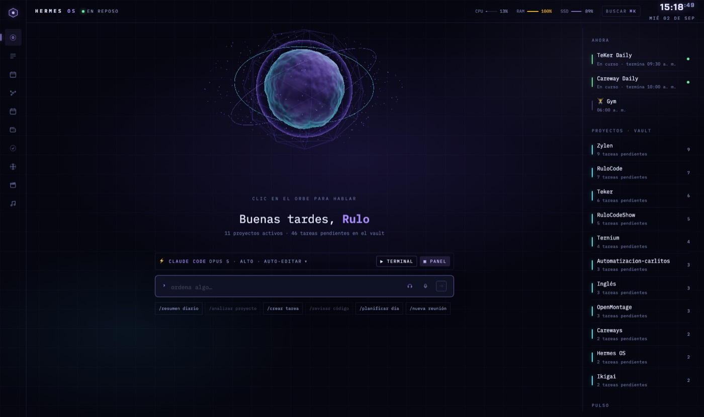
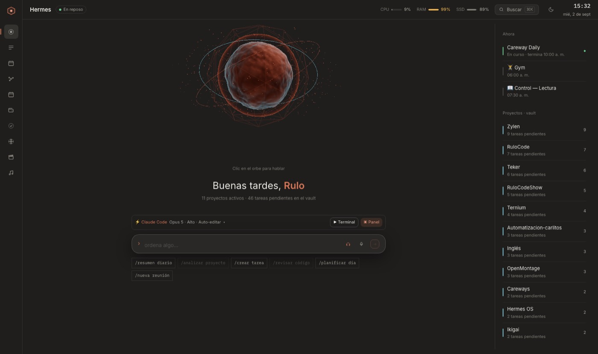
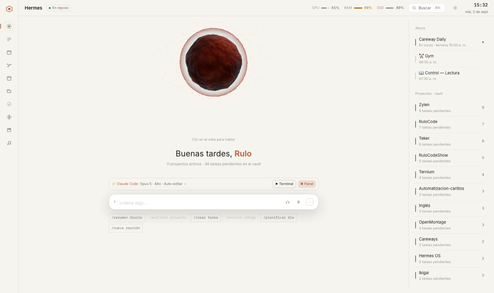
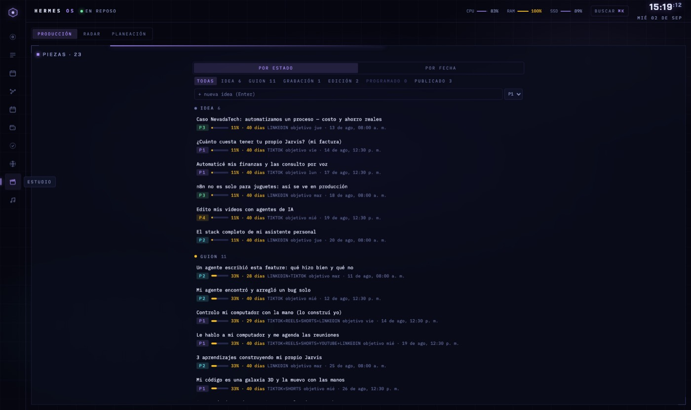
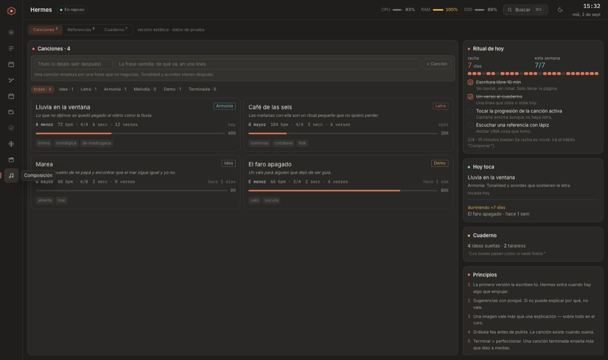
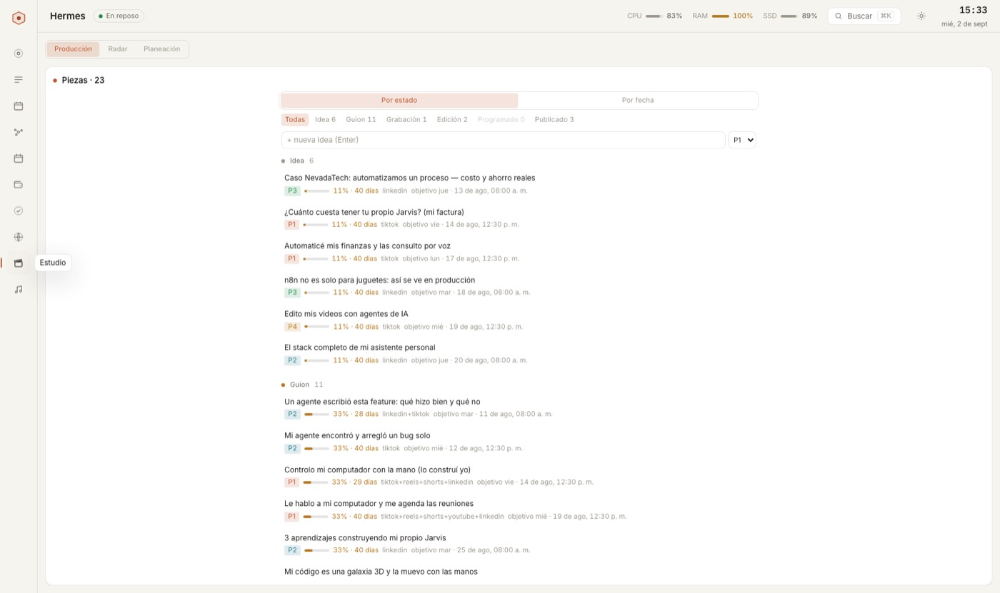
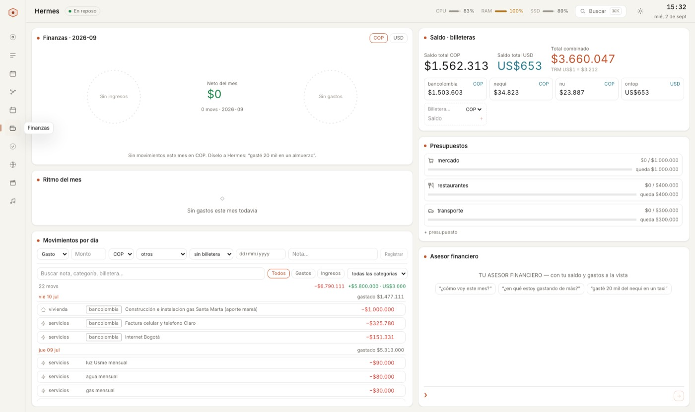
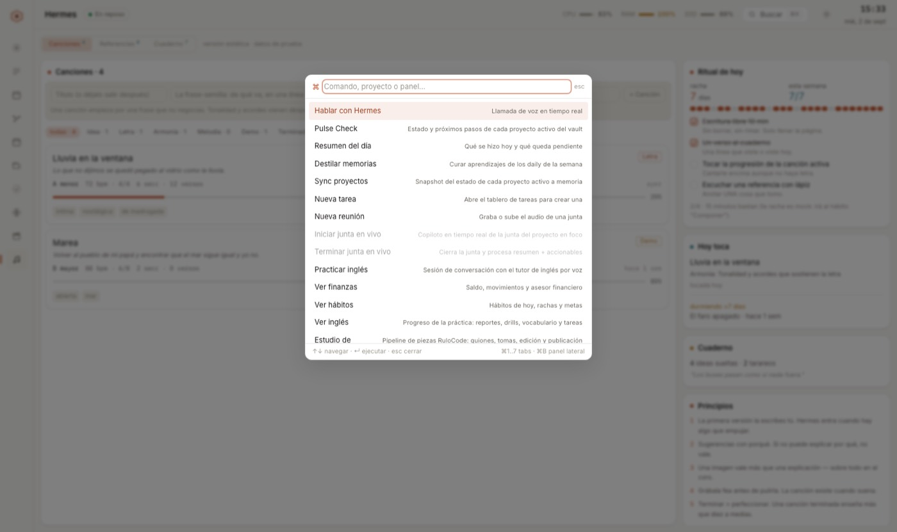

# Diagnóstico de UI y rediseño "limpio" — 2026-09-02

Pedido: dejar la temática cyberpunk/futurista y llevar Hermes a una interfaz limpia
al estilo de las últimas versiones de **Claude** y **ChatGPT**, con **modo claro** en
toda la app. Esto es el diagnóstico de lo que había, qué se cambió y por qué, y qué
queda.

## Referencias (Mobbin)

- Claude web — home con saludo, composer centrado, sidebar en frase normal, neutros
  cálidos y UN acento terracota: [pantalla 1](https://mobbin.com/screens/33b8745d-b1f7-405b-aa9c-a50c06e44ab4),
  [pantalla 2](https://mobbin.com/screens/99067951-15dc-4fba-8ca8-94686a70985c),
  [conversación](https://mobbin.com/screens/028209d5-855b-43dd-9ee1-d0caf63e3aae).
- Claude Design — paneles con borde de 1px, tarjetas blancas sobre papel, chat lateral:
  [pantalla](https://mobbin.com/screens/16b71c74-387d-4aa8-83ca-8b542a5c4876).
- ChatGPT — ajustes de **Apariencia: Sistema / Oscuro / Claro** y su modo oscuro
  neutro (sin neón): [selector](https://mobbin.com/screens/dc5c896c-7c98-417c-8473-b08d1541cfd3),
  [general](https://mobbin.com/screens/396e6b9f-9eaf-4a3b-94a6-bc2a8f898331).
- Linear / Notion — dashboards claros con rail de iconos, tarjetas con borde sutil y
  charts pequeños: [Linear](https://mobbin.com/screens/9c8e3907-b7af-48d6-ae2d-9b4ff700d433),
  [Notion](https://mobbin.com/screens/41f32a46-0aa4-4205-a6ab-627135308029).

## Lo que había (diagnóstico)

Medido sobre `apps/web/src` antes de tocar nada:

| Rasgo cyberpunk | Alcance | Efecto |
| --- | --- | --- |
| `uppercase` + `tracking-label` (0.2–0.35em) | 110 archivos · 312 usos | Todo gritaba; las etiquetas se leían como HUD, no como producto |
| Cuerpo en **monoespaciada** (IBM Plex Mono) | global (`body`) | Texto largo cansado; nada parecía "app moderna" |
| Fuente display Chakra Petch | 44 archivos | Look sci-fi en títulos y reloj |
| Glows (`glow-*`, `shadow-[0_0_…]`, `boxShadow` con color) | 26 + 12 + 5 usos | Neón en dots, tabs, pills, reloj, rail |
| Paneles con **brackets** en las esquinas, glass + blur | `.hud-panel` (todos los paneles) | Firma visual del HUD |
| Fondo con nébulas + **grid** + **scanlines** | `body`, `body::after` | Atmósfera, pero ruido permanente |
| Paleta neón violeta/cian sobre #05060f | tokens | Sin versión clara posible |
| Radios de 2–6px | tokens | Cajas duras |
| Piso tipográfico 10px | `text-2xs` en 117 archivos | Demasiado chico para uso diario |
| Arranque "BOOT SEQ · V5.0" con marco, scanlines y log en mayúsculas | `BootLoader` | Primera impresión = videojuego |
| Colores fijos fuera de tokens | 15 archivos | No podían seguir un tema |

Lo BUENO que ya había, y que hizo posible el cambio en un día: un design system
real con tokens en `@theme`, componentes que consumen clases (`text-violet`,
`border-line`) o `readToken()` para canvas, y la regla de "todo dato visible es
real". El rediseño cambió VALORES, no APIs.

## Lo que se hizo

### 1. Dos temas de verdad (`apps/web/src/app/globals.css`)
- Oscuro nuevo (default): neutros cálidos de Claude dark (`#1f1e1d` / `#292826`),
  texto `#edebe4`, líneas en blanco al 9–18 %.
- Claro: papel `#f5f4ef`, tarjetas blancas, texto `#1f1e1b`, líneas en negro al 10–20 %.
- **Un acento**: terracota (`#d97757` oscuro · `#c2542d` claro, AA sobre blanco).
  El token sigue llamándose `violet` para no tocar cientos de usos; `cyan/blue/
  green/amber/red` quedan como semántica de estado en versión "tinta".
- Charts: paleta categórica nueva por tema (`--color-chart-1..5`, `@theme static`).
- Mecánica: `@theme` emite las vars en `:root`; `:root[data-theme="light"]` las
  redefine. Tailwind v4 referencia `var(--color-x)`, así que todo sigue el tema sin
  recompilar. `color-scheme` acompaña (selects, scrollbars nativos).

### 2. Selector de apariencia
- `src/state/ThemeProvider.tsx`: `system | light | dark`, en localStorage
  (`hermes-theme`), resuelve contra `prefers-color-scheme`, estampa
  `<html data-theme>`, limpia la caché de `readToken()` y emite `hermes:theme`.
- `src/state/theme-init.ts`: script inline en `<head>` → sin destello al cargar.
- Botón en el header (`ThemeToggle`: sistema → claro → oscuro) y comando ⌘K
  "Cambiar apariencia".
- Canvas/three que leen tokens una vez se re-montan con `key={theme.resolved}`
  (orbe de voz, grafo de código 3D).

### 3. Tipografía
- Cuerpo y display en **Inter**; IBM Plex Mono solo donde hay `font-mono`
  (números, código, acordes, IDs).
- Escala +1px: 2xs 11 · xs 12 · sm 13 · base 14 · md 15 · lg 17.
- **Sin mayúsculas**: dos reglas globales fuera de `@layer` devuelven `.uppercase`
  a frase normal y llevan todo `tracking-*` (incluidos los arbitrarios
  `tracking-[0.18em]`) a 0.01em. Si algo DEBE ir en mayúsculas, se escribe así en
  el string.

### 4. Superficies y componentes
- `.hud-panel`: opaco, borde 1px, radio 12px, sombra por tema; sin brackets, sin
  blur. `hud-title` en 13px semibold con un dot de tono de 6px (sin glow).
- Fondo plano: se eliminaron nébulas, grid y scanlines.
- Glows apagados (las clases quedan por compatibilidad): reloj, pills, tabs,
  section titles, rail, riel de contexto, botón de comandos (sin el prefijo ">").
- Radios: 4 / 8 / 12 / 16 / 20.
- TopBar: wordmark "Hermes", estado como pill, vitales neutros, botón Buscar con
  icono y `⌘K` como kbd, toggle de apariencia, reloj sin glow y fecha en frase normal.
- SideRail: activo en gris neutro con barra de acento; tooltips como cards.
- Arranque: mismo canvas (ahora con colores del tema), sin marco/scanlines/viñeta,
  log y estados en frase normal, celdas de progreso finas.
- Orbe de voz 3D en claro: base de porcelana, mezcla normal en vez de aditiva y
  bloom al 12 % (el aditivo sobre papel saturaba a blanco).
- Colores fijos migrados a tokens: Toasts, ContextRail, ChatPanel (composer),
  PianoKeys (`--color-key-*`), ChordBuilder, markdown (`.md-*`), scrollbars.

### 5. Cobertura verificada (Playwright, :31415, 1600×950)
Capturas en claro y oscuro de: home (orquestador), tareas, reuniones, memoria,
agenda, finanzas, hábitos, inglés, estudio, composición, ⌘K y el arranque. Sin
errores de consola; sin scroll horizontal. Antes/después en `docs/ui/`.

## Antes / después (`docs/ui/`)

| Antes (HUD) | Después · oscuro | Después · claro |
| --- | --- | --- |
|  |  |  |
|  |  |  |

## Qué queda (siguiente pasada)

1. **Textos escritos en mayúsculas dentro de strings** (p. ej. "TU ASESOR
   FINANCIERO", labels de datos) — ya no los transforma el CSS; se corrigen a mano
   donde molesten.
2. `font-mono` sigue en muchos labels que no son datos (chips `/comando`, cabeceras
   de sección del Estudio). Es coherente, pero un pase por componente los llevaría a
   sans donde no sean números.
3. Los ~78 `style={{…}}` con `var(--…)` funcionan con el tema pero deberían migrar a
   clases (deuda previa).
4. El grafo de conocimiento (`KnowledgeGraph`) y el grafo 3D leen `--color-bg` al
   montar: en claro el fondo de la escena es papel y los nodos siguen legibles, pero
   el bloom está calibrado para oscuro — revisar strength/threshold por tema.
5. Móvil (`mobile/`) no se tocó: sigue con su propio tema.
6. Accesibilidad: contraste AA verificado a ojo en tokens; falta correr un audit
   automático (axe) en ambos temas.
